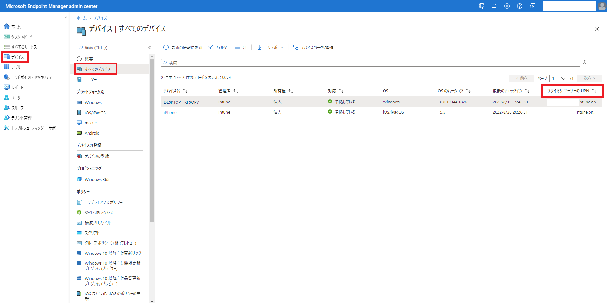
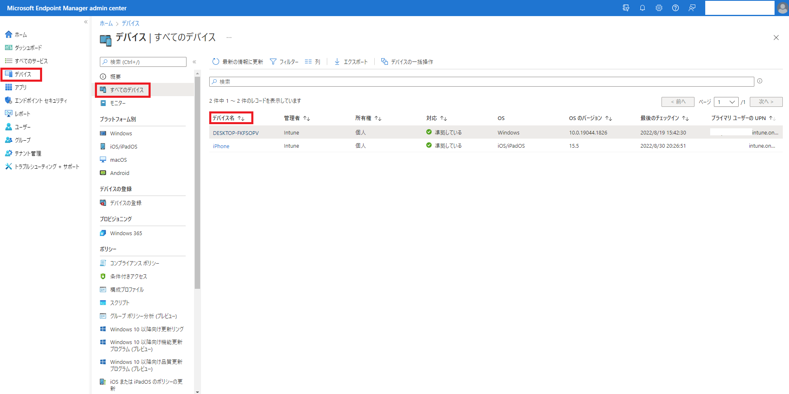
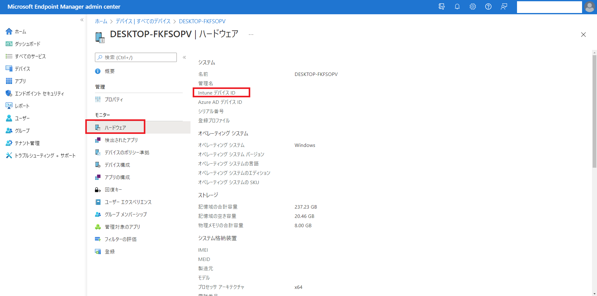
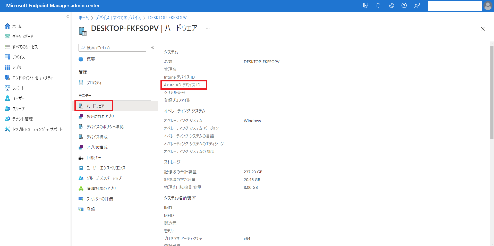
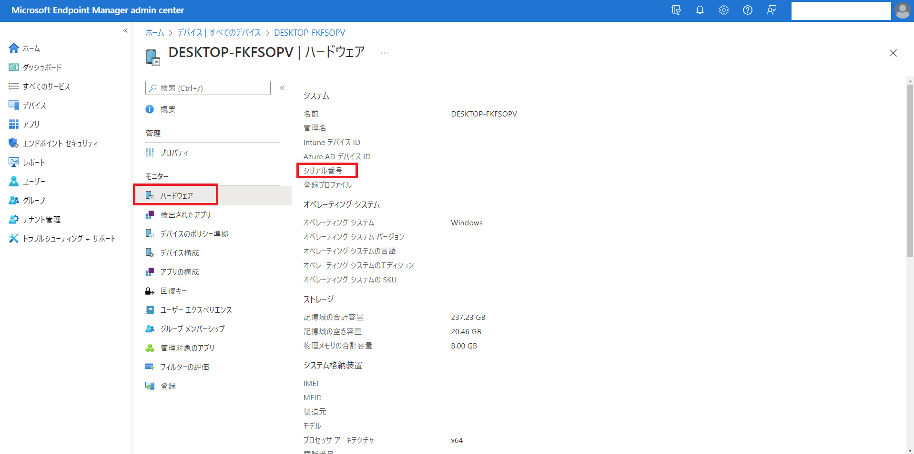

こんにちは! Microsoft Intune サポートチームのIshikawaです。
皆様、平素より弊社 Intune をご利用いただきまして誠にありがとうございます。

本投稿では弊社 Microsoft の Intune サポート チームへお問い合わせをご起票いただく際にお客様側で事前に採取可能な**基本情報**についてお纏めいたします。

# 免責事項
下記内容及び、画面ショットは 2022/9/13 時点での仕様についての記載となっております。
弊社ではお客様のご意見を頂戴し、日々、品質向上に努めております。その為、製品アップデートが頻繁に行われており、お客様の手元の環境とは異なってしまう可能性がありますことを予めご承知置きくださいますようお願い致します。

# 基本情報
今回ご案内をする情報採取は Intune チームからお客様にご案内をすることがある情報採取の中で最も基本的なものになります。

**ご案内する基本情報**
* UPN
* Intune デバイス ID
* AAD(Azure AD) デバイス ID
* シリアル番号

それぞれご案内いたします。

## 1. UPN (User Principal Name)
UPN とはユーザーオブジェクトにユニークに付与されているメールアドレス形式の文字列です。例)sample@intune.onmicrosoft.com

以下の手順で事象発生ユーザーの UPN を採取してご提供ください。

**1. Microsoft Endpoint Manager admin center < https://endpoint.microsoft.com/ >へログインする**

**2. 左側タブ内の [デバイス] > [すべてのデバイス] の画面にて事象発生デバイスの [プライマリ ユーザーのUPN] を確認する。**

<参考>
UserPrincipal Nameとは < https://docs.microsoft.com/ja-jp/azure/active-directory/hybrid/plan-connect-userprincipalname#what-is-userprincipalname >

## 2. Intune デバイス ID
IntuneデバイスIDとは、Intuneに登録されているデバイスを一意に識別するGUID(Globally Unique Identifier)です。

以下の手順で事象発生ユーザーの UPN を採取してご提供ください。

**1. Microsoft Endpoint Manager admin center < https://endpoint.microsoft.com/ >へログインする**

**2. 左側タブ内の [デバイス] > [すべてのデバイス] の画面にて事象発生デバイスの [デバイス名] を確認する。**

**3. タブ内の[ハードウェア]をクリックし、IntuneデバイスIDを確認する。**

## 3. Azure AD デバイス ID
Azure AD デバイス IDは、Azure AD内のオブジェクトです。確認方法は 2. IntuneデバイスIDと同様になります。
以下の手順で事象発生ユーザーのAzure ADデバイスIDを採取してご提供ください。

**1. Microsoft Endpoint Manager admin center < https://endpoint.microsoft.com/ >へログインする**

**2. 左側タブ内の [デバイス] > [すべてのデバイス] の画面にて事象発生デバイスの [デバイス名] を確認する。**

**3. タブ内の[ハードウェア]をクリックし、Azure AD デバイス IDを確認する。**

## 4. デバイスのシリアル番号
デバイスのシリアル番号は製造元のデバイスのシリアル番号です。確認方法は2. IntuneデバイスID、3. Azure AD デバイス IDと同様になります。
以下の手順で事象発生ユーザーのデバイスのシリアル番号を採取してご提供ください。

**1. Microsoft Endpoint Manager admin center < https://endpoint.microsoft.com/ >へログインする**

**2. 左側タブ内の [デバイス] > [すべてのデバイス] の画面にて事象発生デバイスの [デバイス名] を確認する。**

**3. タブ内の[ハードウェア]をクリックし、シリアル番号を確認する。**

\* (注) 2022年9月現在、Android 12 以降を実行している Android の個人所有の作業プロファイル デバイスのシリアル番号は表示されません。< https://docs.microsoft.com/ja-jp/mem/intune/remote-actions/device-inventory#hardware-device-details >

### 最後に
日々弊社の Intune  をご利用頂きありがとうございます。
本記事、または Intuneに関しましてご不明点等ございましたら、お気兼ねなくIntune サポートチームの担当者へお問い合わせください。

本記事でのご案内事項は以上となります。ご一読頂きありがとうございました。
ご参考になりましたら幸いです !