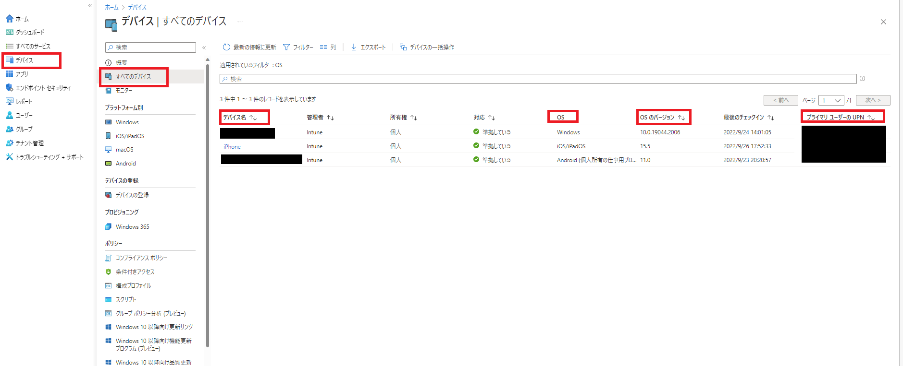
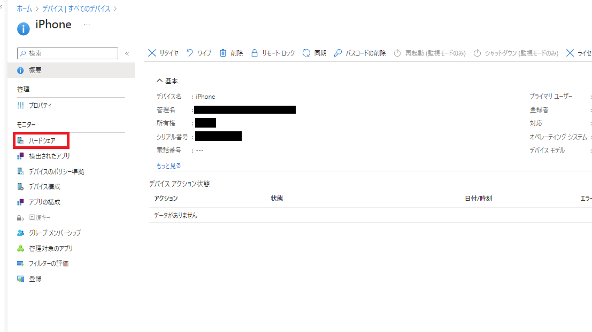
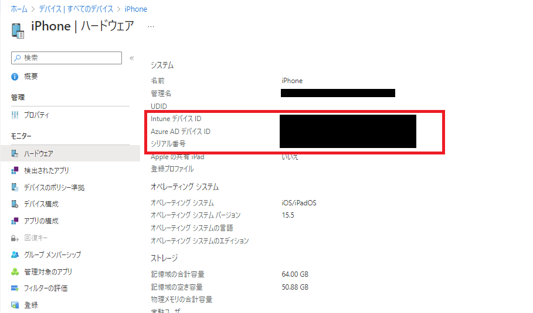

こんにちは! Microsoft Intune サポートチームの Ishikawa です。
皆様、平素より弊社 Intune をご利用いただきまして誠にありがとうございます。

本投稿では弊社 Microsoft の Intune サポートチームへお問い合わせをご起票いただく際にお客様側で事前に採取可能な**基本情報**についてお纏めいたします。

# 免責事項
下記内容及び、画面ショットは 2022/9/21 時点での仕様についての記載となっております。
弊社ではお客様のご意見を頂戴し、日々、品質向上に努めております。その為、製品アップデートが頻繁に行われており、お客様の手元の環境とは異なってしまう可能性がありますことを予めご承知置きくださいますようお願い致します。

# 基本情報
今回ご案内をする情報採取手順は Intune チームからお客様にご案内をすることがある情報採取の中で最も基本的なものになります。
**この情報は、どのような事象発生時にも事前採取をお願いしたい内容になります。**

**ご案内する情報採取手順**
* UPN
* Intune デバイス ID
* AAD (Azure AD) デバイス ID
* シリアル番号

以下情報手順の流れをご説明いたします。

## 1. 事象発生デバイスの特定

弊社への問い合わせの際に、同一デバイス名で登録されている別の端末の情報提供をいただくケースが少なくございません。その為、以下の手順で、事象発生デバイスの特定をお願いいたします。

**1. Microsoft Endpoint Manager admin center < https://endpoint.microsoft.com/ > へログインする**

**2. 左側タブ内の [デバイス] > [すべてのデバイス] の画面にて [デバイス名]、[OS]、[OSのバージョン]、[プライマリ ユーザーのUPN] を確認の上、事象発生デバイスの特定をする**

*(注) 同一デバイス名 (例 : iPhone) で複数デバイスが登録されている場合がございますので、事象発生デバイスのご確認をお願いします。

<参考>
UPN とはユーザーオブジェクトにユニークに付与されているメールアドレス形式の文字列です。
例) sample@intune.onmicrosoft.com

User Principal Nameとは < https://docs.microsoft.com/ja-jp/azure/active-directory/hybrid/plan-connect-userprincipalname#what-is-userprincipalname >

## 2. 事象発生デバイスの情報採取

**1. 事象発生デバイスのデバイス名を選択し、左側タブ内の [ハードウェア] を選択する**

**2. 表示される [Intune デバイス ID]、[Azure AD デバイス ID]、[シリアル番号] を確認する**

**3. 採取した UPN、Intune デバイス ID、Azure AD デバイス ID、シリアル番号を Microsoft 社への起票時に添付する**

\* (注) 2022 年 9 月現在、Android 12 以降を実行している Android の個人所有の作業プロファイル デバイスのシリアル番号は表示されません。< https://docs.microsoft.com/ja-jp/mem/intune/remote-actions/device-inventory#hardware-device-details >

### 最後に
日々弊社の Intune をご利用頂きありがとうございます。
本記事、または Intune に関しましてご不明点等ございましたら、お気兼ねなく Intune サポートチームの担当者へお問い合わせください。

本記事でのご案内事項は以上となります。ご一読頂きありがとうございました。
ご参考になりましたら幸いです !