こんにちは! Microsoft Intune サポートチームの Ishikawa です。
皆様、平素より弊社 Intune をご利用いただきまして誠にありがとうございます。

本投稿では弊社 Microsoft の Intune サポートチームへお問い合わせをご起票いただく際にお客様側で事前に採取可能な**モバイルデバイスの情報**についてお纏めいたします。

# 免責事項
下記内容及び、画面ショットは 2022/9/28 時点での仕様についての記載となっております。
弊社ではお客様のご意見を頂戴し、日々、品質向上に努めております。その為、製品アップデートが頻繁に行われており、お客様の手元環境とは表示等が異なる可能性がございますことを、予めご承知おきくださいますようお願い致します。

# モバイルデバイスの情報
今回ご案内をするのは Intune チームからお客様にご案内をすることがあるモバイルデバイスの情報採取手順になります。

**ご案内する情報採取手順**
* Intune ポータルサイトアプリのインシデント ID
* MAM (Mobile Application Management) ログ

iOS 端末、Android 端末のそれぞれついてご案内いたします。

## 1. Intune ポータルサイトアプリのインシデント ID
Intune ポータルサイトアプリのインシデント ID とは Intune ポータルサイトアプリに紐づけられた ID です。
**この情報は、モバイル端末を Intune に登録できない場合などに事前採取をお願いしたい内容になります。**

以下の手順で事象発生デバイスのインシデント ID を採取してご提供ください。iOS 端末と Android 端末では採取の手順が異なります。

### [iOS 端末]
**1. iOS のポータルタイトアプリを起動する**

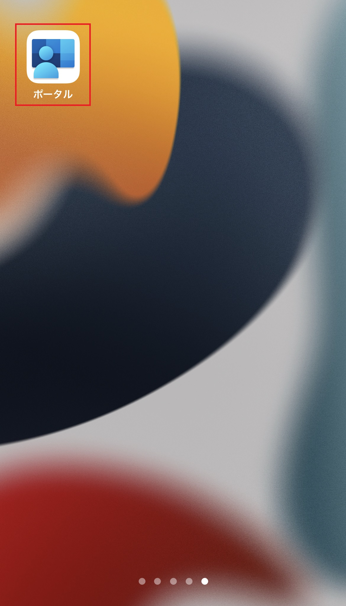

**2. 右下の[… その他] > [ ヘルプ ] をタップする**

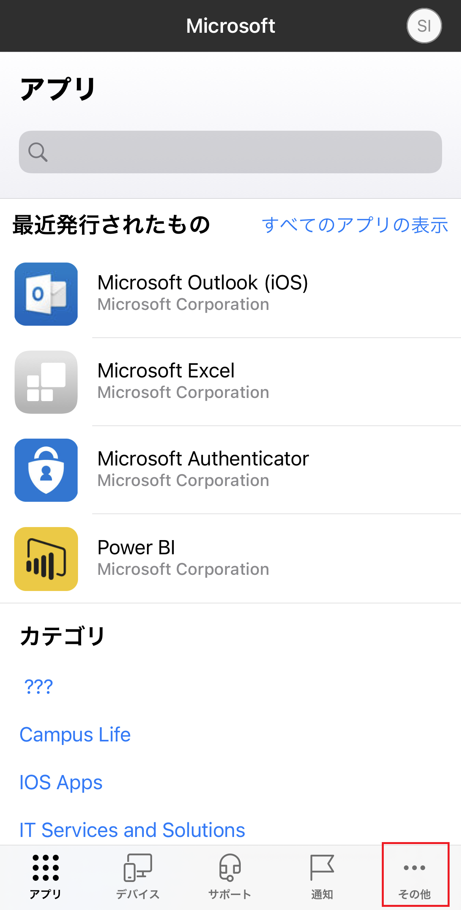  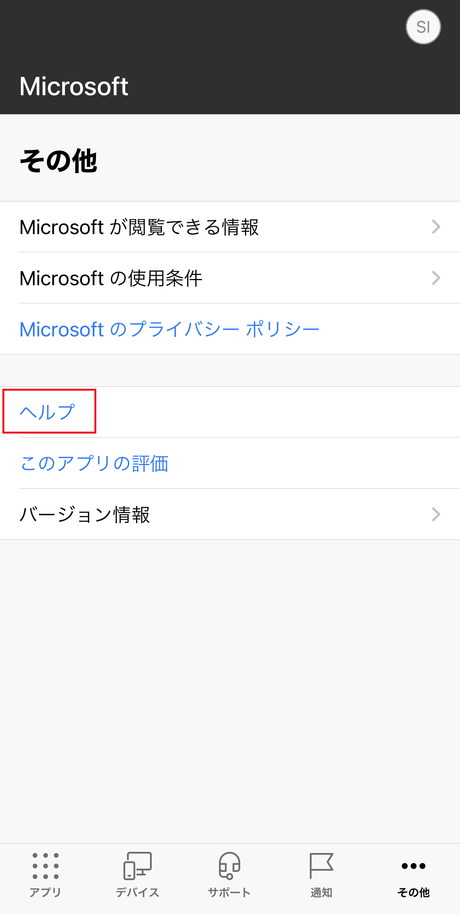

**3. [ヘルプの取得] 画面にて使用しているインシデント ID を確認する**

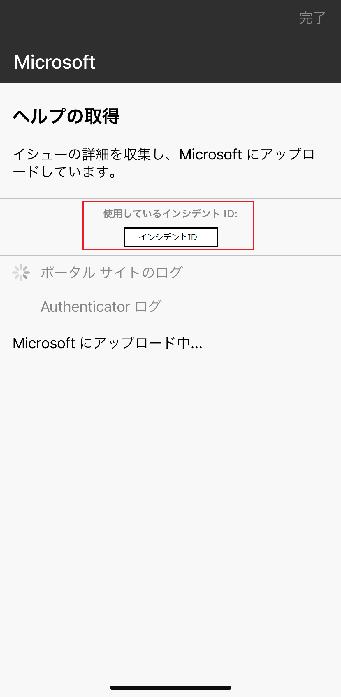

**4. 採取したインシデント ID を Microsoft 社への起票時に添付する**

### [Android 端末]
**1. Android のポータルサイトアプリを起動する**

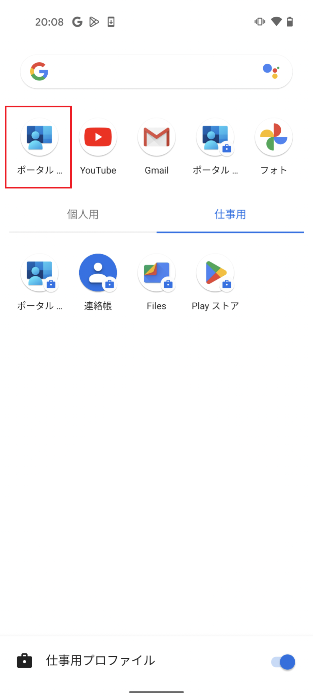

**2. 左上の [三] > [ヘルプ] をタップする**

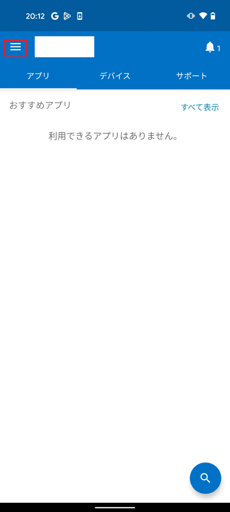　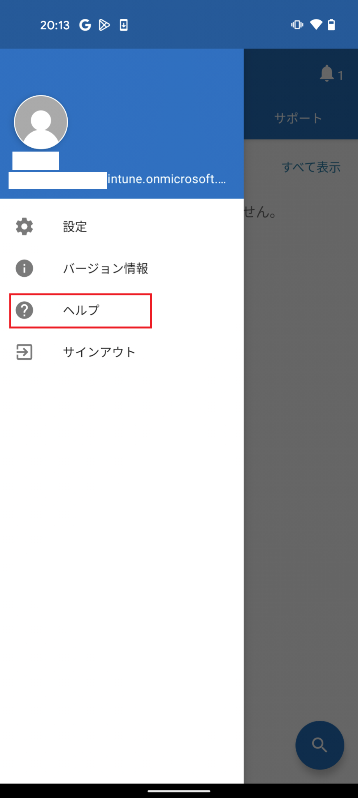

**3. [ログの送信] をタップする**

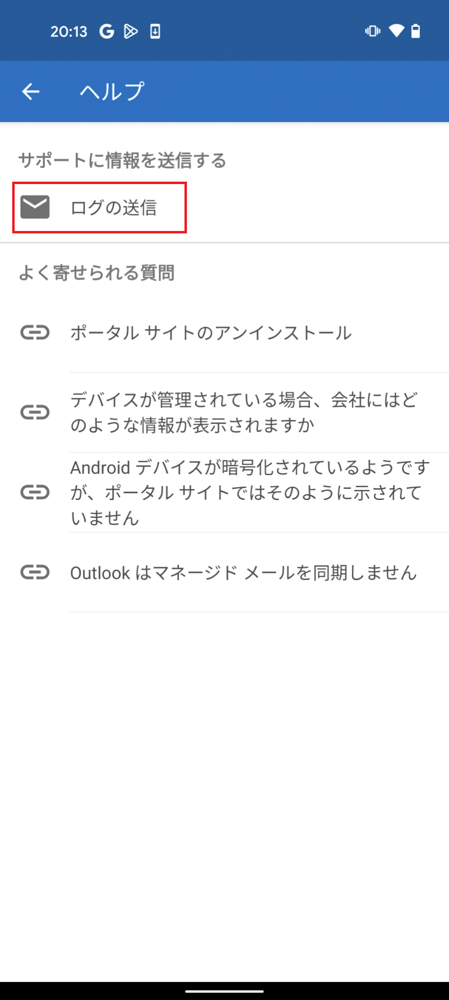

**4. [ログのみ送信] をタップし、インシデント ID を確認する**

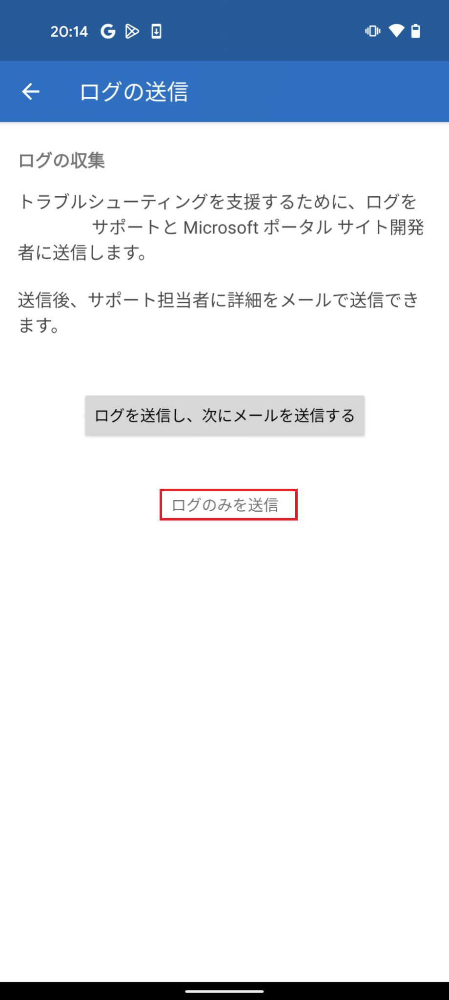　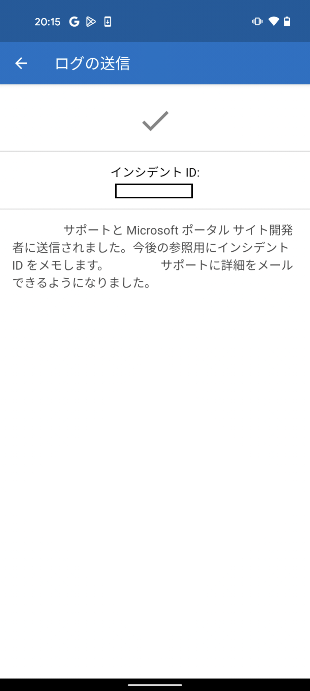

<参考>
Android アプリ ログを Microsoft に送信する < https://docs.microsoft.com/ja-jp/mem/intune/user-help/send-logs-to-microsoft-android?source=recommendations#send-logs >

**5. 採取したインシデント ID を Microsoft 社への起票時に添付する**

## 2. MAM (Mobile Application Management)
MAM (Mobile Application Management) ログとはモバイルアプリ管理に関する操作情報の記録です。
**この情報は、アプリ保護ポリシーが適用できない場合などに事前採取をお願いしたい内容になります。**

**Android 端末の場合、MAM ログと Intune ポータルサイトアプリのインシデント ID は同一となりますので、インシデント ID を弊社にご送信いただけますと、MAM ログも弊社にて確認が取れる状態となります。**

以下の手順で事象発生デバイスの MAM ログを採取してご提供ください。

### [iOS端末]

**1. iOS の Microsoft Edge アプリを起動する**

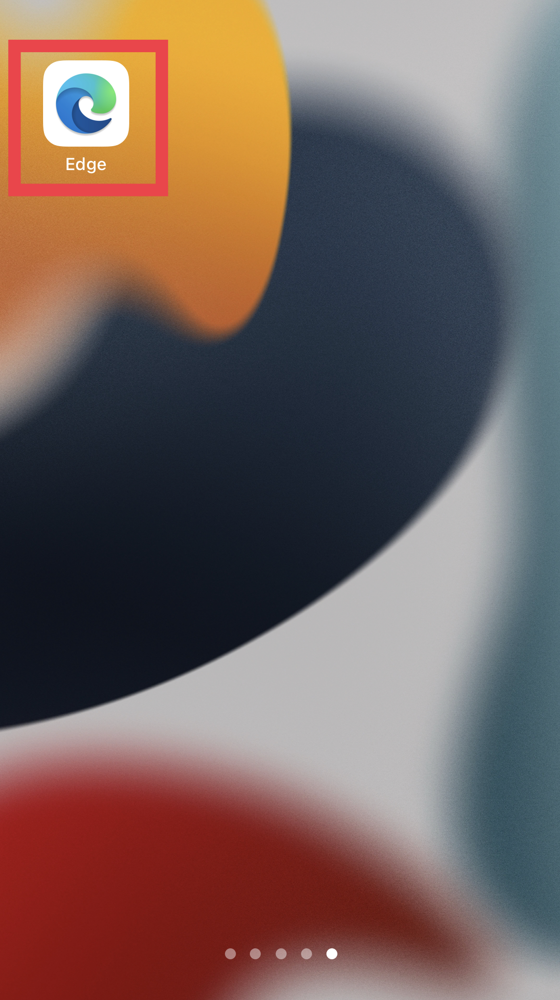

**2. [検索またはWebアドレスを入力] タブにて、”about:intunehelp” と入力する**

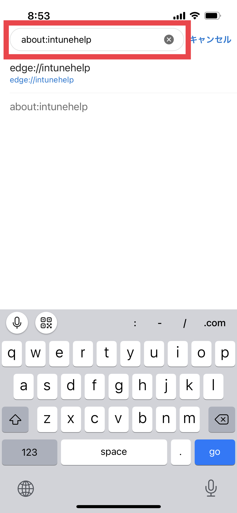

**3. [Intune 診断] 画面にて、[開始する] をクリックする**

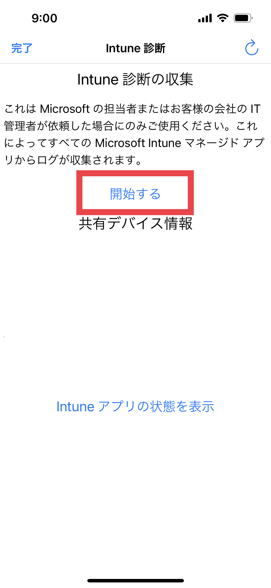 

**4. [Intune診断の収集] 画面にて、MAM ログ (参照 ID) を確認する**

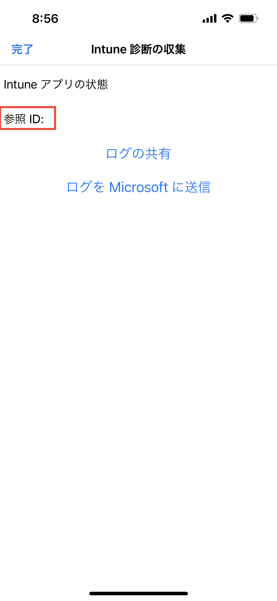

**5. 採取した MAM ログを Microsoft 社への起票時に添付する**

※ Microsoft 製品以外のアプリの場合、アプリごとにログが出力される可能性がございますので、各ベンダー様に確認いただく場合がございます。

<参考>
iOS と Android に Edge を使用してマネージド アプリ ログにアクセスする < https://docs.microsoft.com/ja-jp/mem/intune/apps/manage-microsoft-edge#use-edge-for-ios-and-android-to-access-managed-app-logs >

### 最後に
日々弊社の Intune をご利用頂きありがとうございます。
本記事、または Intune に関しましてご不明点等ございましたら、Service Request（お問い合わせ）にて Intune サポートチームの担当者にお気兼ねなくご相談ください。

本記事でのご案内事項は以上となります。少しでもお役に立つ情報であれば幸いです。
最後までお読みいただき、ありがとうございました !