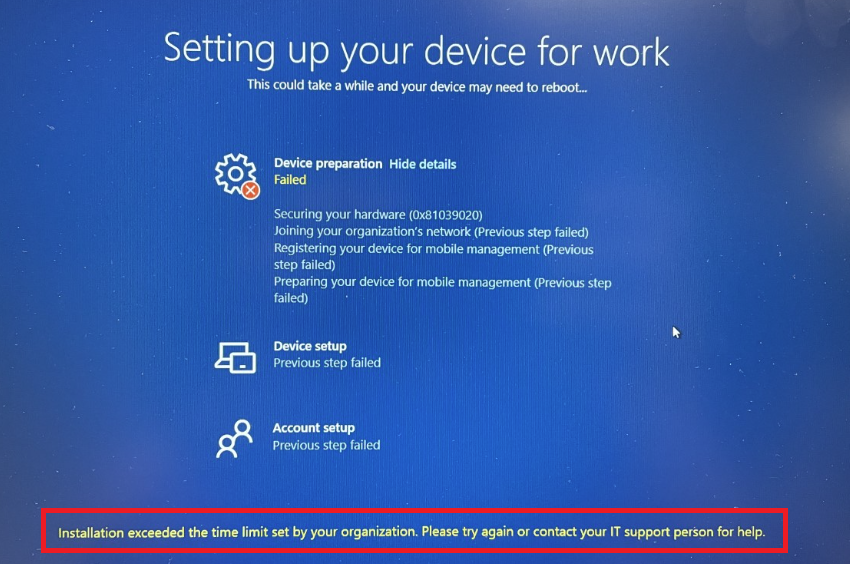

こんにちは! Microsoft Intune サポートチームの Ishikawa です。
皆様、平素より弊社 Intune をご利用いただきまして誠にありがとうございます。

本投稿では弊社 Microsoft の Intune サポート チームへお問い合わせをご起票いただく際にお客様側で事前に採取可能な **Autopilot ログ**についてお纏めいたします。

# 免責事項
下記内容及び、画面ショットは 2022/9/21 時点での仕様についての記載となっております。
弊社ではお客様のご意見を頂戴し、日々、品質向上に努めております。その為、製品アップデートが頻繁に行われており、お客様の手元の環境とは異なってしまう可能性がありますことを予めご承知置きくださいますようお願い致します。

## Autopilot ログ
今回ご案内をするのは Intune チームからお客様にご案内をすることがある Autopilot ログの情報採取手順になります。
**このログ情報は、Autopilot が失敗している場合に事前採取をお願いしたい内容になります。**

以下の手順で事象発生デバイスの Autopilot ログを採取してご提供ください。

### [Intune へ登録できていない場合]

**1. 該当デバイスにてエラーメッセージが表示されている画面上で Shift + F10 キーを押してコマンドプロンプトを開く**



**2. コマンドプロンプトから下記のコマンドを実行し、autopilot 関連の情報を採取する**

```
mdmdiagnosticstool.exe -area Autopilot;TPM -cab C:\Temp\autopilot.cab
```

※ 手順 2 において、コマンドが失敗する場合は

```
mdmdiagnosticstool.exe -area Autopilot -cab C:\Temp\autopilot.cab
```

を実行ください。

**3. C:\Temp に格納されている autopilot.cab を Microsoft 社への起票時に添付する**

### [Intune へ登録できている場合]

**1. Microsoft Endpoint Manager admin center < https://endpoint.microsoft.com/ > へログインし、[デバイス] >  Windows] にて対象のデバイスを選択する**

**2. デバイスの [概要] ページ上部の [診断の収集] > [はい] を選択すると、デバイスの [概要] ページに保留中の通知が表示される**


※ 上部に [診断の収集] が表示されていない場合は、[...] > [診断の収集] のように選択ください。

**3. 左側の [モニター] 配下の [デバイス診断] を選択し、[ダウンロード] > [はい] をクリックする**


**4. 採取した診断ログを Microsoft 社への起票時に添付する**


### 最後に
日々弊社の Intune をご利用頂きありがとうございます。
本記事、または Intune に関しましてご不明点等ございましたら、お気兼ねなくIntune サポートチームの担当者へお問い合わせください。

本記事でのご案内事項は以上となります。ご一読頂きありがとうございました。
ご参考になりましたら幸いです!