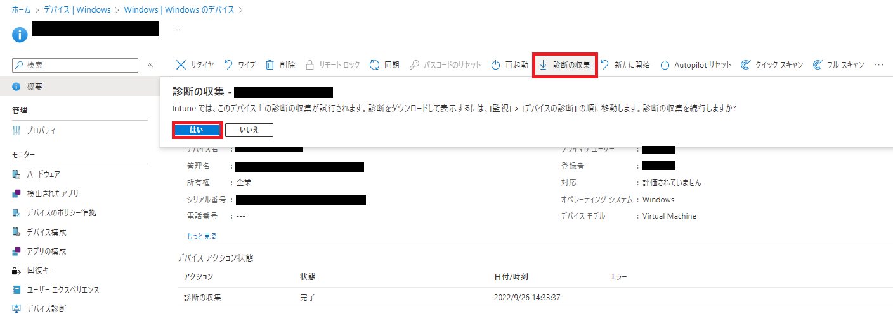
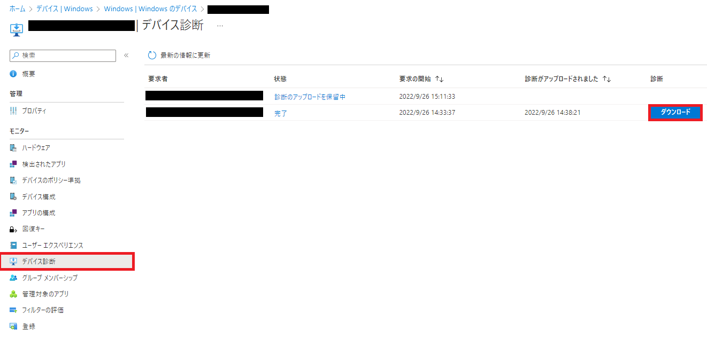

こんにちは! Microsoft Intune サポートチームのIshikawaです。
皆様、平素より弊社 Intune をご利用いただきまして誠にありがとうございます。

本投稿では弊社 Microsoft の Intune サポート チームへお問い合わせをご起票いただく際にお客様側で事前に採取可能な**Autopilotログ**についてお纏めいたします。

# 免責事項
下記内容及び、画面ショットは 2022/9/21 時点での仕様についての記載となっております。
弊社ではお客様のご意見を頂戴し、日々、品質向上に努めております。その為、製品アップデートが頻繁に行われており、お客様の手元の環境とは異なってしまう可能性がありますことを予めご承知置きくださいますようお願い致します。

## Autopilotログ
今回ご案内をするのは Intune チームからお客様にご案内をすることがあるAutopilotログの情報採取手順になります。
以下の手順で事象発生デバイスのAutopilotログを採取してご提供ください。

### [Intuneへ登録できていない場合]

**1. Shift + F10 キーを押してコマンドプロンプトを開く**

**2. コマンドプロンプトから下記のコマンドを実行し、autopilot 関連の情報を採取する**

```
mdmdiagnosticstool.exe -area Autopilot;TPM -cab C:\Temp\autopilot.cab
```


*(注) 手順2において、コマンドが失敗する場合は

```
mdmdiagnosticstool.exe -area Autopilot -cab C:\Temp\autopilot.cab
```

を実行ください。

### [Intuneへ登録できている場合]

**1. Microsoft Endpoint Manager admin center < https://endpoint.microsoft.com/ >へログインし、[デバイス] > [Windows]にて対象のデバイスを選択する**

**2. デバイスの [概要] ページ上部の [診断の収集] > [はい] を選択すると、デバイスの [概要] ページに保留中の通知が表示される**



※  上部に [診断の収集] が表示されていない場合は、[...] > [診断の収集] のように選択ください。

**3. 左側の [モニター] 配下の [デバイス診断] を選択し、[ダウンロード] > [はい] をクリックする**



### 最後に
日々弊社の Intune  をご利用頂きありがとうございます。
本記事、または Intuneに関しましてご不明点等ございましたら、お気兼ねなくIntune サポートチームの担当者へお問い合わせください。

本記事でのご案内事項は以上となります。ご一読頂きありがとうございました。
ご参考になりましたら幸いです !