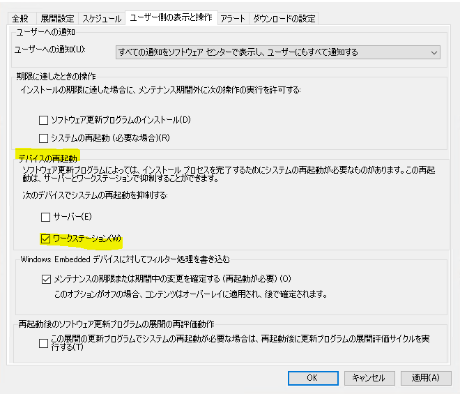
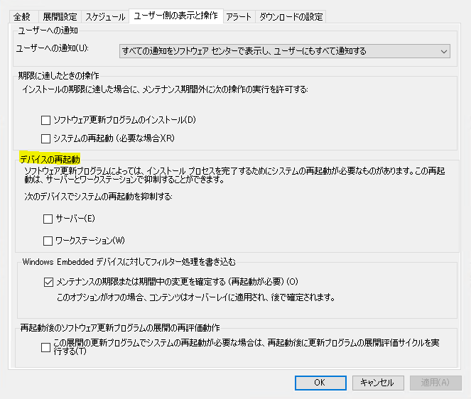
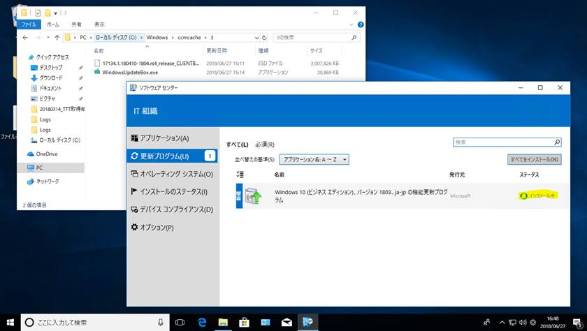
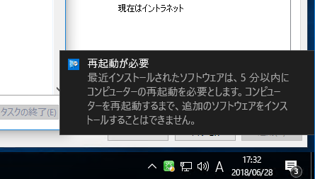
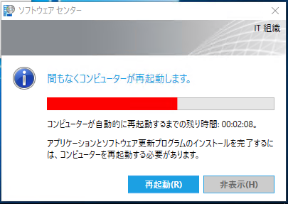

みなさま、こんにちは。Configuration Manager サポート チームです。

本記事では、Configuration Manager から更新プログラム配信時の再起動動作についてご紹介いたします。

Configuration Manager から更新プログラムを展開しているが、Configuration Manager クライアントによって意図せず端末が再起動された、または Windows 10 で 「高速スタートアップ」 を利用していて、端末を停止しても休止状態になり再起動されないため、多数の端末が再起動保留状態のまま更新プログラムの適用が完了しないというお問い合わせをよくいただきます。Configuration Manager で再起動を抑制させる/再起動させる設定のお役立て情報おまとめいたしました。
ご利用環境で上記のようなお困りごとに遭遇されている管理者の方は、是非ご活用いただければと思います。

## 再起動を抑制する場合
展開設定時に [デバイスの再起動] - [サーバー(サーバーOSの場合) or ワークステーション(クライアントOSの場合)]　にチェックを入れることで、再起動の抑制をすることが可能です。

上記設定値を入れることで以下のポップアップとなります。

## 再起動をさせる場合
展開設定時に [デバイスの再起動] - [サーバー(サーバーOSの場合) or ワークステーション(クライアントOSの場合)]　のチェックを無効にすることで、強制的に再起動させることが可能です。

**機能更新プログラムのインストール 工程**

ソフトウェアセンターにインストール状況が表示。

 

**機能更新プログラムのインストール後**

再起動通知が発生 

再起動までの時間がカウントアップされます。 

 

再起動までの猶予時間が経過すると強制的に再起動します。 

## 補足 - 再起動までの猶予時間を制御
再起動されるまでの時間は [管理] - [概要] - [クライアント設定] - [既定のクライアント設定 or カスタムクライアント設定] - [コンピュータの再起動]　にて設定可能でございます。 

