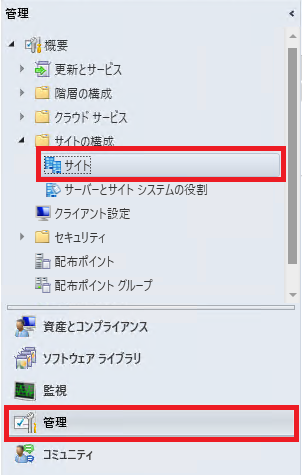
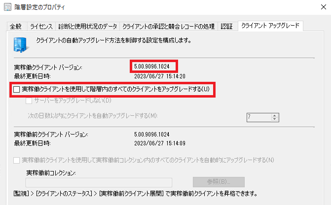
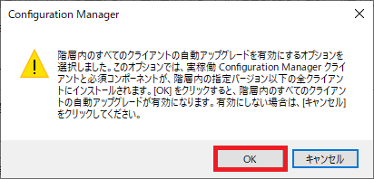
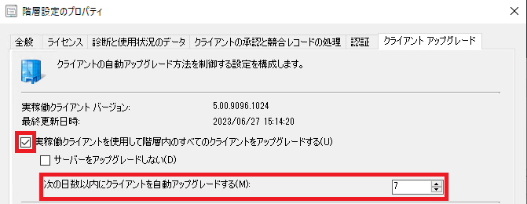

# SCCM CB 自動クライアント アップグレード手順

**2018/08/23 初版公開**  
**2023/08/16 更新**  
**- 最新バージョンの動作に合わせ記載を修正しました。**  


みなさま、こんにちは。

日本マイクロソフト Configuration Manager サポートチームです。

本日は、Microsoft Configuration Manager (ConfigMgr) クライアントをサイトのバージョンアップ後、自動的にアップグレードする手順についてご案内させていただきます。
クライアントのアップグレード方法は、以下のように、複数がございます。

・自動クライアント アップグレード
・クライアント プッシュ インストール
・グループ ポリシーによるインストール
・ログオン スクリプトによるインストール
・手動インストール
・アップグレード インストール

お客様環境の運用方式に従い、お選びいただけますが、その中で、これからご案内する自動クライアント アップグレードは、一番作業の手間が少ない方法となりますので、クライアントのアップグレードの際に、本機能のご利用をご検討いただけますと幸いです。

## 自動クライアント アップグレードの手順

1. [Configuration Manager コンソール] を開き、[管理] - [概要] - [サイトの構成] - [サイト] に移動します。


2. 対象のサイトを選択し、リボンメニューから [階層設定] を選択します。


3. [階層設定のプロパティ] の画面で、[クライアント アップグレード] タブを開きます。


4. [実稼働クライアント バージョン] が、アップグレードしたいクライアントのバージョンと一致していることを確認し、  
"実稼働クライアントを使用して階層内のすべてのクライアントをアップグレードする" にチェックを入れます。


5. "階層内のすべてのクライアントの自動アップグレードを有効にするオプションを選択しました。…" とのメッセージが表示されますので、[OK] を選択します。


6. [実稼働クライアント バージョン] の、"実稼働クライアントを使用して階層内のすべてのクライアントをアップグレードする" にチェックが入ったことを確認し、"次の日数以内にクライアントを自動アップグレードする" の設定を行います。
選択可能な範囲は、1 から 31 となります。
ここで指定した期間内のランダムなタイミングで、クライアントがアップグレードされます。


7. [OK] ボタンを選択し、画面を閉じます。
8. [管理] - [概要] - [更新とサービス] に移動し、最新バージョンの更新項目を選択の上、  
リボンメニューから [実稼働前クライアントの昇格] を選択します。
ここで、確認メッセージが表示されますので、[昇格] を選択します。


手順は、以上となります。

管理対象が多い大規模の環境では、自動クライアント アップグレードの機能を有効にすることで、一気にクライアントのアップグレードがされ、ネットワークを逼迫することが懸念点として考えられますが、上記の設定画面にて、自動アップグレードの期間を長く指定してきただくことで、ネットワークの負荷を分散することができます。

例えば、指定可能な最長日数の 31 としていただきますと、クライアントは、1 ~ 31 日の期間中、ランダムの日付に、アップグレードを行います。
念の為、具体的なクライアントのアップグレード動作を、補足説明いたしますのでご参考いただけますと幸いです。

## クライアント アップグレードの動作の流れ

1. ConfigMgr サーバにおいて自動クライアント アップグレードを有効にする際に、アップグレード期間を指定します。
2. クライアントが自動クライアント アップグレードのポリシーを受信します。
3. クライアント ポリシーを受信後、WMI の CCM_ClientUpgrade クラス の IsEnabled プロパティが "True" に変更されます。
CCM_ClientUpgrade クラスは、以下の PowerShell コマンドレットで確認可能です。

```txt
gwmi -namespace root\ccm\policy\machine\actualconfig -class CCM_ClientUpgrade
```

3. ConfigMgr クライアントが上記の WMI の変更を検知し、ccmsetup のコンテンツ ダウンロードを行います。
4. ダウンロード完了後、ClientServicing が ccmsetup を実行します。実行時、[次の日数以内にクライアントを自動アップグレードする] で設定した期間を考慮してランダマイズされた日時でスケジュールされます。

5. 上記でスケジュールされた日時になるとアップグレードが実行されます。
