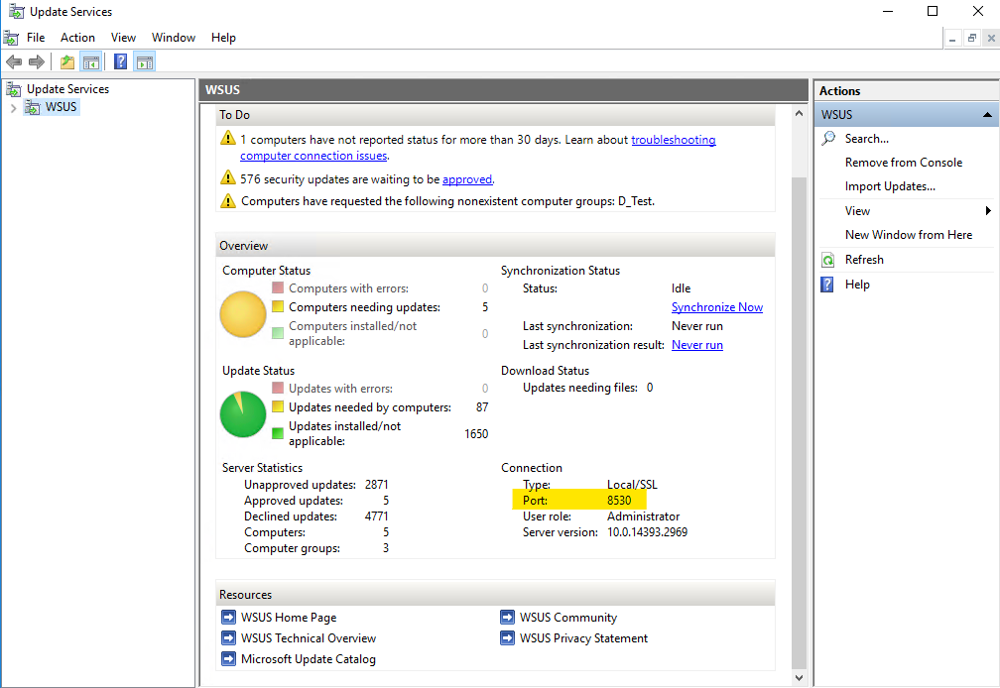

みなさま、こんにちは。WSUS サポート チームです。  

今回は WSUS で使用するポートを既定のポート 8530 / 8531 番から **80 番**に変更している環境において、**2017 年 7 月以降にリリースされたマンスリー品質ロールアップ (KB4025331 / KB4025336 以降 )** を適用した場合に発生する事象についてご案内します。  

本事象が発生した場合には、後述の手順を実施することで、事象を改善することができますので、ご確認くださいますようお願い申し上げます。なお、WSUS で使用しているポート番号については、WSUS 管理コンソールの以下の画面よりご確認ください。  

  

### 対象製品

・Windows Server 2012 の WSUS  
・Windows Server 2012 R2 の WSUS  

### 概要

HTTP 80  ポートで構成している WSUS サーバーに対して、手動や Windows Update によって対象の更新プログラムを適用した後に、クライアントからの更新プログラムの検出処理でエラー **0x8024401f / 0x80244008** が発生します。  

### 原因

WSUS へ対象の更新プログラムを適用すると、クライアント Web サービスにて ASP. NET Webサービスではなく WCF が用いられるようになります。この変更の一環として WSUS を動作させるために、Web サイトに対して HTTP と HTTPS の両方のポート番号のバインド設定が必要となりますが、更新プログラムを適用する以前から 80 番 (HTTP) を利用している環境では、443 番 (HTTPS) がバインドされていないために本事象が発生します。  

なお、2017 年 7 月以降のマンスリー品質ロールアップには、この WSUS に対する更新が含まれますため、ご注意ください。  

### 対処方法

更新プログラムを適用した状態で、WSUS サーバーに付属する wsusutil コマンドを実行し、いったん既定のポート (8530 / 8531) に戻したうえで、改めて 80 /443 番ポートに変更します。なお、本手順による WSUS サーバーへの影響はございません。  

コマンド プロンプトを管理者権限で実行します。
以下コマンドを実行し、既定のポート (8530 / 8531) に戻します。  

```text
“C:\Program Files\Update Services\Tools\wsusutil.exe” UseCustomWebSite true
```

以下コマンドを実行し、あらためて 80 / 443 番ポートに変更します。

```text
“C:\Program Files\Update Services\Tools\wsusutil.exe” UseCustomWebSite false
```
