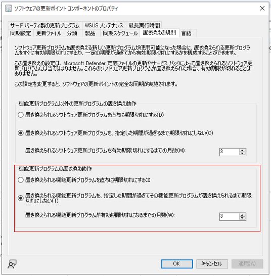
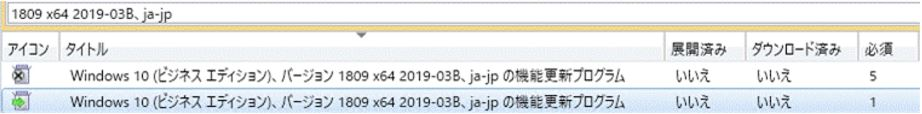
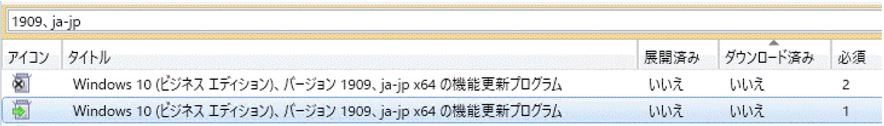

みなさま、こんにちは。Configuration Manager サポート チームです。  
Microsoft Endpoint Configuration Manager (以下 MECM) 環境において、Windows 10 の機能更新プログラムを展開後に、展開が削除される事象についてご説明いたします。  

# 事象

機能更新プログラムが再リリースされた場合、新しい機能更新プログラムによって置き換えられる展開済みの古い機能更新プログラムのリリース日が古い場合、`[機能更新プログラムの置き換え規則]` によって期限切れとなり、古い機能更新プログラムの展開が削除される場合があります。  
最近では、CVE-2020-16908 の脆弱性対応のため、Windows 10 1809 / 1909 の機能更新プログラムが再リリースされました。(2020/10/14)  

## 置き換え規則の設定箇所

[管理] -> [サイトの構成] -> [サイト] -> [サイトコンポーネントの構成] -> [ソフトウェア更新ポイント] -> [置き換えの規則]

【機能更新プログラムの置き換え動作】  
設定値：置き換えられる機能更新プログラムを、指定した期間が過ぎてその機能更新プログラムが置き換えられるまで期限切れにしない。  
置き換えられる機能更新プログラムが有効期限切れになるまでの月数：3 (既定)  

「置き換え規則」による期限切れの判定 は、更新プログラムのリリース日が起点となりますので、上記設定 (3 ヶ月) の場合 2019 年 11 月 13 日にリリースされた古い機能更新プログラムは、2020 年 10 月 14 日にリリースされた新しい機能更新プログラムによって置き換えられることで、リリース日から 11 ヶ月を過ぎていることになりますので、「期限切れ」となります。  
期限切れとなった場合、次のスケジュール同期のタイミングで既存の展開が削除され、7 日後に非表示となります。  

# 対処方法について

再リリースされた機能更新プログラムを展開することで対処を行います。

## 手順

1. Configuration Manager コンソールより、[ソフトウェア ライブラリ]-[Windows 10 のサービス]-[すべての Windows 10 更新プログラム] を開きます。
2. 列を右クリックし、`[アイコン]` 列を追加します。
3. 緑色の矢印アイコンとなっている機能更新プログラムを確認します。
4. 機能更新プログラムを右クリックし、`[展開]` から展開作業を行います。

機能更新プログラムの検索例：

// Windows 10 1809 の場合

// Windows 10 1909 の場合

### 補足

古い機能更新プログラムを展開し続けたい場合は、上記の設定で最大 99 ヶ月まで閾値を変更できますので、そちらの設定値の変更をご検討ください。
