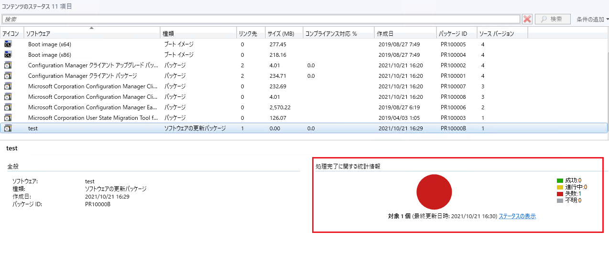

こんにちは。Configuration Manager サポートチームです。

本ポストでは、MECM から配信しているコンテンツのダウンロードが開始されないときのお役立ち情報をご紹介いたします。

 

MECM クライアントの CCMCACHEフォルダ内にダウンロード用のフォルダは作成されるのに、その中にファイルがいっこうにダウンロードされてこないというお問い合わせをよくいただきます。
(例：ソフトウェア センター上でダウンロードが 0 % のまま進まないなど)

 

ご利用環境で同様の問題が発生し原因の見当がつかない場合は、まずは MECM クライアントの ContentTransferManager.log で suspended という記録があるか確認してみてください。

ログの所在：
%windir%\CCM\Logs フォルダー

```
ContentTransferManager.log

----------------------------------------

CCTMJob::UpdateLocations - Received empty location update for CTM Job {320853F3-42B3-4D1C-9518-C1C7DA291B78}     201x/12/06 18:18:08  9020 (0x233C)

CTM job {320853F3-42B3-4D1C-9518-C1C7DA291B78} suspended       201x/12/06 18:18:08  9020 (0x233C)

----------------------------------------
```


suspended が記録されている場合は、(1) 境界、または境界グループの設定が不足しており、管理ポイントから利用可能な配布ポイントの情報を取得できない問題か、(2) 配布ポイントにコンテンツファイルがなくダウンロードできない問題に該当している可能性が非常に高いです。その場合は次の 2 つの確認を実施し、問題が解消するか確認してみてください。  

 

## (1) 境界と境界グループの確認
<br>


MECM クライアントが配布ポイントからコンテンツをダウンロードできるためには、予め対象のクライアントの IP アドレスが境界に含まれており、その境界を含む境界グループで利用可能な配布ポイントが紐づけられている必要があります。この設定が正しくされているかを次の方法で確認します。

1). ipconfig /all コマンドで問題の端末の IP アドレスとサブネット マスクを確認します。

2). MECM コンソールを起動して [管理] - [階層の構成] - [境界グループ] を開きます。

3). 複数の境界グループが存在する場合は、すべての境界グループを右クリックしてプロパティを開き、次の確認をします。

 

3)-①

[参照] タブに配布ポイントが登録されていることを確認します。


3)-②
[全般] タブに登録されている境界を確認します。


3)-②の境界に含まれるネットワーク ロケーションのクライアントがアクセスできる配布ポイントが 3)-① となります。

 

 

4). 正常に動作していないクライアントの IP アドレス、サブネット マスク、AD サイトを確認し、どれか 1 つでも、上記境界に含まれているか確認します。含まれていない場合は、次の手順で境界を作成して、ダウンロードさせたい配布ポイントが含まれる境界グループに登録してください。

 

4)-①. [管理] - [階層の構成] - [境界] を右クリックして [境界の作成] をクリックします。

4)-②. 正常に動作していないクライアントの IP アドレスを含むように境界を作成します。(IP アドレスの範囲か IP サブネットで登録することになるかと存じます。)

4)-③. [管理] - [階層の構成] - [境界グループ] でダウンロードさせたい配布ポイントを含む境界グループを右クリックしてプロパティを開きます。

4)-④. [全般] タブで [追加] をクリックして、作成した境界を追加し、[OK] をクリックします。

 

その後ダウンロードが進むか確認します。

 

<ご参考>

Configuration Manager の境界としてネットワークの場所を定義する

https://docs.microsoft.com/ja-jp/sccm/core/servers/deploy/configure/boundaries

 

Configuration Manager の境界グループを構成する

https://docs.microsoft.com/ja-jp/mem/configmgr/core/servers/deploy/configure/boundary-groups

<br>

## (2) 配布ポイントのファイル確認 (展開パッケージのコンテンツ ステータス)

<br>
1). [監視] – [概要] – [配布ステータス] - [コンテンツのステータス] を開きます。

2). パッケージの中から、展開対象とするコンテンツが含まれるパッケージをクリックして、右ペイン下部の配布ポイントのステータスを確認します。

緑の円グラフになっていなかった場合は、配布ポイントへのコピーが失敗しています。



その場合は該当の展開パッケージを右クリックして [配布ポイントの更新] をクリックしてください。


その後ダウンロードが進むか確認します。


\- 免責事項

このドキュメントは現状有姿で提供され、 このドキュメントに記載されている情報や見解 (URL 等のインターネット Web サイトに関する情報を含む) は、将来予告なしに変更されることがあります。 お客様は、その使用に関するリスクを負うものとします。

