みなさま、こんにちは。Configuration Manager サポート チームです。  

本日は Configuration Manager (CM) の便利な機能である**スクリプト機能**のご紹介をさせていただきます。本機能により CM 管理下の端末にリアルタイムに遠隔からスクリプトを実行させることが出来ます。

# 該当機能のドキュメント

Configuration Manager コンソールから PowerShell スクリプトを作成して実行する
https://docs.microsoft.com/ja-jp/mem/configmgr/apps/deploy-use/create-deploy-scripts

# 機能の説明

CM サーバーから CM コンソールを使って、デバイス単位、コレクション単位に指定したowershell を、**リアルタイム**に実行する機能です。同じことは Enter-PSSession コマンドレットを使えば出来ますが、本機能は複数のデバイスに対して Powershell を実行できることに強みがあります。また、Intuneによるスクリプト配布機能もありますが、こちらの方がオンデマンドな処理を行う際には便利です。

# ユースケース

Powershell で実現できることは何でも出来ますが、CM 管理者であれば例えば以下のような点で利用出来るでしょう。

1. 一時的に、デバイスのレジストリの値を採取する。定期的な回収が必要ではないようなものには便利。(定期的な回収はハードウェア インベントリを利用したほうが良い)
2. あるデバイスから、あるサーバーへのネットワーク到達性のチェック。HTTPリクエストが通るか、デバイスに対してポートが開放されているか、はたまたデバイスでサーバーのURLへの名前解決が可能かどうか、などをチェックする。
3. CM クライアントの状態チェック。あるソフトウェア センターの表示状態のアイテムの確認。

# 利用に当たっての推奨事項

「大いなる力には大いなる責任が伴う」の言葉通り、何でも出来るということはセキュリティ上のリスクでもあります。ご利用の組織のポリシーに従って、明確なルールを制定してご利用ください。

以下、ご利用に当たっての推奨事項になります。

## スクリプトの承認プロセスを設ける

スクリプトの作成者と承認者で担当者を分け、CM にスクリプトを追加する前に承認が必要なようにしましょう。
なお、CM コンソール上の既定の設定では、作成者が直接承認を行えないよう、
以下のフラグが有効化されています。  

[CMコンソール]-[管理]-[概要]-[サイトの構成]-[サイト]-対象のサイトを選択-[階層設定]-[全般タブ]-「スクリプトの作成者には追加のスクリプト承認者が必要」

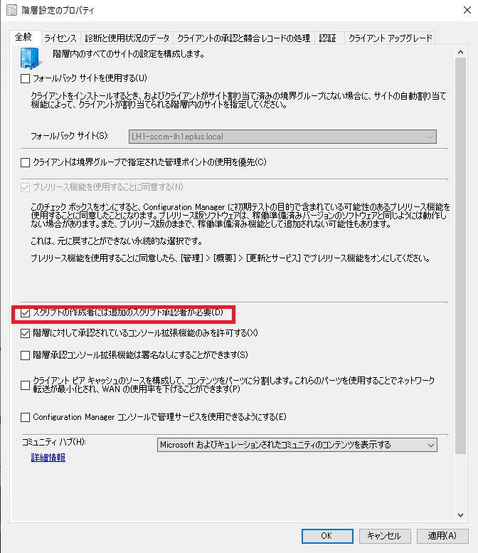

## 承認ルールを定める

スクリプトの承認者が判断に迷わないよう、承認に当たってルールを決めておきましょう。例えば、以下のようなルールが考えられるかと思います。

- CM クライアントに対して変更処理が入るようなスクリプトは承認しない
  - 例: ファイルの作成、機能の有効化、レジストリ値の変更、等

- 操作誤りによりインフラに影響を与えるようなスクリプトは承認しない
  - 例: 複数クライアントによる負荷テスト

## 実行ルールを定める

CM としてはスクリプトの実行後、特に証跡が残るような仕組みは用意されておりません。また、実行にあたっての承認プロセスを実装する仕組みもまた、提供されておりません。

お客様のポリシーに依るかと存じますが、ポリシー上、厳密な管理を要求される場合であれば、スクリプトの実行記録について台帳等で記録を残す
る、スクリプト実行前後に承認プロセスを用意する、等の実行ルールを定めると良いかと存じます。

# スクリプト作成のコツ

## スクリプトの結果は少ない文字数で標準出力しよう。

CMでスクリプトを実行すると、以下のように、デバイスごとに標準出力の内容が1行で出力されます。

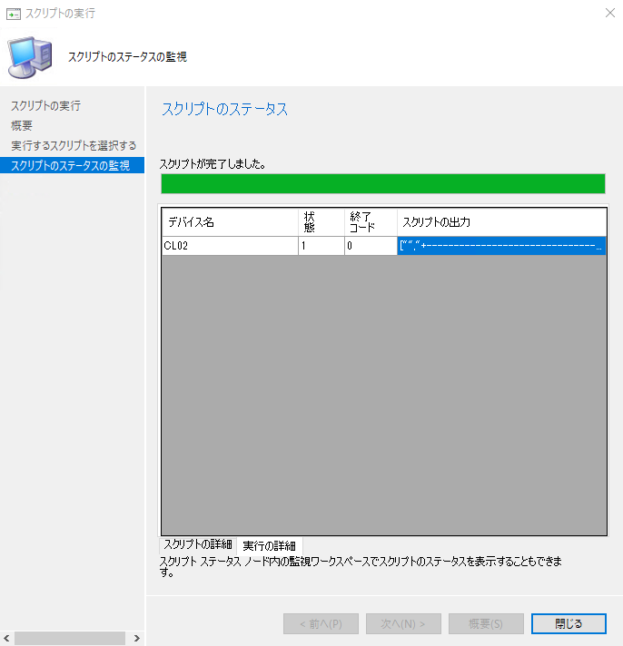

スクリプトの出力欄をダブルクリックすると、以下のように出力内容の詳細を確認できます。

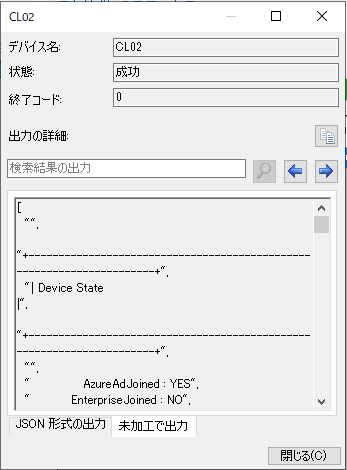

コレクションに対する実行結果を一覧で見たい時などは、上記の例のような出力だと比較が難しいので、スクリプトの実行目的に従って、出力結果の文字数を制限するようにしましょう。

例えば、以下のような形が良いかと存じます。この例では、.Net FrameworkのVersionを確認するためのスクリプトを実行し、結果を短い文字列で出力するようにしています。

なお、スクリプトを上手く作ると、実行結果を出した後、「概要」タブを選択することで、出力結果を以下のようにグラフ表示できます。

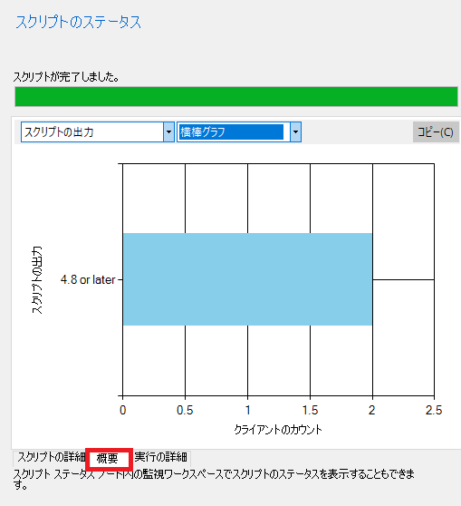

## 実行失敗時は終了コードを0以外の数値を出力しよう。

上記のスクリーンショットで示したとおり、「スクリプトの出力」で表示される文字数は限定されていますので、実行時エラーもスクリプト出力に表示させると一覧性が悪化します。
代わりに、想定されるエラー発生時のエラーコードを決め、エラーコードを内部で保持し、対応する方が良いでしょう。

## パラメータを受け取る場合は、パラメーター内容の妥当性確認を実施しよう

スクリプト作成時に下記の通りParamを指定することで実行時パラメーターを指定することが出来ます。

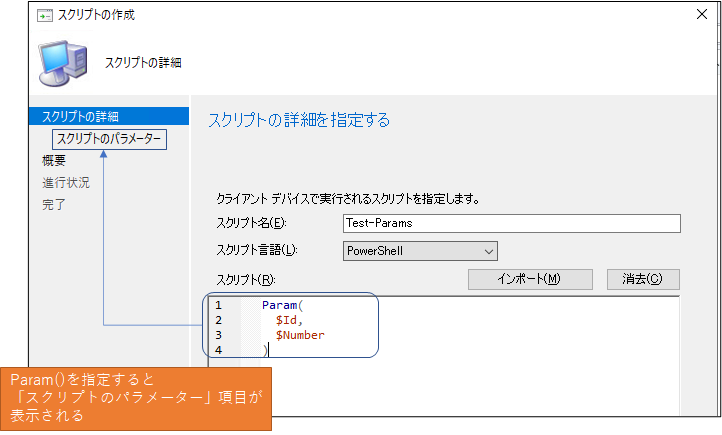

パラメーターを入力すると、下記画面で各パラメーターの妥当性確認を行います。正規表現も利用可能ですので、受け取ったパラメーターの妥当性を厳密に実施するようにしましょう。こちらで妥当性確認が出来ない内容についてはスクリプト側で確認するようにしましょう。

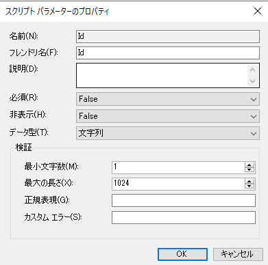

## スクリプトをCMコンソールに登録する前に開発環境でテストしよう

お客様のポリシーによりますが、本番環境に置いては、上記の通りスクリプトの登録時に承認プロセスがある筈ですので、CMコンソールで実施する前に開発環境で十分にスクリプトをテストしてからスクリプトを登録するようにした方が良いかと存じます。ちょっとしたスクリプトの修正で承認プロセス通してたら時間がかかってしまいますので･･･。

# スクリプトの作成手順

**以下、パラメーターを指定しない場合の**、スクリプト 作成者による CM コンソールでのスクリプトの作成手順は以下の通りです。

1. **スクリプト作成者**の ID で CM コンソールが動く端末にログインします。
2. [CMコンソール]-[ソフトウェア ライブラリ]-[概要]-[スクリプト]に遷移します。
3. [スクリプトの作成]をクリックします。
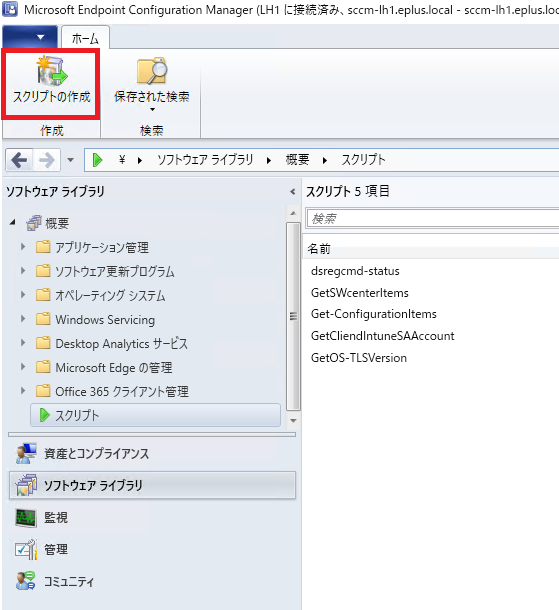
4. 「スクリプト名」に適宜名前を付けます。
5. 「スクリプト」にスクリプトを書きます。「インポート」でps1ファイルから読み込む事も出来ます。

6. 以降はウィザードに従って、最後まで「次へ」をクリックし、完了後「閉じる」をクリックします。

# スクリプトの承認手順

1. **スクリプト承認者**の ID で  CM コンソールが動く端末にログインします。
2. [CMコンソール]-[ソフトウェア ライブラリ]-[概要]-[スクリプト]に遷移します。
3. スクリプト作成者から報告のあったスクリプトの名前を選択します。「承認状態」が「承認を待っています」となっていることからも判断出来ます。
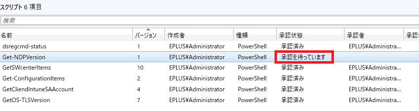
4. 画面上部「承認/拒否」ボタンをクリックします。

5. 起動したウィザードにて、スクリプト内容を確認、レビューします。
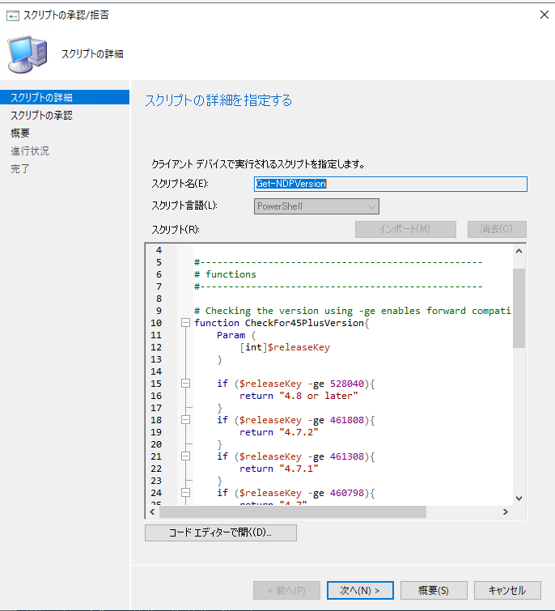
6. レビュー結果を記載します。適宜レビューコメントを入力できます。
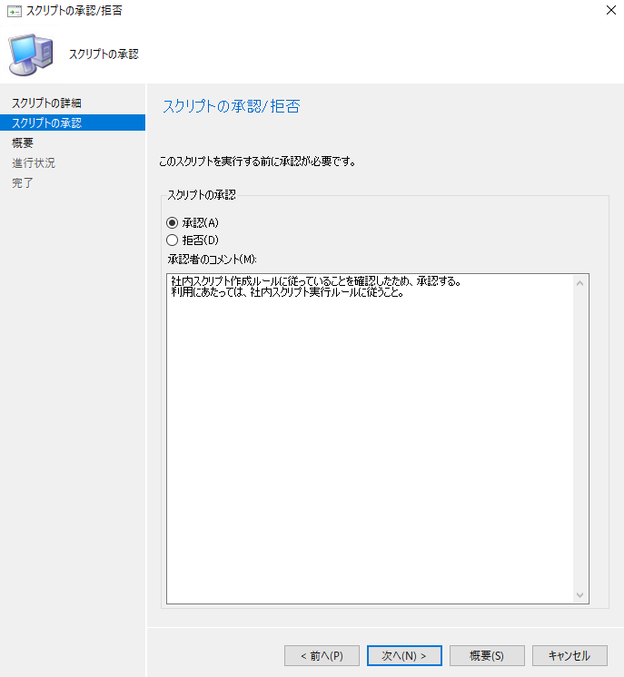
7. 以降はウィザードに従って、最後まで「次へ」をクリックし、完了後「閉じる」をクリックします。
8. 登録完了後、該当のスクリプトが「承認済み」となっていることを確認します。
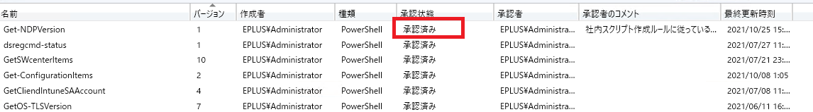

# スクリプトの実行手順

1. スクリプトの実行権限を持つIDで、CMコンソールが動く端末にログインします。
2. スクリプトの実行対象によって以下を選択します。
- [CMコンソール]-[資産とコンプライアンス]-[概要]-[デバイス]
- [CMコンソール」-[資産とコンプライアンス]-[概要]-[デバイス コレクション]
3. 実行対象を右クリックすると、「スクリプトの実行」メニューがあるので、そちらをクリックします。  

4. 実行するスクリプトを選択し、「次へ」をクリックします。
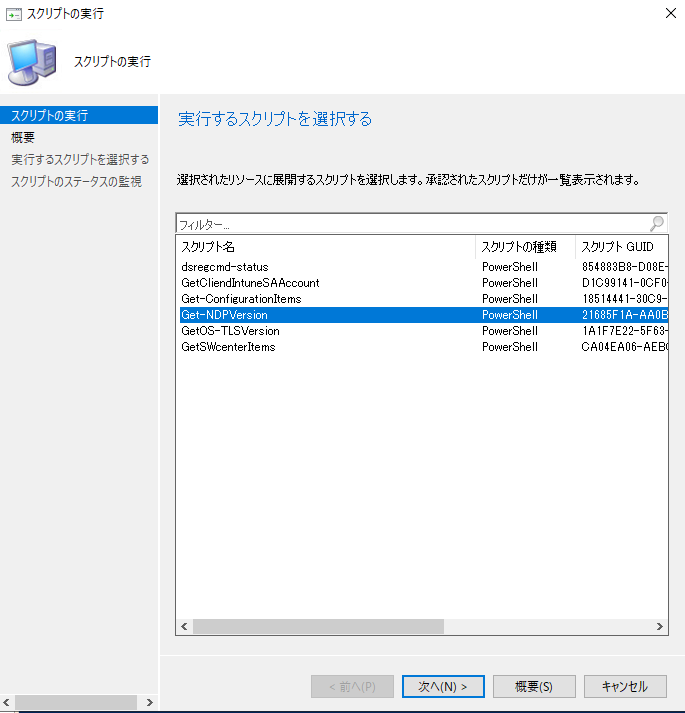
5．概要画面で「次へ」を選択します。

6. 実行が完了するのを待機します。オンデマンドで指定したクライアントに対してスクリプトを配布し、実行し、その結果を表示しますので時間がかかります。
7. 実行結果を確認します。適宜、結果をスクリーンショット等に取りましょう。
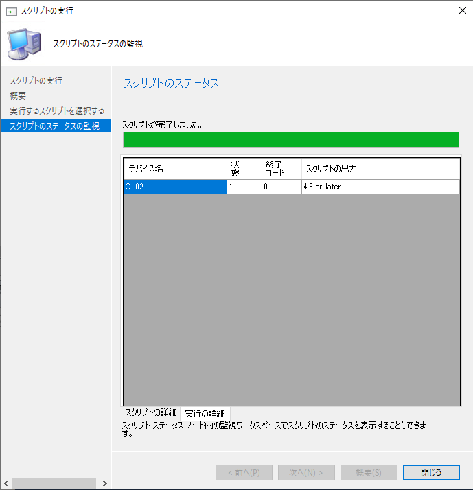
8. 出力セルを選択した後、「Ctrl+A」を押下して、メモ帳等に貼り付けると結果をテキスト形式で取得できます。
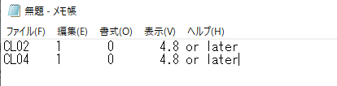
9. ウィザードを適宜閉じます。

