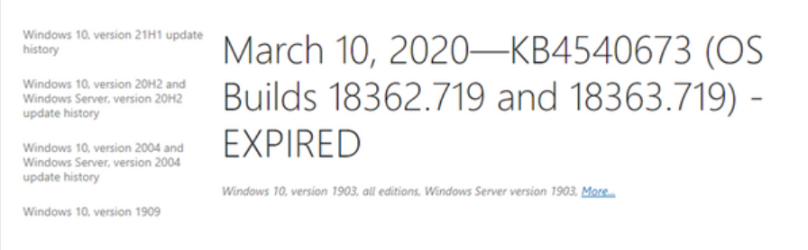
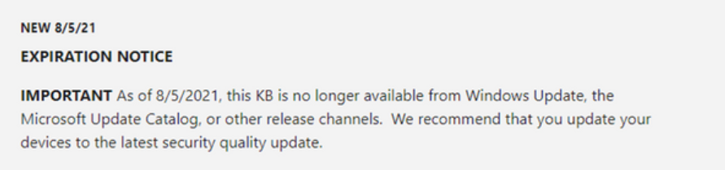

Microsoftは、サポートされているWindowsプラットフォームごとに毎月2〜3つの更新プログラムを作成しています。
これにより、更新のバックログが発生し、更新パッケージのサイズが大きくなる可能性があります。
ただし、これらの更新の多くは累積的であり、そのプラットフォーム用に公開された以前のすべての更新が含まれています。
つまり、古いパッケージの有効期限が切れても、累積的な更新をインストールすることで、それらのパッケージに含まれている更新を引き続き受け取ることができます。

古い冗長パッケージを期限切れにすることで、パフォーマンスが向上し、スキャン時間が短縮され、ユーザーエクスペリエンスが向上し、新しい、より安全な更新に置き換えられた古い更新を展開するリスクが軽減されます。 
WindowsUpdate の有効期限ポリシーに関してよく寄せられる質問への回答は次のとおりです。

## 更新パッケージはどのくらいの頻度で期限切れになりますか？

公開されたパッケージは、定期的に有効期限が評価されます。十分な数の候補者が見つかると、有効期限が切れます。

## 古いアップデートの有効期限が切れていないのはなぜですか？

一部の古いパッケージは、まだ評価されていないか、有効期限の基準を満たしていない可能性があります。
その特定の更新への既存の依存関係のために、それらがまだ期限切れになっていない可能性もあります。

## 有効期限が切れないパッケージはありますか？

Windows 8.1、Windows Server 2012 SP2、Windows Server 2012、Windows 7 SP1、Windows Server 2008 R2、およびWindows Server 2008 SP2 のセキュリティのみの更新パッケージは、累積的ではなく、1か月分の修正しか保持されていないため、有効期限はありません。
さらに、最新の更新パッケージが古いパッケージに依存している場合、古いパッケージは、新しいパッケージに置き換えられるまで期限切れになりません。

## アップデートの有効期限が切れているかどうかを確認するにはどうすればよいですか？

更新の有効期限が切れている場合は、support.microsoft.com の特定の更新に関連するリリースノート記事のタイトルに「EXPIRED」という単語が追加されています。

記事の上部にも有効期限の通知があります。

Windows Server Update Services（WSUS）を使用している場合、特定の更新プログラムの有効期限が切れていると、詳細ウィンドウの上部にバナーが表示されます。

注：このポリシーは、WindowsUpdate にのみ適用されます。他の Microsoft ソフトウェアまたはファームウェアの更新には異なるポリシーがある場合があるため、個別に検討する必要があります。