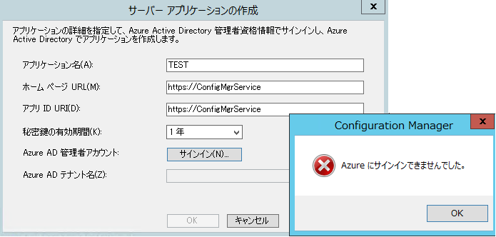
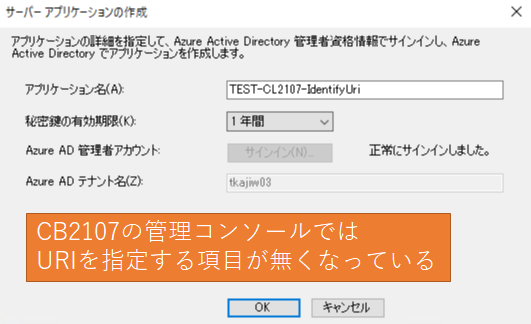

みなさま、こんにちは。Configuration Manager サポート チームです。  

本日は、10/15に Azure AD Applicationの仕様が一部変更されたのに伴い、Configuration Manaer (CM) 側で
「クラウド管理」の Azure サービスが利用する Azure AD アプリケーションを作成する際の仕様変更についてご連絡致します。

なお、上記 Azure サービスは主にクラウド管理ゲートウェイ関連で利用することが多いものでございます。

# 仕様変更の内容

以下の記事の通り、Azure アプリケーションを作成する際に指定する App ID URI のフォーマット形式が変更となりました。

https://docs.microsoft.com/en-US/azure/active-directory/develop/reference-breaking-changes#appid-uri-in-single-tenant-applications-will-require-use-of-default-scheme-or-verified-domains

# 影響を受ける範囲

すでに作成済みの Azure サービスは影響を受けません。そのまま利用可能でございます。

影響を受けるのは、
Configuration Manager Current Branch (CM CB) 2103 以前で「クラウド管理」のアプリケーションを作成する場合となります。

# 対処方法

Configuration Manager Current Branch (CM CB) 2103 以前で、新規に「クラウド管理」アプリケーションを作成する際の、 "Web App" を指定する際の、URIの形式を下記サイトでもご案内している通り、デフォルトの形式https://ConfigMgrService に近い文字列ではなく、以下のフォーマットに従った文字列を指定くださいますようお願い致します。

- api://{tenantId}/{string}
- https://{verifiedCustomerDomain}/{string}

https://docs.microsoft.com/en-us/mem/configmgr/core/clients/manage/cmg/configure-azure-ad#create-the-web-server-app-registration

- {tenantId}: アプリケーションを作成する対象の Azure AD のテナント ID を指定ください。  
  [Azure Portal]- [Azure Active Directory] - [概要] から確認できます。
- {verifiedCustomerDomain}: アプリケーションを作成する対象の利用可能なカスタム ドメインを指定ください。  
  [Azure Portal]- [Azure Active Directory] - [カスタム ドメイン名] から確認できます。
- {string}:　自由な文字列を指定ください。ただし、他の Azure AD アプリケーションと URI が重複しないようにする必要がございます。

※例: 
- api://a8573488-ff46-450a-b09a-6eca0c6a02dc/ConfigMgrService
- https://contoso.onmicrosoft.com/ConfigMgrService

# 対処を行わない場合に発生する事象

上記形式に従わない URI を指定すると、正しい ID でログインしているのに ログイン エラーが発生します。

# CM CB 2107 以降の対応

CM CB 2107 以降については、本 URI の指定は以下のようにシステム側で自動的に行われるため、必要がございませんので、ご安心ください。

Azure AD アプリケーション画面から該当のURIが自動作成されていると確認できます。

