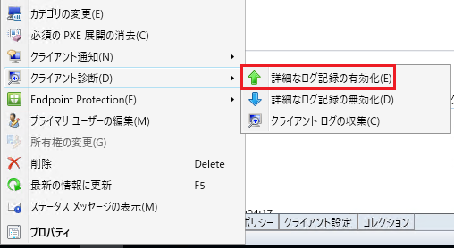
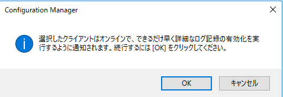
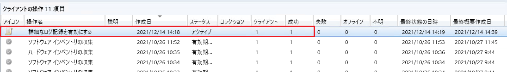

みなさま、こんにちは。Configuration Manager サポート チームです。  

本日は Configuration Manager (CM) コンソールから、クライアント端末のログを詳細化する方法についてご紹介させていただきます。
以下の方法でクライアント端末側から手動でログを詳細化することも可能でございますが、今回ご紹介する方法は Configuration Manager コンソール上から操作することが可能でございますので、用途に合わせて使い分けていただければ幸いです。

■MECM エージェント ログの詳細化方法について
https://jpmem.github.io/memlog/configmgr/logverbose/verbose_client.html 

  

# コンソール上の操作について

 1. デバイス一覧より対象デバイスを右クリックして [クライアント診断] - [詳細なログ記録の有効化] をクリックします。
 

2. 以下のウィンドウが表示されますので、OK をクリックします。

3. [監視] - [クライアントの操作] と辿り、成功していることを確認します。

 
※本情報の内容（添付画像を含む）は、作成日時点でのものであり、予告なく変更される場合があります。