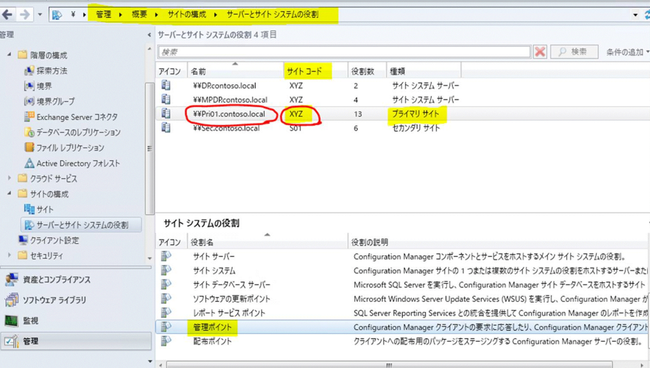

みなさま、こんにちは。Configuration Manager サポート チームです。

本日は、Configuration Manager を手動でインストールする基本的な手順について解説致します。

ご利用頂いているインストール手法が失敗する際などに、本手順によるインストールも失敗するのかを切り分ける方法として、ご活用下さい。

1. SCCM サイト サーバーから以下の "client" フォルダを丸ごとコピーし、クライアント端末のローカルの任意の場所に貼り付けます。

```text
C:\Program Files\Microsoft Configuration Manager\Client
```

2. クライアント端末にてコマンド プロンプトを管理者権限で開きます。

3. 以下のようなコマンドを実行し、クライアントをインストールします。

```bash
<Client フォルダをコピーしたパス>\client\ccmsetup.exe /source:<Client フォルダをコピーしたパス>\client  SMSSITECODE=<サイトコード> SMSMP=<プライマリサイトの管理ポイントサーバーの FQDN>
```

例えば、client フォルダのコピー先が、"c:\temp"で、サイトコードが "P01"、プライマリサイトの管理ポイントサーバーの FQDN が "sccm.contoso.com" の場合、以下のコマンドを実行します。

```bash
C:\temp\client\ccmsetup.exe /source:c:\temp\client SMSSITECODE=P01 SMSMP=sccm.contoso.com
```

※ サイトコードやプライマリサイトの管理ポイントサーバーの FQDN は、SCCM コンソールの以下の画面にてご確認いただけます。
[管理] > [概要] > [サイトの構成] > [サーバーとサイト システムの役割]



4. コマンドプロンプトを閉じます。

5. インストールが行われる間、クライアント端末のタスクマネージャーにて、ccmsetup が動作していることをご確認いただけます。
   インストールの完了は、以下のログにてご確認いただけます。

- ファイル場所
  C:\Windows\ccmsetup\logs\ccmsetup.log
  <br>
- ログ出力
  最後に、以下のログが出力されたことで、インストール完了と判断できます。

```text
CcmSetup is exiting with return code 0
```
