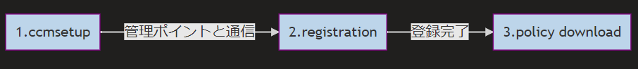

みなさま、こんにちは。Configuration Manager サポート チームです。

今回は Configuration Manager のクライアント インストール・登録がうまく行かない際にご確認頂きたいポイントについて、解説させて頂きます。

---

# クライアント登録の大まかな流れについて



1. ccmsetup（クライアント インストール）を実行します。
2. インストールが成功すると、管理ポイントと通信し、クライアント登録を試行します。
3. 登録が完了すると、各種ポリシーをダウンロードします。
   これが成功すると、コントロール パネル > Configuration Manager の [操作] タブの各項目が表示されます。

クライアント登録がうまく行かない場合には、上記フロー中のどこかで失敗していることになりますので、以下の確認ポイントに沿って切り分けを行うことが有効です。

---

# クライアント登録がうまく行かない時の確認ポイント

## 1. ccmsetup.log の確認

まずは ccmsetup のログを確認しましょう。クライアント端末の下記のログファイルを開きます。
C:\Windows\ccmsetup\logs\ccmsetup.log

最終的な実行結果がご確認いただけます。正常であれば 0 となります。

```text
CcmSetup is exiting with return code 0
```

ここで 0 以外のコードで終了している場合には、ccmsetup が失敗している可能性がありますので、調査が必要となります。

## 2. ClientIDManagerStartup.log の確認

ccmsetup が return code 0 で終了していれば、インストール処理は問題なく完了していますので、次は登録処理の確認です。
クライアント端末の下記のログファイルを開きます。
C:\Windows\CCM\Logs\ClientIDManagerStartup.log

下記のような出力が確認できれば、クライアントの登録処理は成功していることがご確認いただけます。

```text
[RegTask] - Client is registered. Server assigned ClientID is GUID:XXXXXXXX-XXXX-XXXX-XXXX-XXXXXXXXXXXX. Approval status 1
```

## 3. 管理ポイントとの疎通確認

もし、ClientIDManagerStartup.log にて上記出力が確認できなかった場合には、管理ポイントとの通信状況を確認しましょう。

クライアント端末にて、PowerShell を開き、下記コマンドを実行します。

```powershell
Invoke-WebRequest -Uri "http://<管理ポイントの FQDN>/sms_mp/.sms_aut?mplist" -UseBasicParsing
```

正常にアクセスできる場合、StatusCode : 200 となります。
それ以外の場合には、クライアントと管理ポイントとの間で疎通できていない状態となりますので、ネットワーク観点で問題の特定を進める必要がございます。

## 4.管理ポイントとの疎通も問題がない場合

この場合には、詳細な調査が必要となることが想定されますので、弊社サポートへのお問い合わせをご検討下さいませ。
