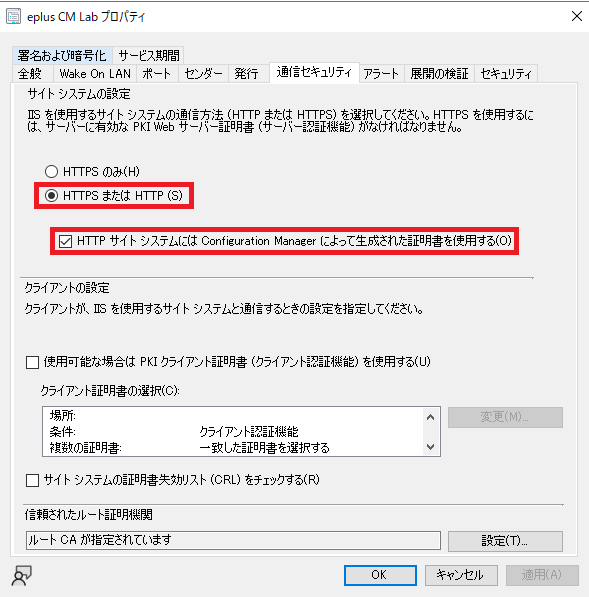
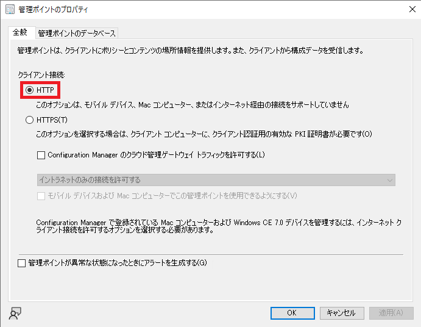
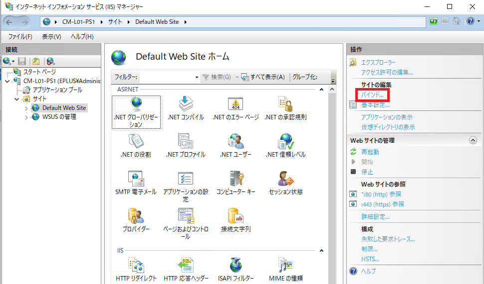
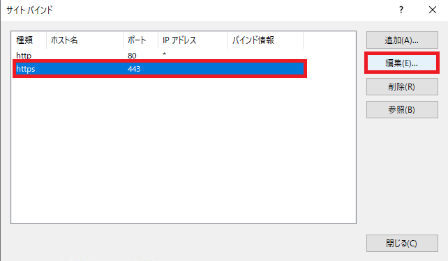
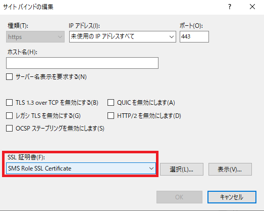

みなさま、こんにちは。Configuration Manager サポート チームです。本日は、Configuration Manager (CM) にて拡張 HTTP 接続が設定されているかどうかをサーバー側で確認する手順をご案内します。特に、HTTPS 接続方式から、拡張 HTTP 接続方式に変更された場合、IIS にバインドされている証明書が誤っている場合がございますので、心当たりのある方はご確認されるようお勧め致します。

拡張 HTTP について詳しくは下記URLをご参照ください。  

拡張 HTTP - Configuration Manager | Microsoft Docs  
https://docs.microsoft.com/ja-jp/mem/configmgr/core/plan-design/hierarchy/enhanced-http

# 拡張 HTTP 接続の確認方法

確認箇所は以下の 4 点となります。

1. サイト設定
2. 管理ポイント設定
3. 配布ポイント設定
4. IIS マネージャーのバインド設定

## サイト設定の確認

以下の画面を確認ください。

[CM コンソール] - [管理] - [概要] - [サイトの構成] - [サイト] - 対象のサイトを選択 - [プロパティ] - [通信セキュリティ] タブ

- サイト システ の設定にて、[HTTPS または HTTP] が選択されている。
- [HTTP サイト システムには Configuration Manager によって生成された証明書を使用する] にチェックが入っている。

## 管理ポイント設定

以下の画面を確認ください。このとき、下記の設定が「HTTPS」だと拡張 HTTP は使われず、PKI 証明書を使った HTTPS 通信が強制的に実施されますのでお気を付けください。

[CM コンソール] - [管理] - [概要] - [サイトの構成] - [サーバーとサイト システムの役割] - 対象のサイト システムを選択- 画面下部 - [管理ポイント] - [プロパティ] - [全般]タブ

 - クライアント接続に [HTTP] が選択されている

## 配布ポイント設定

以下の画面を確認ください。このとき、下記の設定が「HTTPS」だと拡張 HTTP は使われず、PKI 証明書を使った HTTPS 通信が強制的に実施されますのでお気を付けください。

[CM コンソール] - [管理] - [概要] - [サイトの構成] - [サーバーとサイト システムの役割] - 対象のサイト システムを選択- 画面下部 - [配布ポイント] - [プロパティ] - [通信]タブ

- 「クライアント コンピューターまたはモバイル デバイスがこの配布ポイントと通信する方法を指定します」にて [HTTP] が選択されている。

## IIS マネージャーのバインド設定

管理ポイント、 配布ポイント の役割を持つサーバーにて、「インターネット インフォメーション サービス (IIS) マネージャー」 を起動し、以下を確認ください。

1. [IIS マネージャー] - サーバーを選択 - [サイト] - [Default Web Site] - 操作タブ - 「バインド」

2. [https] を選択し、[編集] ボタン をクリック。

3. [SSL 証明書] として、「 SMS Role SSL Certificate 」が選択されている。

### バインド設定の修復方法

もともと、HTTPS 形式を通信方式として設定されていた場合、バインド 設定にて PKI 証明書が設定されていて、変更しようとしても、選択肢に 「SMS Role SSL Certificate」 が表示されていない場合がございます。その場合は、下記手順にて修復できますので、お試しくださいませ。

1. IIS マネージャーを起動ください。
2. [サイト] - [Default Web Site] を選択し、画面右カラムから「バインド」 を選択してください。
3. 「https」 を選択し、「削除」 を実施ください。
4.  [CMコンソール] - [管理] - [概要] - [サイトの構成] - [サイト] - 対象のサイトを選択 -「プロパティ」 を選択ください。
5. 「通信セキュリティ」 タブで 「 HTTP サイトシステムには Configuration Managerによって生成された証明書を使用する」 のフラグを一度、無効化し、画面右下の「適用」ボタンをクリックください。
6. 1 分程度お待ちください。
7. 「HTTP サイトシステムには Configuration Manager によって生成された証明書を使用する」 のフラグを再度有効化し、
   画面右下の「適用」ボタンをクリックください。
8. SMS_EXECUTIVE サービスを再起動ください。
9. 数分待機ください。
10. 再度 IIS マネージャーを起動ください。
11.  [サイト] - [Default Web Site] を選択し、画面右カラムから「バインド」 を選択してください。
12. 削除していた「https」のバインドが復帰していることを確認ください。
13. 「https」 のバインドの中身を確認し、SSL 証明書として「SMS SSL Role Certificate」が選択されていることを確認してください。

