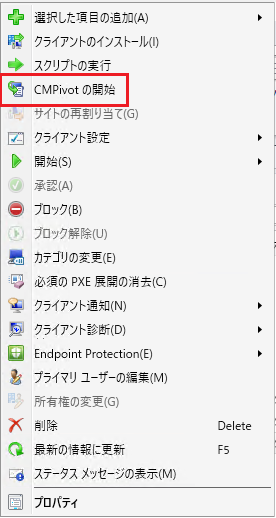
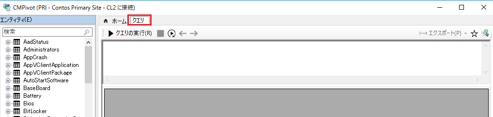
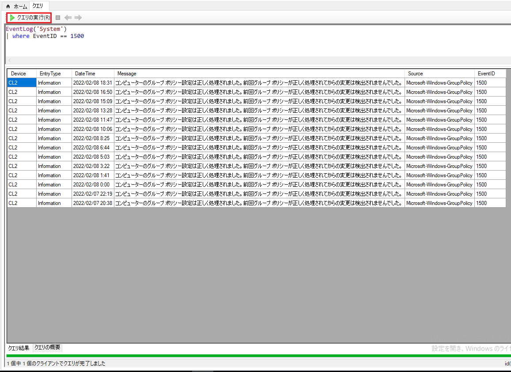

みなさま、こんにちは。Configuration Manager サポート チームです。
  
  
本日は CMPivot についてご紹介させていただきます。
  

CMPivot とは・・・Configuration Manager コンソールからクエリを実行し、リアルタイムでクライアントの情報を取得できる、とても優れた機能です！

参考公開情報  
Title : CMPivot の概要  
URL   : https://docs.microsoft.com/ja-jp/mem/configmgr/core/servers/manage/cmpivot-overview

今回は例として、特定のイベントログを抽出する方法について記載させていただきますので、ぜひお試しください。  


# コンソール上の操作

 1. デバイス一覧より対象デバイス（またはデバイスコレクション）を右クリックして [CMPivot の開始]  をクリックします。



 2. 以下の画面が表示されますので、[クエリ] タブに移動します。


 3. クエリを記載します。以下はシステムイベントログの ID 1500 を抽出するクエリです。
  
```
EventLog('System')  
| where EventID == 1500  
```
 ※イベントログは既定で 24 時間以内のログを抽出しますので、3 日以内など日数をしたい場合は以下のようにクエリを作成します。  
  
```
EventLog('System',3d)  
| where EventID == 1500  
```


 4. [クエリの実行] をクリックし、結果が得られたら成功です。



# 注意点

CMPivot を使用いただくにあたり、前提条件やアクセス許可などが必要がございますので、あらかじめご承知おきいただきますようお願いいたします。

参考公開情報  
Title : 前提条件  
URL   : https://docs.microsoft.com/ja-jp/mem/configmgr/core/servers/manage/cmpivot#prerequisites

※本情報の内容（添付画像を含む）は、作成日時点でのものであり、予告なく変更される場合があります。