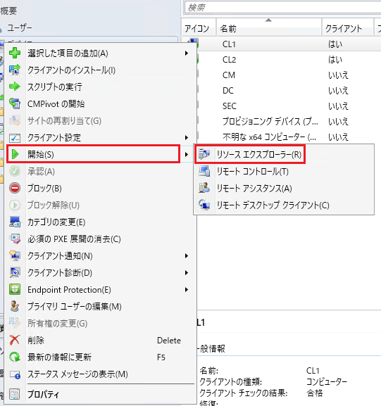
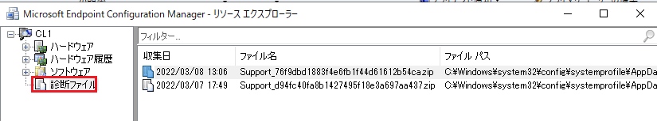
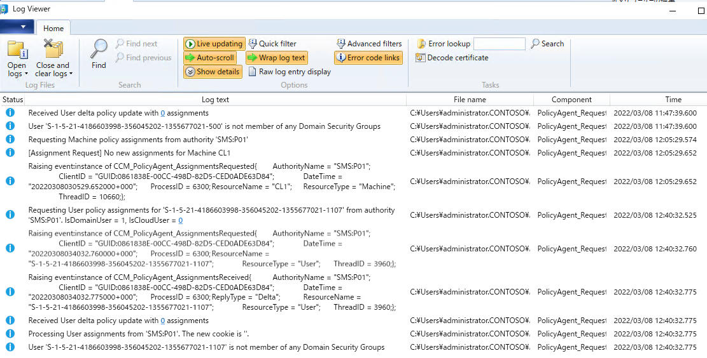
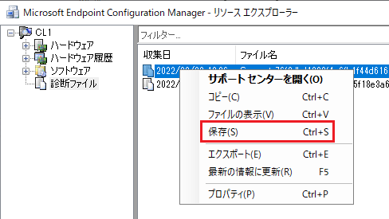
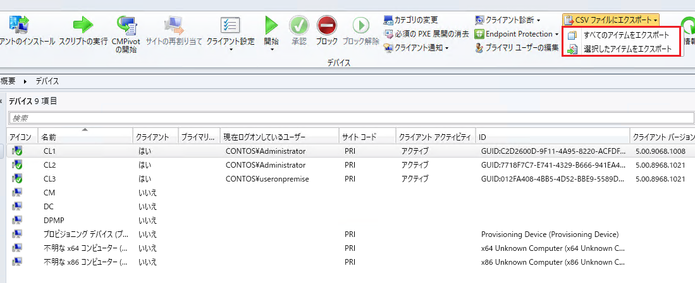
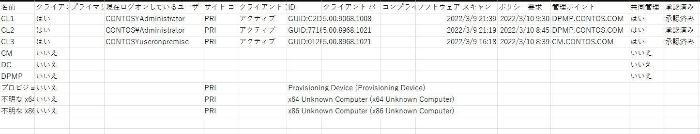
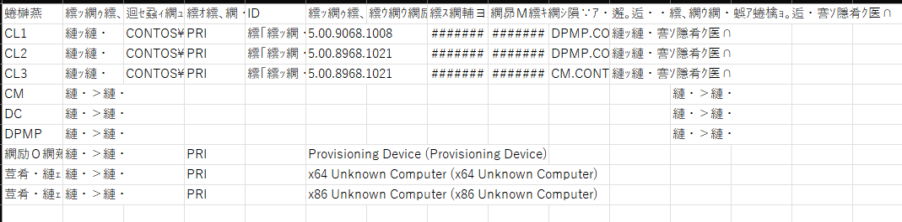

みなさま、こんにちは。Configuration Manager サポート チームです。
  
本日は Configuration Manager の便利な機能について、以下 2 点についてご紹介させていただきます。

```
a. クライアントのログを Configuration Manager コンソールから収集する機能
b. CSV へのエクスポート機能
```

a は何らかの状況でクライアントの操作が出来ない際に、MECM コンソール上からクライアントのログを確認したい、もしくは採取したい時に有効な機能です。  
b は Configuration Manager 2111 から追加された機能で、デバイスやユーザーの一覧を CSV にエクスポートすることが可能です。  
それぞれの手順について以下に記載させていただきますので、ぜひご活用ください。
  

# a. クライアントのログを Configuration Manager コンソールから収集する機能

1. Configuration Manager コンソールを開き、[資産とコンプライアンス] > [概要] > [デバイス] を開き、クライアント ログを収集したいデバイスを選択します。


2. 選択したデバイスを右クリックし、[クライアント診断] > [クライアント ログの収集] を選択します。


3. 下記の警告が表示されますので、[OK] を選択します。


4. [資産とコンプライアンス] > [概要] > [デバイス] に戻り、手順 2 のデバイスを選択し、右クリックから [開始] > [リソース エクスプローラー] を選択します。

  


5. [リソース エクスプローラー] が開きますので、左側ペインから [診断ファイル] を選択します。右側ペインに収集した診断ファイルが表示されます。表示されない場合は少し待ち、再度表示されるまで待ちます。


6. 診断ファイルを選択し、右クリックから [サポート センターを開く] を選択します。


7. Configuration Manager Support Center Viewer が起動しますので、確認したいログをダブルクリックすると以下のようにログが表示されます。
下図は PolicyAgent.log を表示した画面です。


8. 採取したログを保存したい場合は手順 6 で [保存] を選択します。



# b. CSV へのエクスポート機能

1. デバイスやユーザーなど、CSV にエクスポートしたい対象の一覧を表示します。
2. 画面上部にある [CSV ファイルにエクスポート] から [すべてのアイテムをエクスポート] もしくは [選択したアイテムをエクスポート] を選択します。

3. [名前を付けて保存] 画面が表示されますので、任意の場所を選択し、[保存] を選択します。 
4. CSV ファイルを開くと、Configuration Manager コンソール上で閲覧できている状態の情報が表示されています。


```
■注意事項  
エクスポートした CSV ファイルを開くと文字化けしている場合がございます。  
その場合は、以下の手順で直すことが可能です。  

a. CSV ファイルを右クリックし、[プログラムから開く] - [メモ帳] を選択します。  
b. メモ帳が開かれたら、[ファイル] - [名前を付けて保存] を選択します。
c. 画面右下の [エンコード] を [ANSI] に変更し、上書き保存します。
d. 再度 CSV ファイルを開き、文字化けが改善され、正常に表示されていることを確認します。
```

◆  文字化けしている CSV ファイルの例  

  

参考公開情報  
Title : CSV へのエクスポート  
URL : https://docs.microsoft.com/ja-jp/mem/configmgr/core/servers/manage/admin-console-tips#export-to-csv


※本情報の内容（添付画像を含む）は、作成日時点でのものであり、予告なく変更される場合があります。