みなさま、こんにちは。Configuration Manager サポート チームです。本日は、Configuration Manager (CM) にて提供される共同管理機能についてご案内します。  
なお、下記は MECM CB 2111 を前提に記載しておりますのでご留意くださいませ。また、MECM CB 2107 より共同管理機能は「クラウドの接続 (Cloud Attach)」と名前を変更しておりますが、本記事では従来通り「共同管理」の名前を継続利用しておりますのでご承知置きくださいませ。

# 共同管理機能とは

共同管理機能は、同様の機能を持つ CM と Intune について、重複する機能は、どちらかの機能を使い、重複しない機能についてはそれぞれの機能を利用を可能にする機能のことです。本機能は、CM と Intune のみで利用でき、他社 EMM 製品等とは組み合わせられない機能です。また、クライアントがイントラネットに接続している時は CM を使い、 インターネットに接続している時は Intune を使うと言った、Location aware を実現する機能ではございませんので、ご注意ください。インターネット経由で CM の管理下に置く場合、通常、クラウド管理ゲートウェイが必要となります。(なお、ここで言うインターネット経由とは VPN で接続されている環境は通常省きます)  

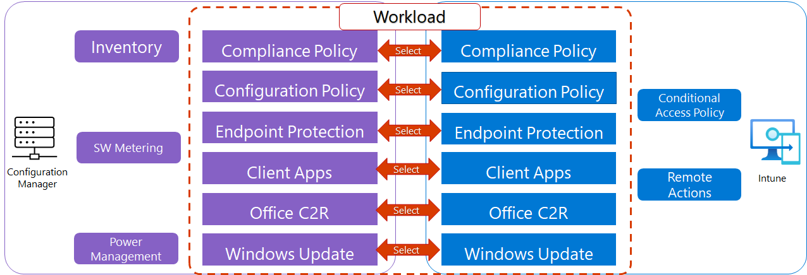

## よくあるユースケース

共同管理機能を使われるユースケースとしては以下のものが挙げられます。

1. スマートフォン等と同一の製品でWindows端末を管理したい。多くの機能は Intune で十分だが、OS の更新プログラムは細やかに管理したいので CM の更新プログラム配布機能を継続利用したい。
2. Intune のインベントリ機能では必要な情報が収集できないので、CM のカスタマイズ可能なインベントリ機能を使ってより詳細な情報収集を行いたい。
3. CM の構成基準を使って Intune より細やかなポリシー制御を行いたい。
4. CM で十分に運用管理出来ているが、Intune の条件付き制御やリモート制御機能を使いたい。
5. 企業ネットワークに接続した際のインターネット回線帯域が限られているので、更新プログラムやアプリケーションの配布は CM の企業ネットワーク配布ポイントを活用したい。

## 共同管理機能の前提条件

共同管理機能の利用前提は以下でご案内しております。
よくあるご質問として、Azure AD Registered の端末が利用できるかのご質問がありますが、共同管理において Azure AD Registered の端末はサポートされておりませんのでご承知おきください。

共同管理とは  
https://docs.microsoft.com/ja-jp/mem/configmgr/comanage/overview#prerequisites

## ワークロード

ワークロード とは、CM と Intune で重複する機能群のことです。共同管理構成ポリシーでは、重複する以下の機能を CM と Intune のどちらで担当するかを設定する必要がございます。なお、一部のワークロードでは 設定次第で CM と Intune どちらでも利用が出来る場合がございますので、ご留意くださいますようお願い致します。

- コンプライアンス ポリシー
  -  本ワークロードを Intune 側に設定した場合でも、Intune 上で以下を設定することで、CM のコンプライアンス ポリシーを　Intune のコンプライアンス ポリシーの一部として利用できます。  
  [コンプライアンス ポリシー] - [コンプライアンス設定] - [Configuration Manager のコンプライアンス] - [Configuration Manager からのデバイス コンプライアンスが必要]  
  
- デバイス構成
  - 本ワークロードを Intune 側に設定した場合でも、CM 上で以下を設定することで、構成基準を継続して利用出来ます。  
  [資産とコンプライアンス] - [概要] - [コンプライアンス設定] - [構成基準] - 該当の構成基準を選択 - [プロパティ] - [全般]タブ - [共同管理のクライアントに対しても常にこの基準を適用する]  
  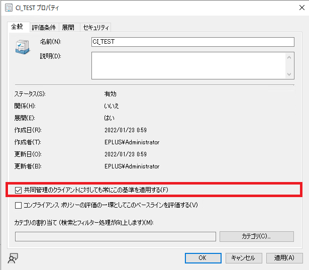
- リソース アクセス ポリシー
- Endpoint Protection
- クライアント アプリ
  - 本ワークロードを Intune 側に設定すると、 CM と Intune 両方のアプリケーションをダウンロード、インストール出来ます。CM 側に設定した場合は CM のアプリケーションのみが配布される形となります。
- Office クイック実行アプリ
- Windows Update のポリシー

## ワークロード外の機能

CM と Intune 間で重複しない以下の機能は共同管理を有効にすることで並行利用が可能となります。

- CM 
  - インベントリ
  - ソフトウェア利用状況
  - 電源管理
- Intune
  - リモート管理(リタイヤ、ワイプ)
  - 条件付きアクセス制御ポリシーの配布

# 共同管理構成の設定方法

共同管理構成の設定方法を以下でご案内します。なお、共同管理構成は CM 側でのみ設定可能で、Intune 側からは設定できませんのでご留意ください。

## 事前準備

共同管理構成のウィザードではいくつかの設定を同時に行う形となっております。事前に下記についてご検討くださいますようお願い致します。

1. Azure AD グローバル管理者権限を持ち、Intune ライセンスが割当たっているAzure AD ユーザーアカウントをご用意ください。
2. 共同管理構成を有効にする対象をご検討ください。すべてのデバイスを共同管理にする場合は特に検討は必要ございませんが、 一部のデバイスのみを対象にしたい場合は、そのデバイスが所属するデバイス コレクションを事前に設定する必要がございます。なお、本デバイス コレクションは1つだけしか割り当てられないのでご理解くださいますようお願い致します。
3. Intune 画面から CM の管理デバイスを操作する「テナントアタッチ」機能を全ての CM 管理デバイスを対象にするか、一部のコレクションのみを対象にするかどうか事前にご検討ください。  
    - Microsoft エンドポイント マネージャーのテナントのアタッチ: デバイスの同期とデバイスの操作  
    https://docs.microsoft.com/ja-jp/mem/configmgr/tenant-attach/device-sync-actions
4. デスクトップの利用情報等を分析できる「Endpoint Analytics」機能をご利用されるかどうか事前にご検討ください。後から設定変更も可能です。  
    - エンドポイント分析とは?  
    https://docs.microsoft.com/ja-jp/mem/analytics/overview
5. 共同管理構成を有効にしたタイミングで端末を Intune に自動登録させるか事前にご検討ください。一部デバイスのみを自動登録させる場合は該当のデバイスが所属するコレクションを作成ください。
6. 事前にワークロードの設定内容をご検討ください。「ワークロード」ステップで設定することになります。

## クライアントのネットワーク要件

- CM のポリシーとして共同管理構成は配布されるため、クライアントが CM の管理ポイントと接続出来る必要があります。
- Intune の自動登録を有効にする場合、Intune を提供する各サイトに接続できる必要がございます。下記 URL をご参考ください。  
Microsoft Intune のネットワーク エンドポイント  
https://docs.microsoft.com/ja-jp/mem/intune/fundamentals/intune-endpoints

## 実際の設定手順

1. CM サーバーに接続し、CM コンソールを起動します。
2. [CM コンソール] - [管理] - [概要] - [クラウド サービス] - [クラウドの接続] を選択します。  
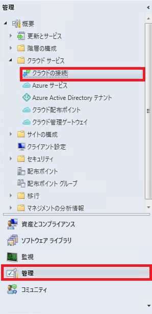
3. [クラウド接続の構成] を選択します。  
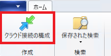
4. 「クラウド接続の構成」のウィザードが起動します。  
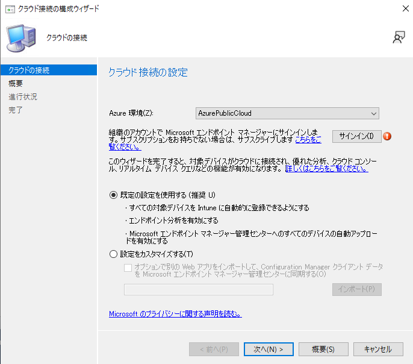  
5. Azure 環境として「AzurePublicCloud」が選択されていることを確認し、「サインイン」ボタンをクリックします。
6. Azure AD の認証が始まりますので事前準備したグローバル管理者権限でサインインします。  
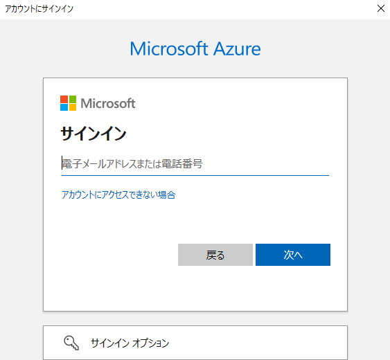  
7. 事前検討で全てのデバイスを Intune に自動登録できるようにする、Endpoint Analyticsを利用できるようにする、全てのデバイスをテナントアタッチを利用出来るようにする、ことを決定されている場合は「既定の設定を使用する(推奨)」を選択ください。以下では「設定をカスタマイズする」の選択を前提にウィザードを進めていきます。選択後、「次へ」をクリックください。
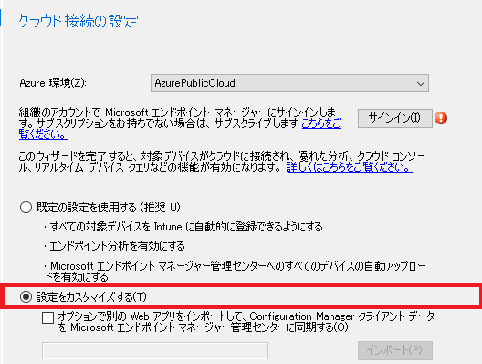  
8. 事前に検討された内容に従って、「テナントアタッチ」の対象を「Microsoft エンドポイント マネージャーにアップロードするデバイスを選択する」の項目を設定ください。
9. 事前に検討された内容に従って、「エンドポイント分析」の項目を設定ください。選択後、「次へ」をクリックします。
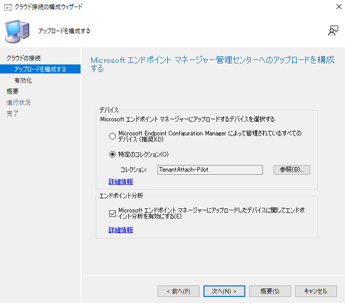  
10.  対象のデバイスを Intune に自動登録させる場合は、「Intune で自動登録」にて「すべて」か「パイロット」を選択して「次へ」を選択します。一部のコレクションのみを自動登録する場合は「パイロット」を選択し、事前に作成しておいたコレクションを指定します。自動登録させない場合は「なし」を選択します。選択後、「次へ」をクリックします。
  
11. 設定内容を確認し、「次へ」をクリックします。
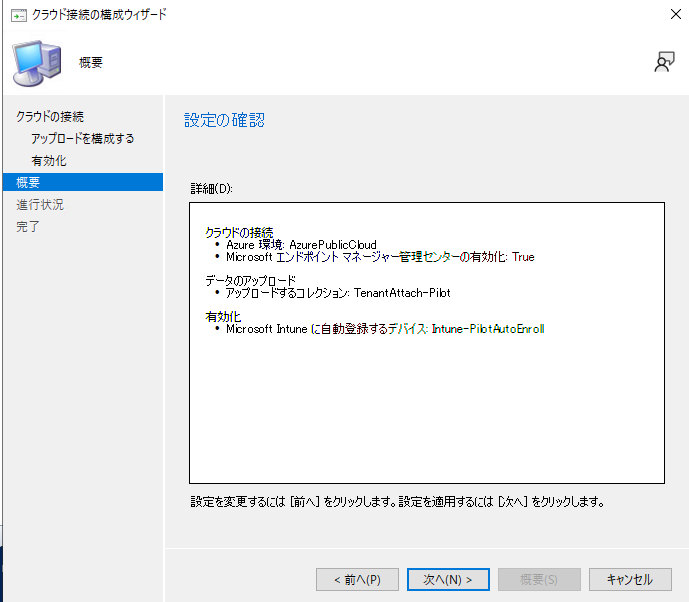  
12. 設定完了したら、「閉じる」をクリックします。
  
13. [クラウドの接続] 画面に戻り、作成された "CoMgmtSettingsProd" を選択して [プロパティ] をクリックします。  
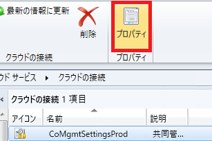  
14. [ワークロード] タブに遷移し、事前に検討したワークロードを設定します。  
  
15. ワークロードにて「パイロット Intune」を選択した場合、「ステージング」タブに遷移して、該当のワークロードを配布するパイロット コレクションを指定して「OK」をクリックします。  
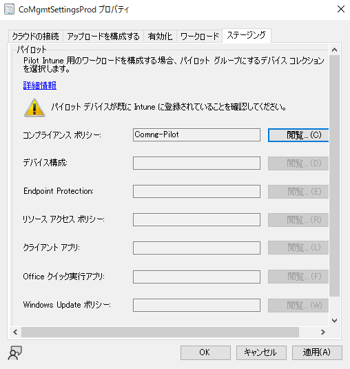  

## 設定がクライアントに適用されたかの確認

### クライアントからの確認方法
共同管理構成ポリシーがクライアントに適用されると、Configuration Manager のコントロール パネル アプレットの「構成タブ」に以下のように "CoMgmtSettings" で始まる項目が表示されます。各項目の意味は以下の通りです。  

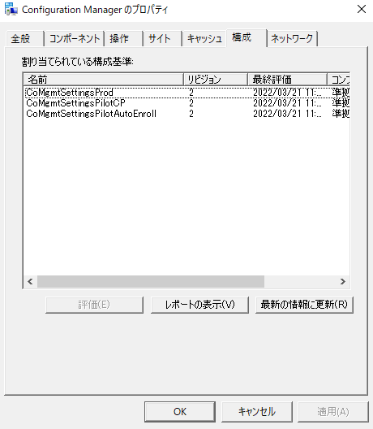  

- CoMgmtSettingsProd
  - 共同管理構成ポリシーが設定された全てのデバイスに設定される項目です。
- CoMgmtSettingsPilotAutoEnroll
  - Intune への自動登録の設定にパイロットコレクションとして指定されたデバイスに設定される項目です。
- CoMgmtSettingsPilotCP
  - ワークロード「コンプライアンスポリシー」のパイロットコレクションとして指定されたデバイスに設定された項目です。
- CoMgmtSettingsPilotDC
  - ワークロード「デバイスの構成」のパイロットコレクションとして指定されたデバイスに設定された項目です。
- CoMgmtSettingsPilotEP
  - ワークロード「Endpoint Protection」のパイロットコレクションとして指定されたデバイスに設定された項目です。
- CoMgmtSettingsPilotRAP
  - ワークロード「リソース アクセス」のパイロットコレクションとして指定されたデバイスに設定された項目です。
- CoMgmtSettingsPilotCApp
  - ワークロード「クライアントアプリ」のパイロットコレクションとして指定されたデバイスに設定された項目です。
- CoMgmtSettingsPilotO365
  - ワークロード「Office クイック実行アプリ」のパイロットコレクションとして指定されたデバイスに設定された項目です。
- CoMgmtSettingsPilotWUP
  - ワークロード「Windows Update のポリシー」のパイロットコレクションとして指定されたデバイスに設定された項目です。

### CM コンソールからの確認方法

下記ダッシュボードを利用して共同管理の登録状況を確認できます。  

[CM コンソール] - [監視] - [共同管理]  

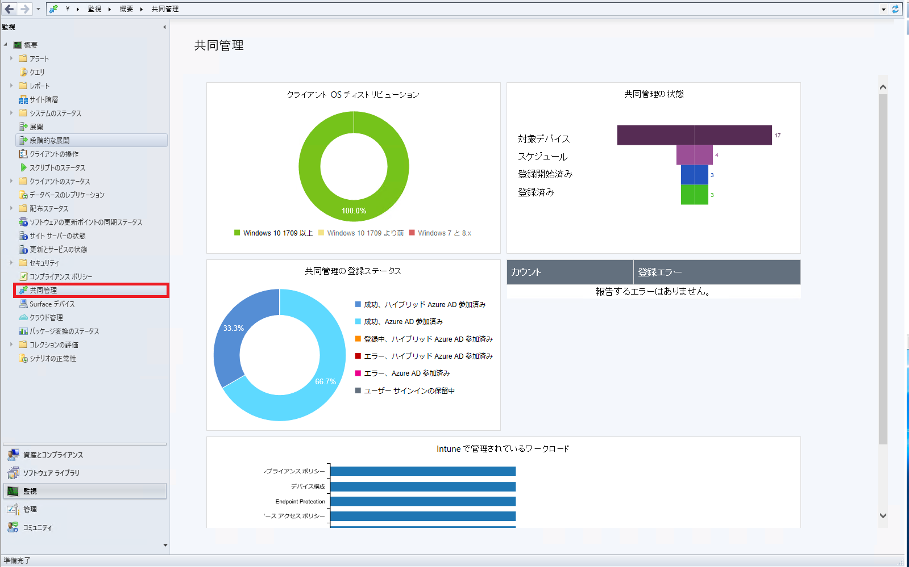

### MEM 管理センターからの確認方法

通常、デバイス一覧で「管理者」が「共同管理」となっているデバイスが共同管理状態となっているデバイスとなります。なお、ここで「管理者」が「ConfigMgr」となっているデバイスはテナントアタッチのみされているデバイスであり、共同管理状態にはなっていないのでご注意ください。  

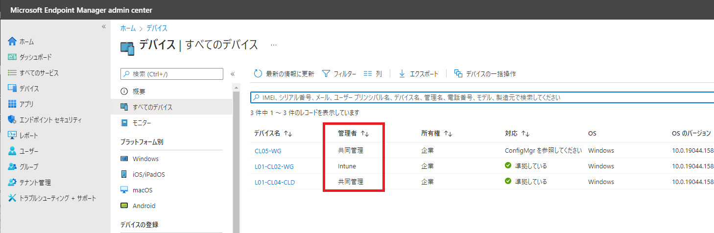
