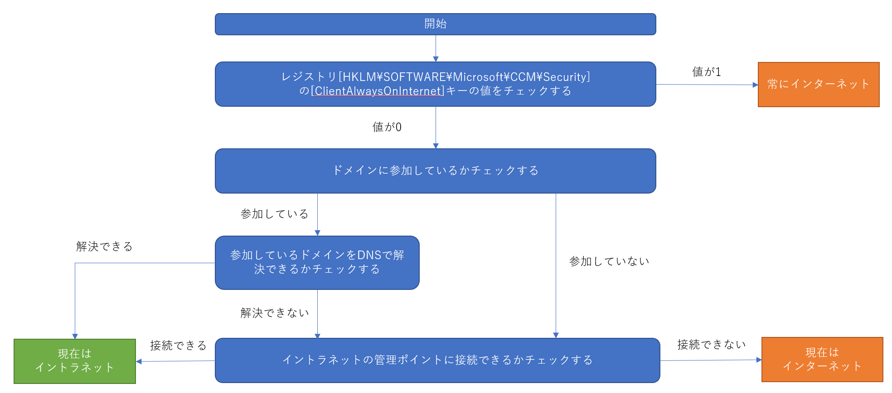
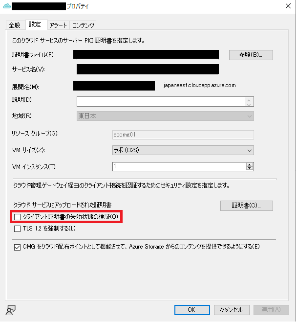
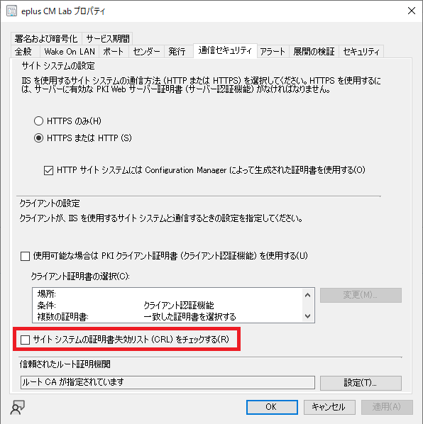
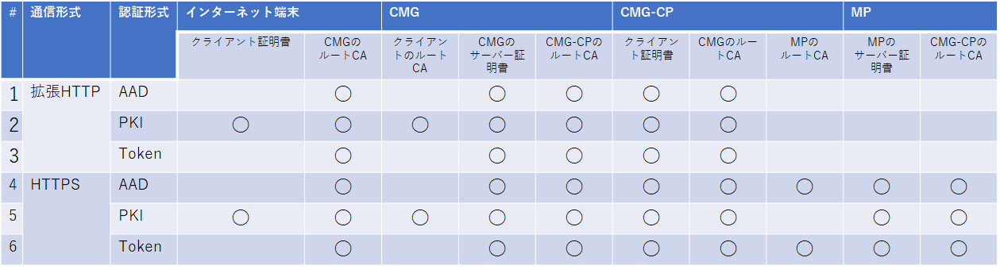

みなさま、こんにちは。Configuration Manager サポート チームです。本日は、Microsoft Endpoint Configuration Manager (MECM) にて提供されるクラウド管理ゲートウェイ (CMG) の設計ポイントについてご案内します。  

本記事は以下の二部構成としております。  

1.  (本記事) CMG の概要とユースケース、及びリバース プロキシとして CMG を利用する際の設計ポイントについてご案内いたします。
2. 配布ポイントとしての CMG についてとインターネット アクセス要件、セキュリティ、サイジング設計、コスト見積についてご案内致します。

なお、下記は MECM CB 2111 および仮想マシン スケール セット (VMSS) の CMG のご利用を前提としておりますのでご留意くださいませ。

# クラウド管理ゲートウェイ (CMG) とは

CMG とは以下の機能を提供する Azure 上で提供されるクラウド サービスです。

- リバース プロキシ機能
  - インターネット上の端末からの通信をイントラネット上の MECM の管理ポイントやソフトウェア更新ポイントに中継する機能。イントラネット上の配布ポイントには中継しませんのでご注意ください。
- クラウド上の配布ポイント機能
  - イントラネット、インターネットのどちらの端末に対してもアプリケーションやパッケージを提供するための配布ポイント機能を提供する機能。

下記 URL でもドキュメントをご提供しておりますのでご参照くださいませ。

クラウド管理ゲートウェイの概要  
https://docs.microsoft.com/ja-jp/mem/configmgr/core/clients/manage/cmg/overview

## CMG のユースケース

CMG を使われるユースケースとしては以下のようなものがございます。

1. リモート ワーク向けに貸し出した企業端末をMECMを使ってインターネット経由で管理したい。これを VPN を使わずに実現したい。
2. リモート ワーク向けに貸し出した企業端末の更新プログラム適用を実施する際、WSUS と同様レベルで管理したい。その際に、VPN 経由でイントラネットの配布ポイントからコンテンツをダウンロードさせるのでは無く、Microsoft の Windows Update や Office CDN からダウンロードさせることにより、限られた社内インターネット帯域の逼迫を回避したい。
3. 社内にある端末だが、事業拠点とデータセンター間の帯域より、インターネット回線の方が早い、もしくは空いているのでそちらを使いたい。

## CMG のリバース プロキシ機能

CMG をリバース プロキシとして利用する場合、以下の要素をご理解くださいますようお願い致します。

1. インターネット端末のみが CMG をリバース プロキシとして利用する
   - イントラネットとして判定されている端末は CMG をリバース プロキシとして利用できません。後述するインターネット端末の判定フローで、イントラネット端末として判定された端末は例え御社外のネットワークにいる端末でも CMG をリバース プロキシとして利用しません。
2. CMG を利用するためクライアント認証が発生する
   - CMG はインターネット上に公開されているサービスなので、不特定多数の端末から管理対象のデバイスの通信のみを受け付けるため、認証行為が発生します。この認証方式は全 3 種類存在し、どの認証方式を採用しているかよく理解しておかないと、CMG に接続出来ないなどのトラブル シューティングの際に苦労することになります。
3. サイト サーバー間の通信暗号化が必要
    - 過去の MECM サーバーの通信と異なり、通信の暗号化のために SSL 証明書が必要となります。各 サイト サーバーにどの証明書が必要かを理解しておかないと環境構築の際のトラブルの原因となります。

### MECM におけるインターネット端末の判定

上記でもご案内の通り、インターネット端末として判定されない場合、クライアントはイントラネット用の管理ポイントに対して通信を試みる形となります。  
MECM において、端末がインターネット経由で接続しているのか、イントラネット経由で接続しているのかの判定条件は以下の図のとおりです。オンプレミス ADに参加している、リモート ワーク向け端末が VPN を介して、オンプレミス ADのドメイン コントローラーやイントラネットの管理ポイントに接続できてしまうと、たとえ利用している回線がインターネット回線でもイントラネット端末として判定されてしまいます。こちらを回避するためにはレジストリを使って「常にインターネット」の設定をする必要がございますのでご理解くださいますようお願い致します。

### CMG におけるクライアント認証

CMG は不特定多数の端末からアクセスがあるため、クライアント認証を行い、成功した端末の通信のみをイントラネットの MECM サーバーに中継する仕組みを持ちます。認証の仕組みとしては以下の3つがございます。

1. Azure AD 認証
2. PKI 証明書認証
3. サイト トークン認証

CMG の認証は 1 -> 2 -> 3 の流れでフォールバックしていきます。　　

#### Azure AD 認証

Windows 10 / 11 端末のみが利用できる Azure AD を使った認証です。Azure AD connect を使ってオンプレミスの AD の情報を Azure AD に同期したり、直接端末を Azure AD に参加させて、その際の シングル サインオン情報を使って認証を行います。 インターネット上の Windows 8.1 や Windows Server 端末は本認証は利用できませんので、他の認証方式と併用する形となります。

なお、CMG では 他のクライアント認証方式を使う場合、Azure AD connectを使った AD - Azure AD 間同期は不要です。ただし、多くの場合、CMG 利用と共同管理の利用は同時に検討されることが多いので、その場合は Hybrid Azure AD 構成が必要になります。

#### PKI 証明書認証

企業内のクライアント証明書配布基盤により配布されたクライアント証明書により認証を行う方式です。例えば、Active Directory 証明書サービスとグループ ポリシーを使って配布する、といった方法があるでしょう。よくありがちなトラブルとして、証明書失効リスト (CRL) の公開元がインターネット公開されていないために CRL チェックが出来ずに認証失敗と言ったものがあります。CRL をインターネット公開していない場合は、以下のように CMG のクライアント認証設定で CRL チェックを外すと解決します。  

  

また、同様に CMG のサーバー証明書の CRL をインターネット公開していないために CMG と通信できない場合は、以下のようにサイトの設定で CRL チェックを外すと解決します。  

[CM コンソール] - [管理] - [概要] - [サイトの構成] - [サイト] - 対象のサイトを選択 - [プロパティ] - [通信セキュリティ]タブ

  

#### サイト トークン認証

Azure AD 認証や PKI 証明書認証基盤が利用出来ない環境における認証手段となります。サイト トークン認証は以下の二つの場合に利用されますが、それぞれ利用するトークンが異なります。

- インターネット端末の MECM サーバーへの登録: 一括登録トークン
  - インターネット端末が MECM サーバーと初めて通信を行う際、サーバー登録用の認証が必要となります。Azure AD や証明書の代替として、登録の際に利用されるトークンが一括登録トークンです。一括登録トークンは階層内の最上位サイト サーバー (中央管理サイト サーバーもしくはプライマリサイト サーバー) にある  BulkRegistrationTokenTool.exe ツールを使用して発行します。このトークンは既定では 3 日間、最大 7 日間有効であり、期間内にインターネット端末にて ccmsetup のオプションでこのトークンを指定すると、インターネット越しでの端末登録が成功します。  

    一括登録トークン  
    https://docs.microsoft.com/ja-jp/mem/configmgr/core/clients/deploy/deploy-clients-cmg-token#bulk-registration-token

- MECM サーバーとの通信: 自己証明 (SelfProve) トークン
  - 一度でも MECM サーバーとの通信に成功したことのあるデバイスに自動的に割り当てられるトークンです。本トークンは 90 日間有効で、インターネット経由でも、イントラネット経由でも MECM サーバーに通信が行われると月に 1 回、自動で更新される仕組みとなっています。90 日間、1度も MECM サーバーに接続出来ないで居ると、本トークンは無効化されます。トークンが無効化された端末はイントラネット経由で MECM サーバーに接続して再度、本トークンを取得する必要があります。
  なお、本トークンの発行は無効化できません。

### クライアント認証方式の選択方針

環境に依りますが、大凡以下の方針で選択されるのが良いかと存じます。各認証方式を組み合わせることも可能です。

1. Windows 10 / 11 端末しか管理しない -> Azure AD 認証
2. Windows 8.1 端末や Windows Server もインターネット越しに管理したい -> PKI 証明書認証
3. 認証基盤の都合上、Azure AD 認証が利用出来ない -> PKI 証明書認証
4. Azure AD 認証や PKI 証明書認証が利用出来ない -> サイト トークン認証
5. 端末のキッティング/再キッティングは必ず企業ネットワークで行われ、かつリモート ワークを行う期間は数日なので3ヶ月以内に企業ネットワークに接続する機会がある -> サイト トークン認証

### サイト サーバー間の通信暗号化

最新の MECM ではサイト サーバー間通信で平文通信 (http) が非推奨となっているため、問題無いかと存じますが、CMG を利用する際、各サイト サーバー間の通信は SSL を使った暗号化通信が必須となっております。選択方式としては、以下の 2 方式がございます。

- 拡張 HTTP
- HTTPS

また、CMG リバース プロキシ シナリオにおいて関係するサイト システムは以下の通りです。

- CMG
- クラウド管理ゲートウェイ接続ポイント (CMG-CP)
  - CMG に対して HTTPS 通信を行い、その通信を維持することでクライアント -> CMG -> CMG-CP -> 管理ポイントもしくはソフトウェア更新ポイントへの通信を中継するサイト システムの役割です。
- 管理ポイント

#### 拡張 HTTP

CM が独自に発行・管理する自己署名証明書を使って、秘匿性の高い、サイト システム間の通信を暗号化する方式です。本証明書は有効期限が自動更新されるため、証明書管理の負担が下がるメリットがあります。

#### HTTPS

企業内のPKI 証明書基盤が発行する証明書を使って全てのサイト システム間の通信を暗号化する方式です。サイト システム間同士がお互いのサーバー証明書・クライアント証明書を認証する必要があるため、多くの証明書が必要となります。これらの証明書には有効期限があるため、期限が切れた証明書は更新する必要があります。

#### 認証方式、通信方式に伴う必要な PKI 証明書の一覧

拡張HTTP、HTTPS 方式それぞれに伴う各ポイントに必要な PKI 証明書は以下の図の通りです。

