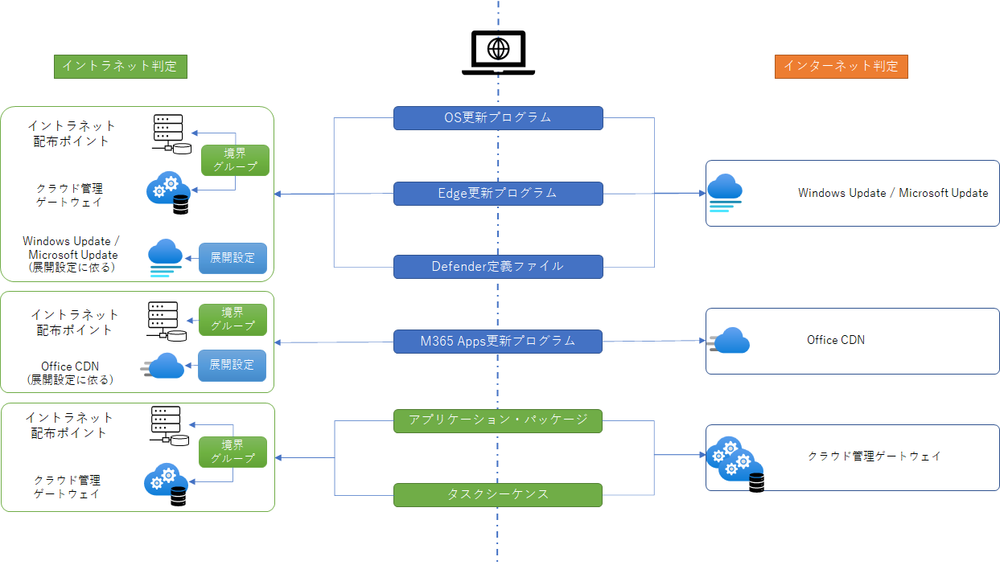
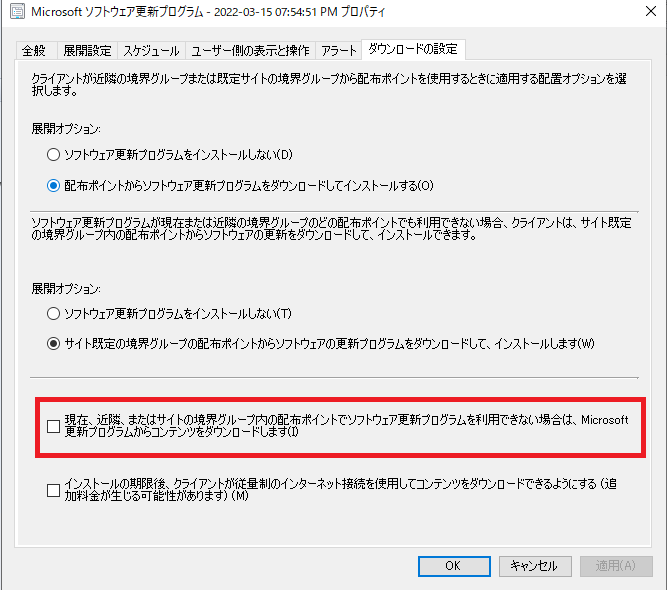

みなさま、こんにちは。Configuration Manager サポート チームです。本日は、Microsoft Endpoint Configuration Manager (MECM) にて提供されるクラウド管理ゲートウェイ (CMG) の設計ポイントについてご案内します。  

本記事は以下の二部構成としております。
1. CMG の概要とユースケース、及びリバース プロキシとして CMG を利用する際の設計ポイントについてご案内いたします。
2. (本記事) 配布ポイントとしての CMG についてとインターネット アクセス要件、セキュリティ、サイジング設計、コスト見積についてご案内致します。  

なお、下記は MECM CB 2111 および仮想マシン スケール セット (VMSS) の CMG のご利用を前提としておりますのでご留意くださいませ。

## CMG のクラウド上の配布ポイント機能

CMG を Azure 上の配布ポイントとして提供する機能です。本機能はリバース プロキシ機能とは異なり、イントラネット端末、インターネット端末両方で利用可能です。イントラネット端末が CMG を配布ポイントとして利用する場合は境界グループへの CMG の紐付けが必要です。インターネット端末はイントラネット端末と異なり、境界グループの影響無しにダウンロード元を決定します。コンテンツ別の、ダウンロード元については以下の図を参考ください。

  

上記図で示している、イントラネット端末に対して、Windows Update や Office CDN をダウンロード元のリストに追加する「展開設定」とは以下のオプションを指します。  

[CM コンソール] - [ソフトウェア ライブラリ] - [概要] - [ソフトウェア更新プログラム] - [すべてのソフトウェア更新プログラム] - [展開] - [プロパティ] - [ダウンロードの設定]タブ

  

また、イントラネット端末に対して、イントラネットの配布ポイントよりも、Windows Update や Office CDN, CMG からのダウンロードを優先させるためには以下のオプションを有効化します。  

[CM コンソール] - [管理] - [概要] - [階層の構成] - [境界グループ] - 対象の境界グループを選択 - [プロパティ] - [オプション]タブ - [オンプレミスのソースよりクラウド ベースのソースを優先します]  

  

### CMG での Microsoft 365 Apps 更新プログラムの配布について

以下でもご案内している通り、 Microsoft 365 Apps の更新プログラムは CMG からの配布をサポートしておりません。 インターネット端末に対しては、 Office CDN からのダウンロード、イントラネット端末に対しては、イントラネットの配布ポイントもしくは Office CDN からダウンロードするようにご対応ください。

クラウド管理ゲートウェイでサポートされる構成  
https://docs.microsoft.com/ja-jp/mem/configmgr/core/clients/manage/cmg/supported-configurations  

### CMG 利用による VPN 帯域使用料削減の条件

多くのお客様において、VPN 帯域の利用料削減を目的に CMG 導入をご検討されることが多くございます。この際の条件としては、URL 指定による VPN スプリット トンネリング機能が必要になって参ります。お客様によっては、IP アドレス指定による VPN スプリット トンネリング機能しかご利用できない場合がございますが、Windows Update や Office CDN, および CMG は URL 指定によるサービスを前提としております。URL 指定の VPN スプリット トンネリング機能のご利用をお勧め致します。

## CMG のインターネットアクセス要件

以下ドキュメントにまとまっております。

CMG のデータ フロー  
https://docs.microsoft.com/ja-jp/mem/configmgr/core/clients/manage/cmg/data-flow

主な通信経路は以下の図の通りです。  


なお、CMDB 内の AzureEnvironments テーブルの中身はそれぞれご確認くださいますようお願い致します。ご参考までに、弊社環境における MECM CB 2111 の場合、他との重複を除きますと、AzurePublicCloud レコードの値は以下の通りです。

```
https://management.core.windows.net/
https://login.microsoftonline.com/
https://gallery.azure.com/
https://vault.azure.net/
core.windows.net
database.windows.net
trafficmanager.net
vault.azure.net
servicebus.azure.com
cloudapp.net
https://graph.microsoft.com/
https://gateway.configmgr.manage.microsoft.com/
https://cmmicrosvc.manage.microsoft.com/
https://portal.manage.microsoft.com/
https://enrollment.manage.microsoft.com/
https://login.windows.net/
cloudapp.azure.com
```

## CMG のセキュリティ

CMG は PaaS レベルで提供されるクラウド サービスです。そのため、責任共有モデルも PaaS のものに準じます。

クラウドにおける共同責任  
https://docs.microsoft.com/ja-jp/azure/security/fundamentals/shared-responsibility

CMG で考慮すべき(設定可能な)セキュリティについては以下にまとまっておりますのでこちらをご参照ください。

クラウド管理ゲートウェイのセキュリティとプライバシー  
https://docs.microsoft.com/ja-jp/mem/configmgr/core/clients/manage/cmg/security-and-privacy-for-cloud-management-gateway

## CMG のサイジング設計について

CMG のサイジングについては下記ガイドをご参照ください。

CMG のパフォーマンスとスケール  
https://docs.microsoft.com/ja-jp/mem/configmgr/core/clients/manage/cmg/perf-scale

上記 URL の注意点としましては、表記される数値はあくまで同時クライアント接続数であることです。1 台のクライアントから CMG に対して複数の接続がある場合もあり、その場合クライアント台数とは完全には一致しませんので、余裕を持って設計されることをお勧め致します。


## CMG のコスト見積について

CMG のコスト見積については下記を参照ください。多くの場合、仮想マシンより Azure からクライアントに対するアウトバウンド ネットワークの費用が、総コストのうち、多くの割合を占めます。

CMG のコスト  
https://docs.microsoft.com/ja-jp/mem/configmgr/core/clients/manage/cmg/cost