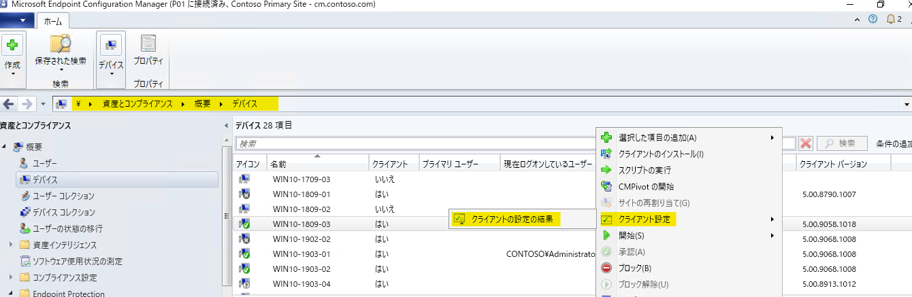
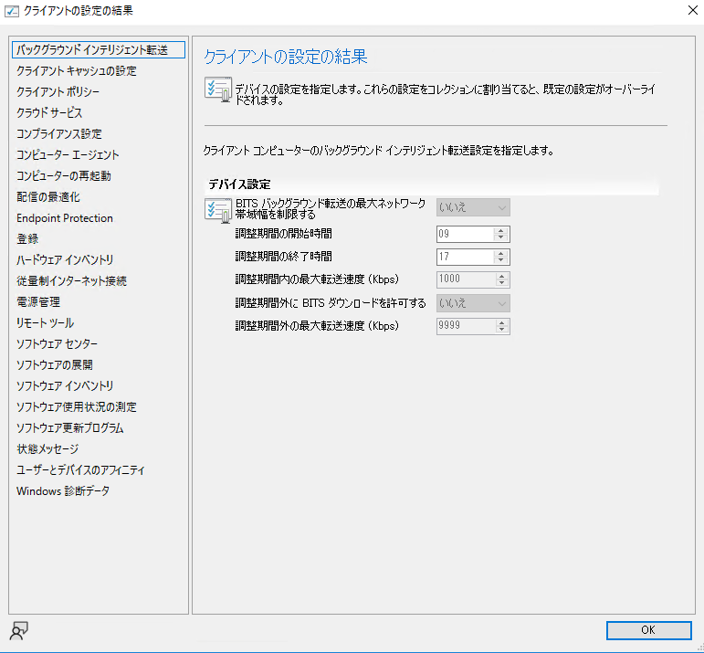
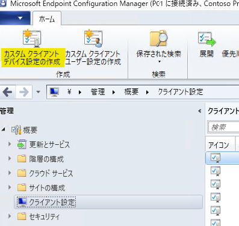
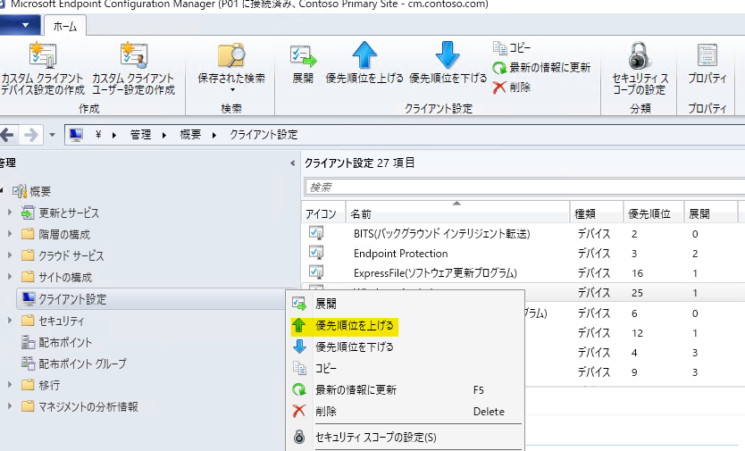
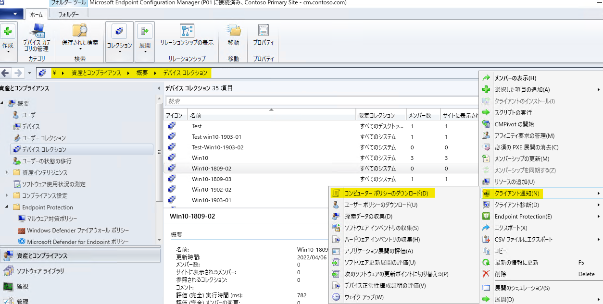

みなさま、こんにちは。Configuration Manager サポート チームです。

今回はクライアント設定がクライアント上で適用されない時に確認ずべき 3 つのポイントについて解説致します。

## 1.管理コンソールの設定を確認しよう

まずはデバイスに意図したクライアント設定が展開されているのかを確認しましょう。クライアント設定には「優先順位」が設けられております。優先順位が高い順（1 が一番強い）に反映されていきますので、カスタム　クライアント設定を複数作成、展開している場合には、優先順位に注意が必要となります。

※ 優先順位はクライアント設定間で設定箇所が重複した場合にどちらを優先するのかを決定するものとなります。重複していない設定については優先順位に関係なく、クライアントに反映されます。

複数のクライアント設定を展開していて、最終的に何が反映されるのかわからなくても大丈夫です。

MECM 管理コンソール > [資産とコンプライアンス] > [概要] > [デバイス] にて確認したいデバイスを右クリック > [クライアント設定] > [クライアントの設定の結果] をクリックすると、最終的にどの設定が反映されているのかを確認することができますので、ここで想定していた設定となっていることを確認ください。



このように結果を確認することができます。


## 2.カスタム クライアント設定を上書き展開してみよう

1 で想定している設定値となっているにも関わらず、クライアント端末側に反映されていない場合には、新たにカスタム クライアント設定を作成し、展開してみましょう。

反映されない設定と全く同じ内容でカスタム クライアント設定を作成してください。
[管理] > [概要] > [クライアント設定] > [カスタム クライアント デバイスの作成]


この時「優先順位」をなるべく高くしておくことがポイントです。
（少なくとも反映されないカスタム クライアント設定よりも高くしてください。）
新規に作成したカスタム クライアント設定を右クリック > [優先順位を上げる] をクリックします。


優先順位を高くしたら、該当のコレクションに展開してみましょう。

展開後はクライアント側の次回のコンピューター ポリシー取得のタイミングで反映されるので少し時間をおきましょう。

もしすぐに反映を促したい場合には、[資産とコンプライアンス] > [概要] > [デバイス コレクション] にてコレクションを右クリック > [クライアント通知] > [コンピューター ポリシーのダウンロード] をクリックすることでクライアント通知により、ポリシー取得を促すことができますのでお試しください。



## 3.クライアント側で管理ポイントとの疎通状況を確認しよう

それでも反映されない場合には、クライアントと管理ポイントとの疎通の状態を確認しましょう。

1.C:\Windows\CCM\Logs フォルダー配下の CcmMessaging.log を開き、直近の日付で下記のような出力があるかを確認します。

```text
OutgoingMessage(Queue='XXXXXXXXXXXXX', ID={XXXXXXXX-XXXX-XXXX-XXXX-XXXXXXXXX}): Delivered successfully to host '<管理ポイント FQDN>'.
```

2.C:\Windows\CCM\Logs フォルダー配下の PolicyAgent.log を開き、「2.カスタム クライアント設定を再展開してみよう」を展開後に下記のような出力があるかを確認します。

```text
Raising event:instance of CCM_PolicyAgent_PolicyDownloadSucceeded
Raising event:instance of CCM_PolicyAgent_PolicyEvaluationComplete
```

もし、上記のどちらかが確認できなかった場合には、管理ポイントからポリシーのダウンロードが完了していないことになります。管理ポイントとの通信状況を確認しましょう。

クライアント端末にて、PowerShell を開き、下記コマンドを実行します。

```powershell
Invoke-WebRequest -Uri "http://<管理ポイントの FQDN>/sms_mp/.sms_aut?mplist" -UseBasicParsing
```

正常にアクセスできる場合、StatusCode : 200 となります。
それ以外の場合には、クライアントと管理ポイントとの間で疎通できていない状態となりますので、ご利用のネットワーク環境上で通信を妨げる何かしらの要因がありますのでご確認くださいませ。

## 4.ログ出力が確認できないが、疎通は成功する場合

この場合には、詳細な調査が必要となることが想定されますので、弊社サポートへのお問い合わせをご検討下さいませ。
