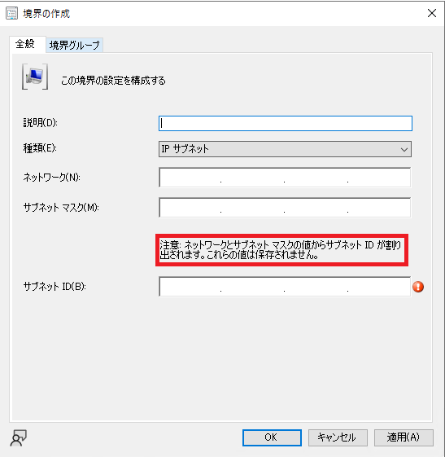
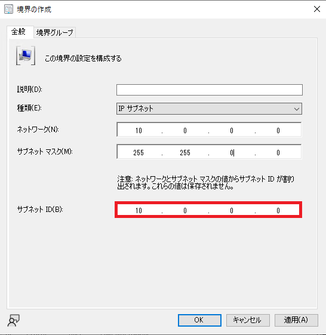
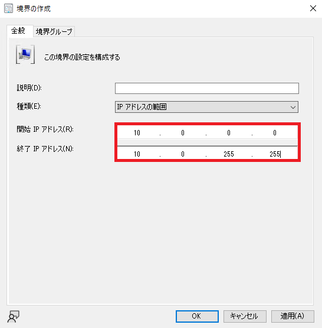

みなさま、こんにちは。Configuration Manager サポート チームです。  

本日は、IP サブネット境界設定について簡単に解説させていただきます。

なお、本記事の画面は Micorosoft Endpoint Manager Configuration Manager  (MECM) Current Branch (CB) 2111 のものです。他の Version では画面が異なる場合があります。

# IP サブネット境界設定

IP サブネット境界を設定する際、以下の画面をご覧になるかと存じます。



この画面の赤枠の文章を見て、「どういうことだろう･･･」と思われた方も多いかと存じます。 

これは、「MECM のサブネット境界判定においては、ネットワーク IP アドレスや サブネット マスク アドレスは使われず、それらから割り出された、サブネット ID のみが使われる」ということを示します。

上の文章だけでもどういうことか分からないかと思いますので、以下の例をご確認ください。

## サブネット境界判定の例 1
以下のサブネット境界を作成したとします。
- ネットワーク IP アドレス  : 192.168.10.0
- サブネット マスク アドレス: 255.255.255.0

上記の場合、割り出されるサブネット ID は･･･以下の通り、 **192.168.10.0** となります。


このとき、クライアント端末 A の IP アドレスが以下の場合、この**サブネット境界に割り当たります。**

- クライアント IP アドレス:    192.168.10.1
- サブネット マスク アドレス: 255.255.255.0

一方、クライアント端末 B の IP アドレスが以下の場合、この**サブネット境界に割り当たりません。**

- クライアント IP アドレス:    192.168.10.10
- サブネット マスク アドレス: 255.255.255.248

上記、違和感を感じますよね。/24 の サブネットを境界で指定したのだから、192.168.10.0 - 192.168.10.255 のIP アドレスは指定したサブネット境界として判定される筈だ、と考えるはずです。

ここで、注意書きの「ネットワークとサブネット マスクの値からサブネット ID が割り出されます。」を思い出してください。

クライアント 端末 A の IP アドレスとサブネット マスク の値から、サブネット境界と同様の方法でサブネット ID を割り出してみましょう。

```
クライアント端末 A のサブネット ID: 192.168.10.0
```

**192.168.10.0** となります。**この ID はサブネット境界のサブネット ID と等しい**ですね。

一方、クライアント 端末 B の IP アドレスとサブネット マスク の値から、サブネット境界と同様の方法でサブネット ID を割り出してみると、

```
クライアント端末 B のサブネット ID: 192.168.10.8
```

**192.168.10.8** となります。**この ID はサブネット境界のサブネット ID と異なります**ね。

もう一つ、例を挙げてみましょう。以下の例の方がよく見かけられるものではあります。

## サブネット境界判定の例 2
以下のサブネット境界を作成したとします。
- ネットワーク IP アドレス  : 10.0.0.0
- サブネット マスク アドレス: 255.255.0.0

/16 のサブネット空間です。多くの /24 のサブネット空間をひとまとめにした境界を作成されたい場合、このような境界を作りたいことは多いかと存じます。

では同様にサブネット ID を計算してみましょう。以下の通り、 **10.0.0.0** がサブネット ID となります。



では、この境界に割当たるクライアント端末の IP アドレスを見ていきましょう。

クライアント端末 C の IP アドレスが以下の場合、この**サブネット境界に割り当たりません。**

- クライアント IP アドレス:    10.0.1.1
- サブネット マスク アドレス: 255.255.255.0

同じく、クライアント端末 D の IP アドレスが以下の場合、この**サブネット境界に割り当たりません。**

- クライアント IP アドレス:    10.0.2.1
- サブネット マスク アドレス: 255.255.255.0

なぜなら、サブネット ID を計算したとき、以下のようになるからです。

```
クライアント端末 C のサブネット ID: 10.0.1.0
クライアント端末 D のサブネット ID: 10.0.2.0
```

そう、両方のサブネット ID がサブネット境界 のサブネット ID 10.0.0.0 と**一致しません。** そのため、/16 のサブネット境界を作った時、それに含まれると考えられる /24 のサブネットの IP アドレスを持つクライアントは、このサブネット境界に含まれません。

なら、どのようなクライアントならサブネット境界に割り当たるかと言うと、以下のような IP アドレスを持つクライアント E の端末となります。

- クライアント IP アドレス:   10.0.1.10
- サブネット マスク アドレス: 255.255.0.0

```
クライアント端末 E のサブネット ID: 10.0.0.0
```

## 結論

ここまで見てきたらお分かりかと存じます。クライアントが IP サブネット の境界に含まれると判定されるには、境界サブネット ID と、クライアントが所属するサブネットのネットワーク アドレスが一致する必要がある、つまりサイズも全く同一の、同じサブネットに所属する必要がある、ということです。そのため、複数の小さなサブネットを含む大きなサブネット境界を設定することは出来ません。

上記のようなことを実施されたい場合は、「IP アドレスの範囲」の境界を使いましょう。例えば、以下のような開始 IP アドレスと終了 IP アドレスを持つ境界を作れば 10.0.1.0/24 と 10.0.2.0/24 のサブネットの 端末を同一の境界として判定させることができます。



