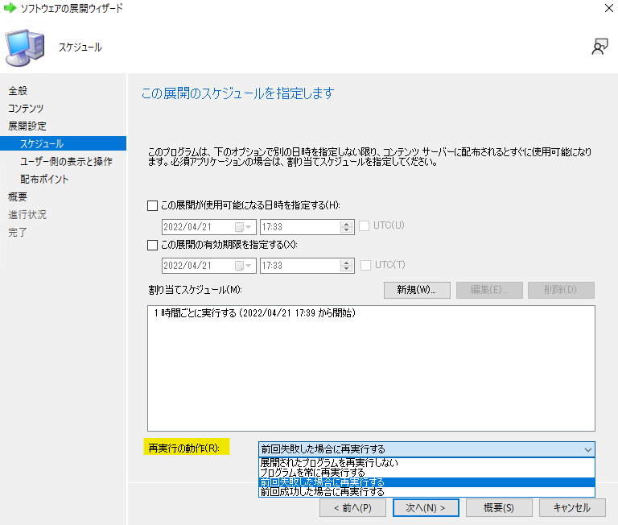
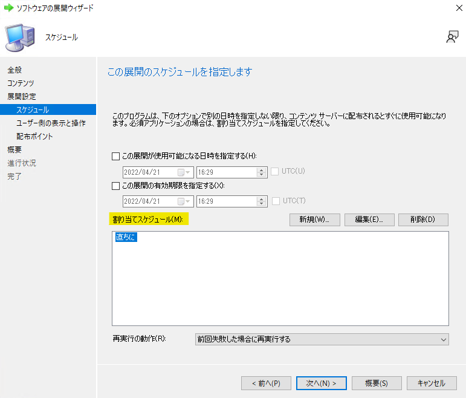
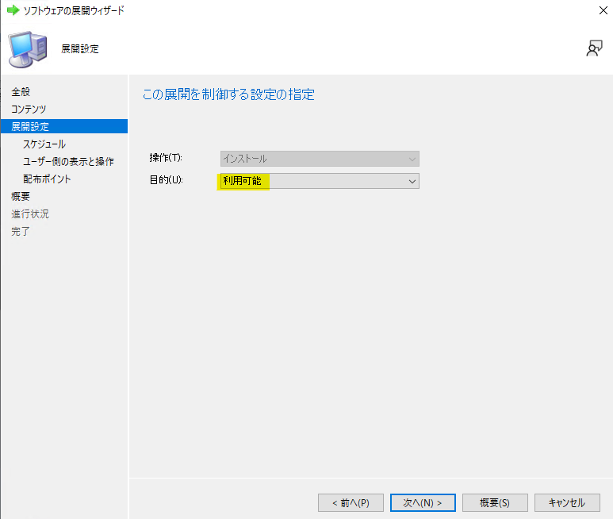
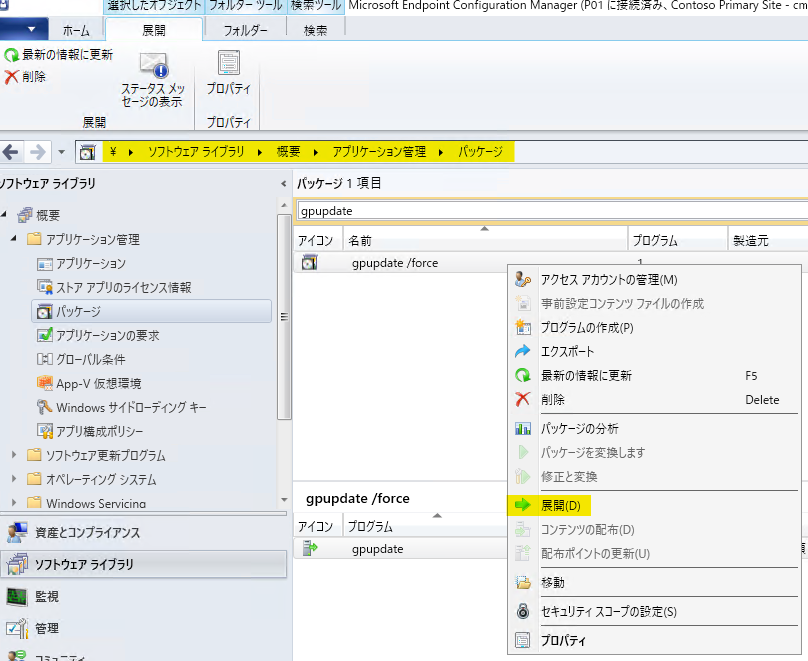
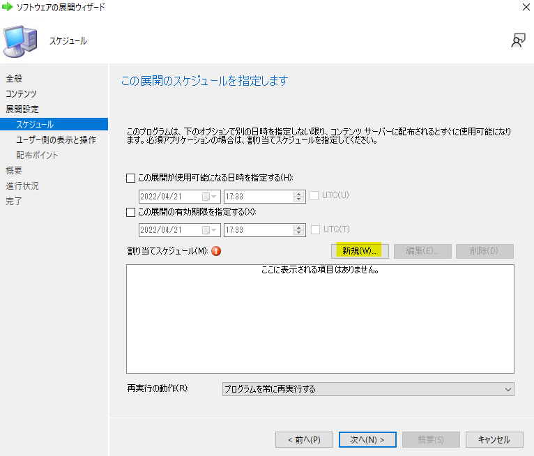
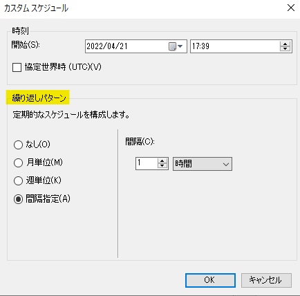

みなさま、こんにちは。Configuration Manager サポート チームの草刈です。  

今回は多くの方が誤解しやすいパッケージの再実行について解説致します。  

## パッケージを再実行させる時のポイント

ポイントは「再実行の動作」の設定だけでは再実行はされない、という点です。実は「割り当てスケジュール」により繰り返し実行するように設定する必要があります。  

一度覚えてしまえば後はご利用のニーズに応じて「割り当てスケジュール」、「再実行の動作」を組み合わせてパッケージ機能を利用することができるうようになりますので、パッケージ実行の概要や各設定箇所について解説させていただきます。  

  

### パッケージ実行の概要について

パッケージを展開した際に、端末側で実行されるタイミングは展開設定によって決定されます。  

#### 必須展開の場合

  

必須展開の場合には [スケジュール] にて設定した [割当スケジュール] に設定されたタイミングで実行されます。  

例えば下記のように「直ちに」とした場合には、クライアント端末側でパッケージ展開のポリシーを受信するとすぐに実行されます。  

  

※ スケジュールのオプションについて
・[この展開が使用可能になる日時を指定する] を設定した場合、指定した日時以降でのみ、実行が可能となります。（それまでは実行されません。）
・[この展開の有効期限を指定する] を指定した場合、有効期限をすぎると実行されなくなります。

#### 利用可能展開の場合

  

利用可能で展開した場合には、クライアント端末上でユーザーがソフトウェア センターを開き、[インストール] ボタンをクリックしたタイミングで実行されます。  

### 再実行の設定方法について

パッケージで再実行を設定する方法について解説させていただきます。　　

1.展開対象のパッケージを右クリック > [展開] をクリックします。　　

  

2.[全般] にて展開したいコレクションを指定し、[次へ] をクリックします。  

3.[コンテンツ] にて展開するパッケージがコンテンツを含む場合には、配布ポイントを指定してコンテンツ配布を設定し、[次へ] をクリックします。
既にコンテンツ配布済みの場合には、何も設定せずに [次へ] をクリックします。  

4.[展開設定] にて、目的 = [必須] を選択し、[次へ] をクリックします。  

  

5.[スケジュール] にて、下記の設定を行います。  

パケージは「割り当てスケジュール」により、実行タイミングを決定します。**注意が必要なのはここで繰り返し設定、または、複数のスケジュールを指定しない限り、再実行はされないということです。**  

例えば割り当てスケジュールに「直ちに」のみ設定した場合には、1 度のみの実行となり、仮に実行が失敗した場合でも再実行はされませんのでご注意ください。  

上記を踏まえて再実行させたい場合のスケジュールの設定方法を解説致します。  

#### 割り当てスケジュールの設定

5-1. [新規] をクリックします。  

  

5-2. [割当スケジュール] ウィンドウにて [スケジュール] をクリックします。  

  

5-3. [カスタム スケジュール] ウィンドウにて繰り返しパターンを設定します。  
ここで再実行させたい周期を設定します。下記は 1 時間ごとに実行を繰り返す設定の例です。  

  

上記設定が完了したら [OK] をクリックしていきます。  

#### 再実行の動作の設定

ここが混乱するポイントです。この設定は、このパッケージの実行が 2 回目以降の場合に適用される設定となります。よくある勘違いが「ここで [前回失敗した場合に再実行する] を選択しておけば、実行が失敗した時に再実行される」と思ってしまいがちなのですがこれは間違いです。  

上記の**「割り当てスケジュール」が繰り返し実行するように設定されていない限り、たとえこの「再実行の動作」を設定していても再実行はされない**のでご注意ください。  

あくまで、2 回以上実行がトリガーされた場合にのみ、「再実行の動作」の設定が評価されるという点がポイントです。  

  

例として、上記の様に、1 時間ごとに実行する「割り当てスケジュール」を設定し、「再実行の動作」にて [前回失敗した場合に再実行する] を選択し、展開を行った場合には、下記のような動作となります。  

**・前回実行 = 成功の場合**  
実行 = 成功　→　1 時間経過　→　前回実行結果を評価　→　前回成功しているので再実行しない  

**・前回実行 = 失敗の場合**  
実行 = 失敗　→　1 時間経過　→　前回実行結果を評価　→　前回失敗しているので再実行される　→　成功　→　1 時間経過　→　前回実行結果を評価　→　前回成功しているので再実行しない  

上記では [前回失敗した場合に再実行する] を例にあげましたが、実行結果に関わらず常に再実行させたい場合など、ご要件に応じで選択する項目を設定くださいませ。  

後は、残りの展開設定を進めて頂き、展開を完了させてください。  
