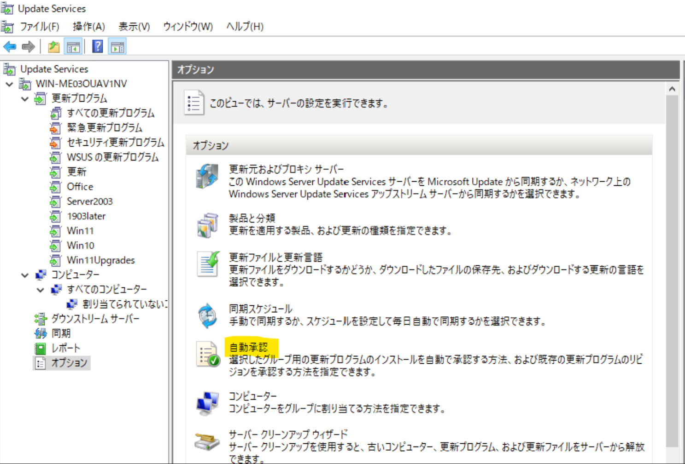

# Configuration Manager の自動展開規則と WSUS の自動承認規則について

皆様こんにちは。Configuration Manager サポート チームです。
今回は Configuration Manager の自動展開規則と WSUS の自動承認規則について各々概要を紹介いたします。  

自動展開規則と自動承認規則は双方ともに、新たに Configuration Manager 及び WSUS に同期した更新プログラムをクライアントへ自動的に展開する方法として用意された機能でございます。

## Configuration Manager の自動展開規則について
Configuration Manager の自動展開規則の機能を利用しますと、Windows OS 向けにリリースされた更新プログラムや Microsoft Defender の定義ファイルをクライアント コンピューターに自動的に展開することができます。

自動展開規則は、Configuration Manager のソフトウェア更新プログラムの展開機能と同様にデバイス コレクションに対して展開を行います。  

一例としましては、Windows 10 version 21H2 のクライアントのみを含むデバイス コレクションを作成し、そちらのデバイス コレクションに対し、Windows 10 version 21H2 用の月例品質更新プログラムを自動展開規則で展開するという運用が考えられます。

自動展開規則のプロパティ フィルターでは、いくつかの種類のフィルターが用意されており、設定したフィルターの条件を満たすソフトウェア更新プログラムが自動展開規則で展開されます。  
なお、プロパティ フィルターはアンド条件でございますので、フィルターを設定いただいた数だけ条件が絞られていく動作となります。  
例えば、下の画像に記載されているプロパティ フィルターの条件は、Windows 10 の毎月の定例セキュリティ更新プログラムを配信する設定でございます。

公開情報でも自動展開規則の作成方法を紹介しておりますのでご参考にしてくださいませ。  
Title : Configuration Manager を使用して定義の更新プログラムを配信する  
URL : https://docs.microsoft.com/ja-jp/mem/configmgr/protect/deploy-use/endpoint-definitions-configmgr

また、Microsoft Defender の定義ファイルにつきましては、1 日に 複数回リリースされるため、Configuration Manager で配信する場合は、自動展開規則を作成することをお勧めいたします。  
また、Configuration Manager から定義ファイルを配信する上でできる限りクライアントがダウンロードされる容量を少なくする方法について、自動展開規則のプロパティ フィルターを使用して Configuration Manager に同期された更新プログラムから Microsoft Defender の定義ファイルだけを自動展開するように構成する必要がありますが、この設定においてクライアントにダウンロードされる容量を少なくするためのポイントがあります。それは 「置き換えられる」 を「いいえ」に設定すること です。

詳細は以下のブログで紹介しております。  

Title : Microsoft Defender / System Center Endpoint Protection の定義ファイルのダウンロードの最適化について  
URL : https://jpmem.github.io/blog/mecm/20180308_01/

## WSUS の自動承認規則について
Configuration Manager の自動展開規則と似た機能として WSUS では自動承認規則が用意されております。  
ただし、自動承認規則が自動展開規則と異なる部分としては、規則作成の際の条件として指定可能な項目が少ないという違いがあります。

WSUS の自動承認規則を利用しますと、Windows OS 向けにリリースされた更新プログラムや Defender のセキュリティ インテリジェンス更新プログラムをクライアント コンピューターが属するコンピューター グループに対し自動的に承認することができます。

自動承認規則の規則の追加では、ステップ 1 で 3 種類のプロパティが用意されており、ステップ 2 でプロパティの条件を詳細に指定します。自動承認規則はこちらのプロパティの条件に従いソフトウェア更新プログラムを自動的に承認します。  
なお、規則の追加については Configuration Manager の自動展開規則と同様にアンド条件でございますので、プロパティを設定いただいた数だけ条件が絞られていく動作となります。

公開情報でも自動承認規則の作成方法を紹介しておりますのでご参考にしてくださいませ。  
Title : 3.2. 自動承認規則を構成する  
URL : https://docs.microsoft.com/ja-jp/windows-server/administration/windows-server-update-services/deploy/3-approve-and-deploy-updates-in-wsus#BKM_3.2.a.