みなさま、こんにちは。Configuration Manager サポート チームです。  

本日は、クラウド管理ゲートウェイ (CMG) の構築手順例をご案内させていただきます。

なお、本記事の画面は Micorosoft Endpoint Manager Configuration Manager  (MECM) Current Branch (CB) 2203 のものです。他の Version では画面が異なる場合があります。

# クラウド管理ゲートウェイ (CMG) の構築手順例

## 前提条件

本構築例は以下の条件を前提としています。なお、以下で上げられている内容は CMG の設計段階で定めておくと良いでしょう。

1. 仮想マシン スケールセットを利用する。
2. 数台のクライアントを管理する、ラボ環境としてのクラウド管理ゲートウェイ (CMG) を構築する。ラボ環境のため可用性は考慮しない。
3. 上記のため、CMG は東日本リージョンに B2S インスタンスを 1 台のみ作成する。
4. この CMG はリバースプロキシ、及びクラウド上の配布ポイントとして利用する。
5. 手順簡略化のため、以下で説明しているクライアント認証方式のうち、サイト トークン認証を選択する。  
クラウド管理ゲートウェイ (CMG) の設計ポイントについて (1)  
https://jpmem.github.io/blog/mecm/20220328_01/#CMG-%E3%81%AB%E3%81%8A%E3%81%91%E3%82%8B%E3%82%AF%E3%83%A9%E3%82%A4%E3%82%A2%E3%83%B3%E3%83%88%E8%AA%8D%E8%A8%BC
6. サーバー証明書は別途プライベート CA で作成し、利用するものとする。
7. 管理対象となるクライアントはオンプレミス AD に参加していない端末 (ワーク グループ) 端末とする。
8. 管理対象となるクライアントに対して、サーバー証明書を発行した CA のルート証明書は別途ファイルコピーで配布する。
9. 管理対象となるクライアントは、レジストリで「常にインターネット」フラグを有効化することで CMG を選択させる。
10. 最上位サイトサーバーに存在する、サービス接続ポイントは Proxy サーバーを介さず、直接インターネットに接続出来る。
11. 最上位サイトサーバーに管理ポイントとクラウド管理ゲートウェイ接続ポイント、ソフトウェア更新ポイントの役割を持たせる。
12. サイト システム間の通信は「拡張 HTTP 方式」とする。  
Configuration Managerにおける拡張 HTTP の確認方法  
https://jpmem.github.io/blog/mecm/20220122_01/  
13. Azure サブスクリプションに紐付けられた、Azure AD のサブスクリプション共同管理者権限兼グローバル管理者権限アカウントを利用して作業出来る。
14. ラボ環境上には DNS サーバーが用意されており、こちらを利用して、管理対象となるクライアントは CMG のドメイン名を解決出来る。そのために、[ホスト名].[リージョン名].cloudapp.azure.com の CNAME をラボの DNS サーバーに登録する。
15. クラウド接続アナライザでの認証テストのため、Azure AD のユーザー情報を MECM サーバーと連携する。

## 事前に決めておくべきもの

以下の項目について事前に決めておきましょう。

1. MECM 上の 「Azure サービス」名。
2. Azure AD 上のクラウド管理アプリケーションのうち、「Web アプリ」名、「ネイティブ クライアント　アプリ」名。
3. クラウド管理ゲートウェイのホスト名。本ホスト名は、Azure 上の 公開 URL にもなるので、URL 全体として(リージョン名を含めて) 世界で唯一である必要があります。

## 構築手順

大凡以下が全体の流れとなります。

1. Azure リソース プロバイダーの確認
2. クライアント設定の確認
3. Azure AD アプリケーションの作成
4. クラウド管理ゲートウェイの作成
5. DNS への CNAME 登録
6. クラウド管理ゲートウェイ接続ポイントの作成
7. 管理ポイント、ソフトウェア更新ポイントの設定
8. クラウド接続アナライザの実施
9. クライアントでの接続検証

### Azure リソース プロバイダーの確認

CMG が利用する以下のリソース プロバイダーの登録状況を確認します。
以下の画面で、リソース プロバイダーがそれぞれ ”Registered” 状態になっているかを確認し、”NotRegistered” になっている場合は画面上部の「登録」ボタンをクリックして ”Registered” 状態に変更してください。

1. Microsoft.Compute
2. Microsoft.Storage
3. Microsoft.KeyVault
4. Microsoft.Network

[Azure Portal] - [サブスクリプション] - ご利用のサブスクリプションを選択 - [リソース プロバイダー] ブレード


### クライアント設定の確認

クライアントに対して CMG への接続を許可するクライアント設定を行います。一部のクライアントに対してだけ接続を許可する場合は、カスタム クライアント設定を使ってください。

- [CM コンソール] - [管理] - [概要] - [クライアント設定] - 対象のクライアント設定を選択 - [プロパティ] - [クラウド サービス]
   - [クライアントでクラウド管理ゲートウェイを使用できるようにする] を 「はい」に
   - [クラウド配布ポイントへのアクセスを許可する] を 「はい」に

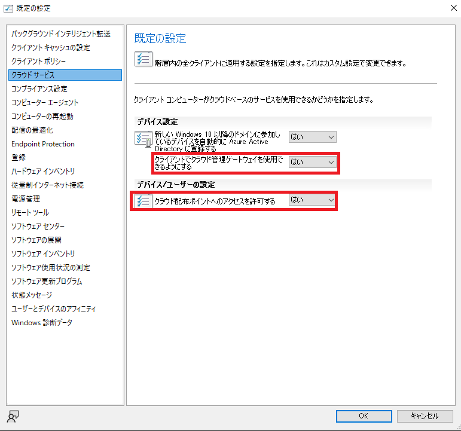

### Azure AD アプリケーションの作成

以下の手順で Azure AD アプリケーションを作成します。

1. [CM コンソール] - [管理] - [概要] - [クラウド サービス] - [Azure サービス] - [Azure サービスの構成]  


2. [Azure サービス ウィザード]が表示されるので、「クラウド管理」が選択されていることを確認して、名前を入力し、「次へ」  


3. [Azure 環境]として [AzurePublicCloud] が選択されていることを確認して、[Web アプリ]の行の「参照」ボタンをクリックします。  


4. 「サーバー アプリ」ダイアログが表示されるので、「作成」ボタンをクリックします。  

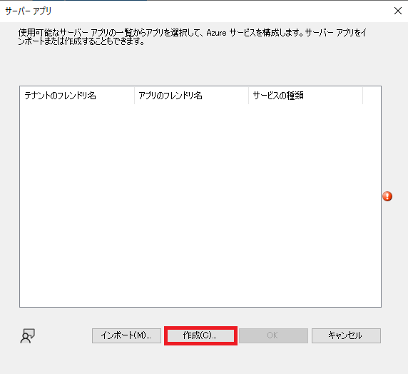

5. 「サーバー アプリケーションの作成」ダイアログで「アプリケーション名」を入力し、「サインイン」ボタンをクリックします。  


6. Azure AD アカウントのログイン画面が表示されるので、Azure AD のグローバル管理者権限を持つアカウントでログインします。  

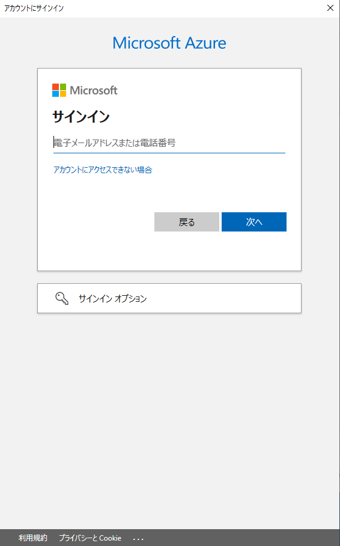

7. ログインに成功すると赤枠の通り、「正常にサインインしました。」と表示されるので、「OK」をクリックします。  

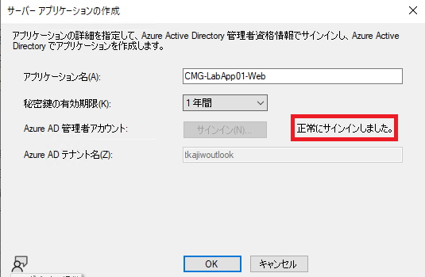

8. 無事アプリケーションが追加されたことを確認して、「OK」をクリックします。  

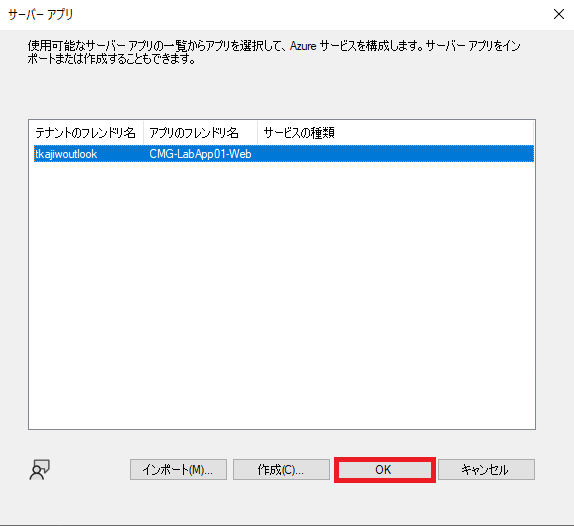

9. 続けてネイティブ クライアント アプリの項目で「参照」をクリックします。  


10. 「クライアント アプリ」ダイアログで「作成」をクリックします。  


11. 「クライアント アプリケーションの作成」ダイアログで「アプリケーション名」を入力し、「サインイン」ボタンをクリックします。  

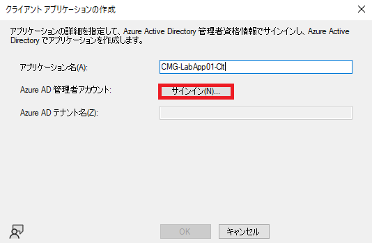

12. Azure AD アカウントのログイン画面が表示されるので、Azure AD のグローバル管理者権限を持つアカウントでログインします。  


13. ログインに成功すると赤枠の通り、「正常にサインインしました。」と表示されるので、「OK」をクリックします。  

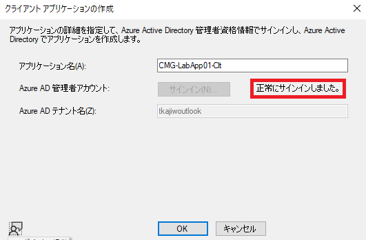

14. 「クライアント アプリ」ダイアログで「OK」をクリックします。  


15. 「アプリのプロパティ」で各アプリの名前が指定されているのを確認して、「次へ」をクリックします。  

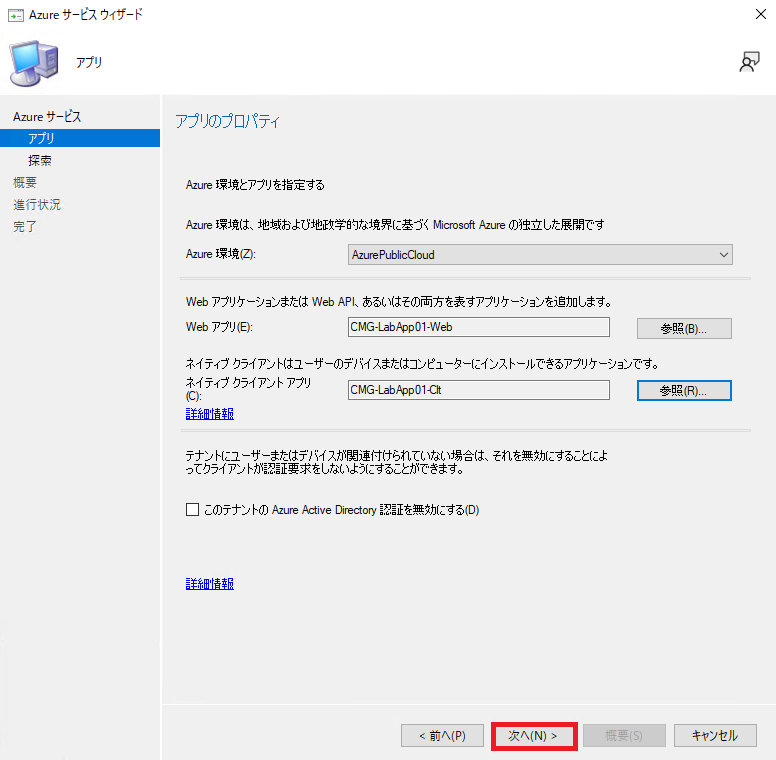

16. 「検出の設定の構成」ステップで「Azure Active Directory ユーザーの探索を有効にする」を有効化にしたまま、「次へ」をクリックします。(クラウド接続アナライザにて グローバル 管理者アカウントを使ったAzure AD 認証テストを行うためにAzure AD ユーザー同期を使います)  

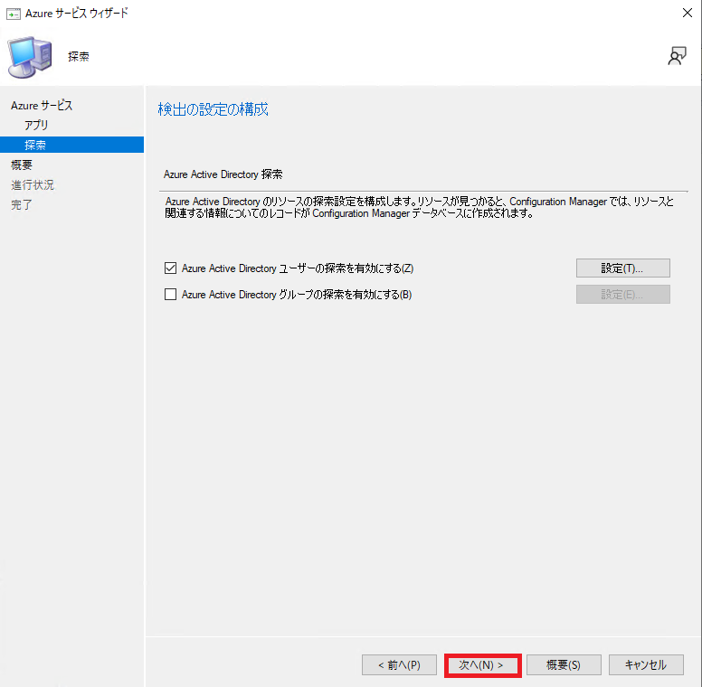

17. 「設定の確認」ステップで内容を確認し、「次へ」をクリックします。  

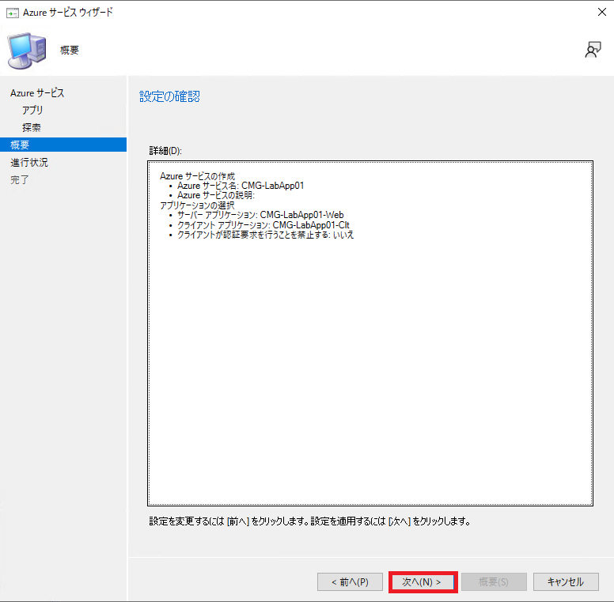

18. 「完了」ステップで「閉じる」をクリックします。  


### クラウド管理ゲートウェイの作成

以下の手順でクラウド管理ゲートウェイを作成します。事前にサーバー証明書をサイトサーバーにアップロードしておきましょう。

1. [CM 管理コンソール] - [管理] - [概要] - [クラウド サービス] - [クラウド管理ゲートウェイ] - [クラウド管理ゲートウェイの作成]


2. 「クラウド管理ゲートウェイの作成ウィザード」が起動したら、Azure 環境として「AzurePublicCloud」が選択されていることを確認して、「サインイン」ボタンをクリックします。

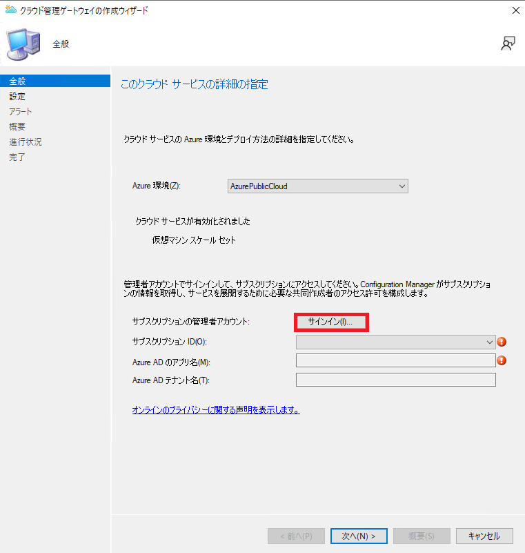

3. Azure AD アカウントのログイン画面が表示されるので、Azure サブスクリプションの共同管理者権限を持つアカウントでログインします。  


4. ログイン後、赤枠の「正常にサインインしました。」が表示されていること、利用するサブスクリプションが選択されていることを確認して、「次へ」をクリックします。  

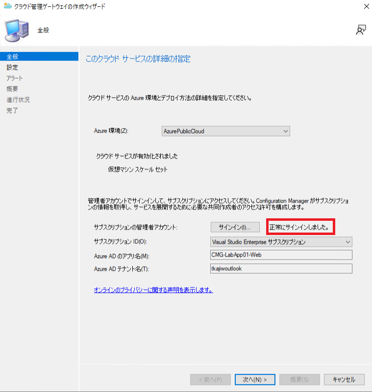

5. 証明書ファイルの「参照」ボタンをクリックして、CMG 用のサーバー証明書を選択します。  


6. 「サービス名」、「展開名」が指定されていることを確認します。(ワイルドカード証明書を利用している場合、サービス名は別途入力します。)


7. 「地域」を「東日本」、「リソースグループの新規作成要否」を「新規作成」、「VM サイズ」を ラボ (B2S) 、「VM インスタンス数」を 「1」に設定し、「次へ」をクリックします。なお、このときの展開名をメモしておきます。  

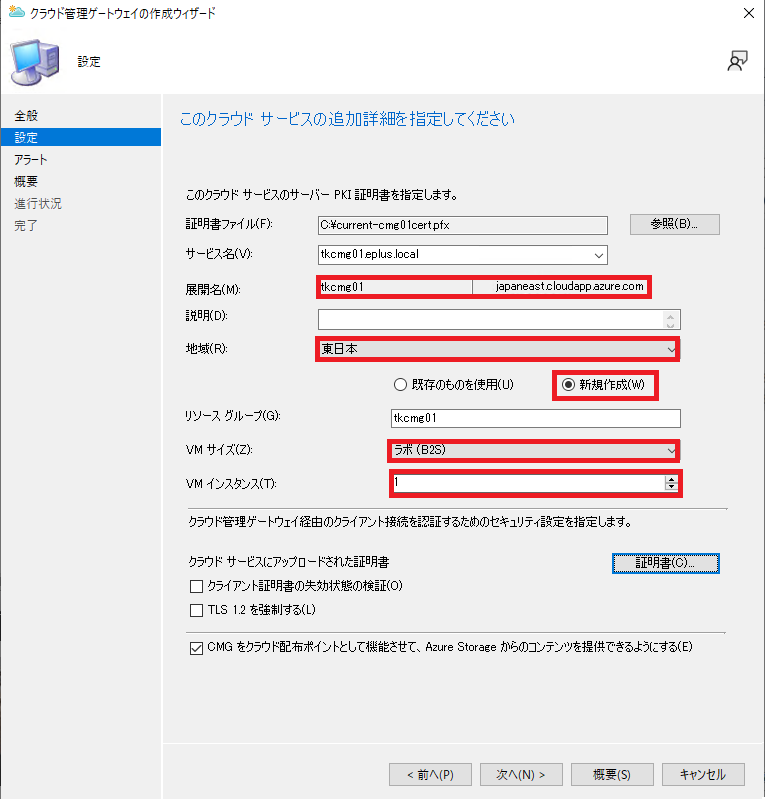

8. 「アラート」は特に設定せず、「次へ」をクリックします。  

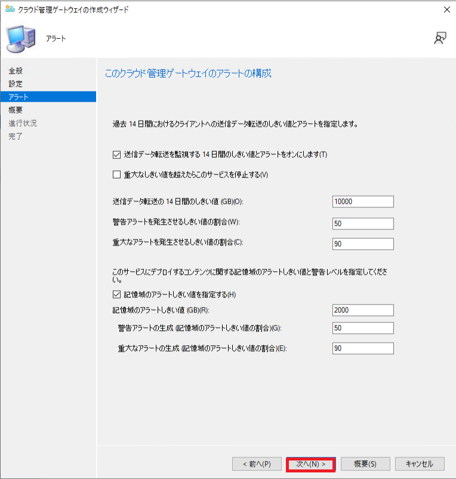

9. 設定内容を確認して、「次へ」をクリックします。  

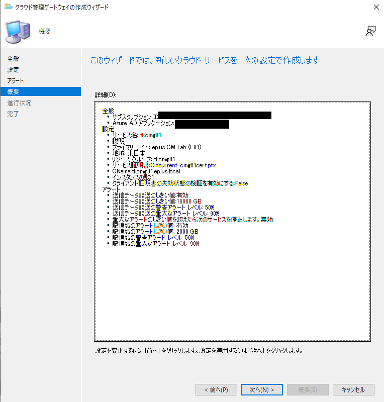

10. 「閉じる」をクリックします。  

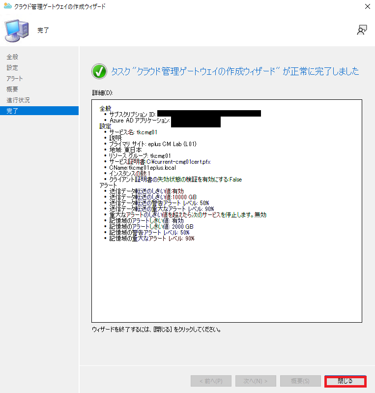

11. クラウド管理ゲートウェイの作成が完了するのを待ちます。  

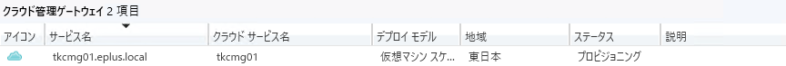

12. ステータスが「準備完了」になれば構築完了です。  


### DNS への CNAME 登録

1. 上記でメモしておいた展開名とサービス名の対応を CNAME として DNS に登録します。以下は Winodws Server の DNS を利用されている場合の例となります。

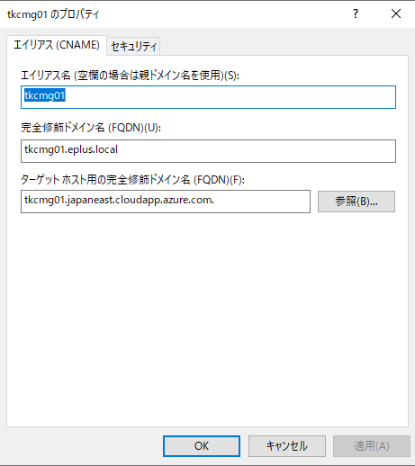

### クラウド管理ゲートウェイ接続ポイントの作成

1. [CM コンソール] - [管理] - [概要] - [サイトの構成] - [サーバーとサイト システムの役割] - 対象のサイト システムを選択 - [サイト システムの役割を追加]  

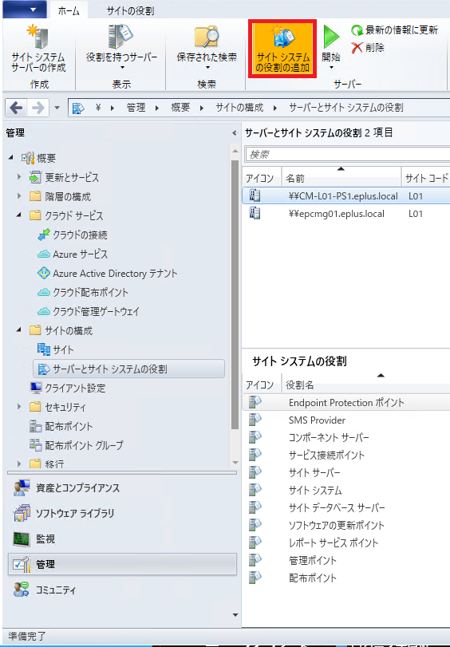

2. 「サイト システムの役割の追加」ウィザードが起動する。「次へ」をクリック。  

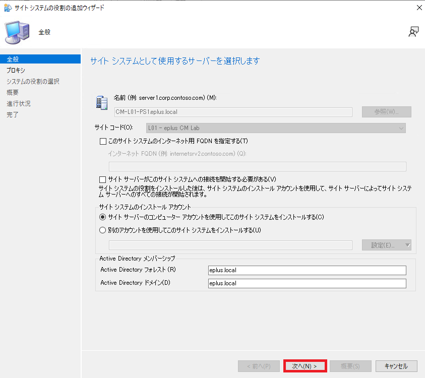

3. プロキシは使わないので、「次へ」をクリックします。  

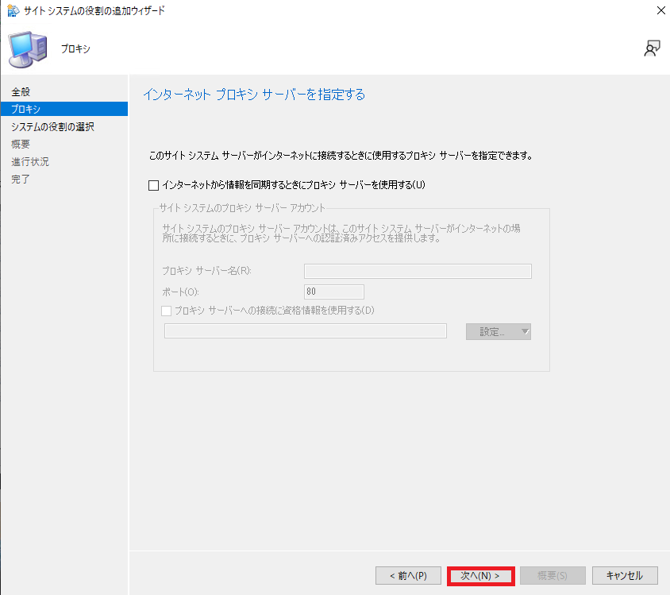

4. 「クラウド管理ゲートウェイ接続ポイント」を選択して「次へ」をクリックします。  

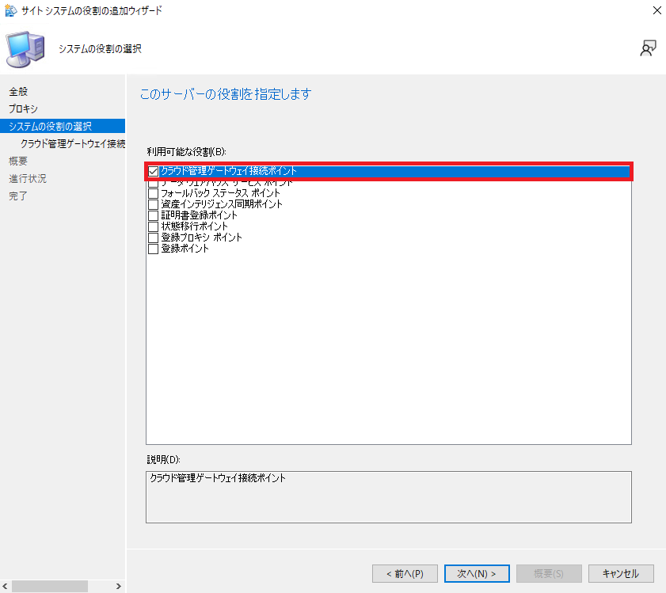

5. 作成したクラウド管理ゲートウェイとリージョンが選択されているのを確認して「次へ」をクリックします。  

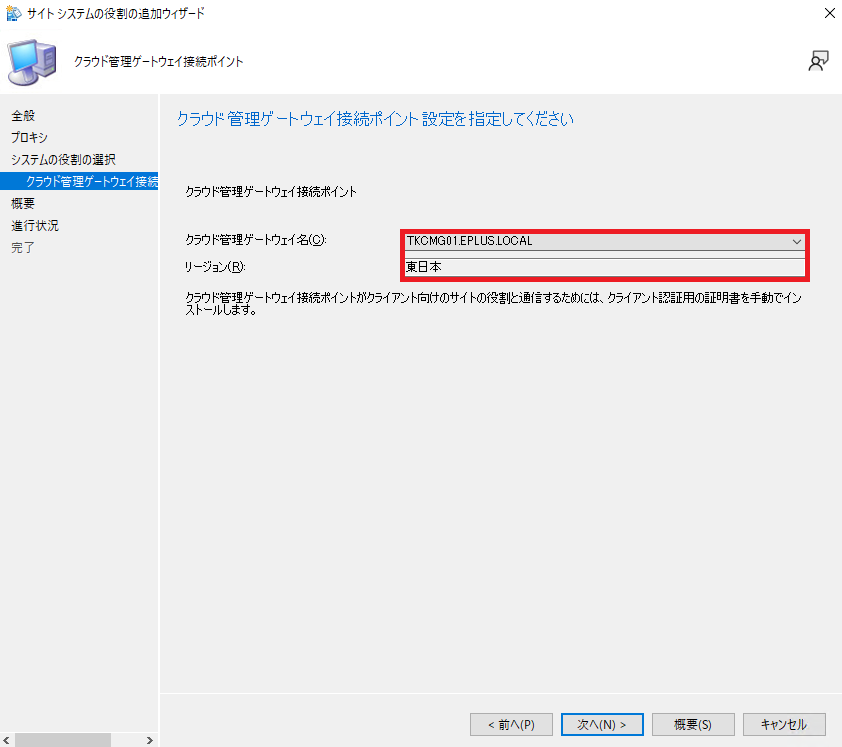

6. 設定内容を確認して「次へ」をクリックします。  

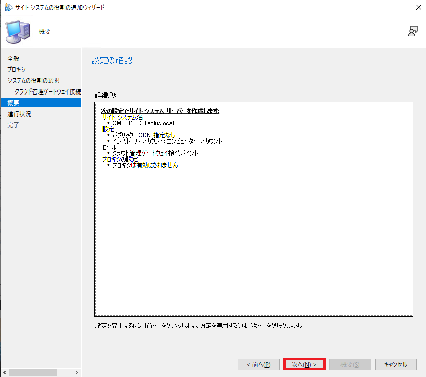

7. 設定完了。「閉じる」をクリックします。  


### 管理ポイント、ソフトウェア更新ポイントの設定

1. 以下 URL の内容に従って各役割の通信方式が拡張 HTTP 方式になっているか確認する。  
Configuration Managerにおける拡張 HTTP の確認方法  
https://jpmem.github.io/blog/mecm/20220122_01/

2. [CM コンソール] - [管理] - [概要] - [サイトの構成] - [サーバーとサイト システムの役割] - 対象のサイト システムを選択 - 画面下部 - [管理ポイント] を選択- [プロパティ]

3. 「全般」タブで「Configuration Manager のクラウド管理ゲートウェイ トラフィックを許可する」を有効化し、下部から「インターネットのみの接続を許可する」か「イントラネットとインターネットの接続を許可する」を選択して、OK をクリックします。


4. [CM コンソール] - [管理] - [概要] - [サイトの構成] - [サーバーとサイト システムの役割] - 対象のサイト システムを選択 - 画面下部 - [ソフトウェアの更新ポイント] を選択- [プロパティ]

5. 「全般」タブで「Configuration Manager のクラウド管理ゲートウェイ トラフィックを許可する」を有効化し、下部から「インターネットのみのクライアント接続を許可する」か「インターネットおよびイントラネット クライアント接続を許可する」を選択して、OK をクリックします。

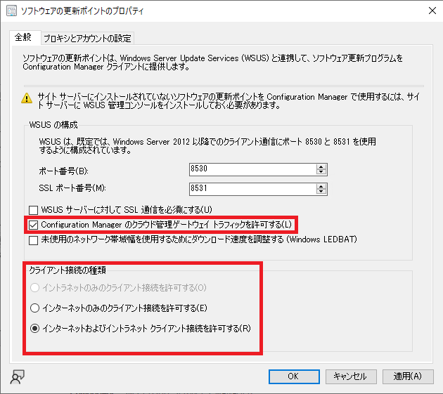

### クラウド接続アナライザーの実施

構築が完了したら、サーバー間の通信が問題無いかを確認するためにクラウド接続アナライザーを実行します。

1. [CM 管理コンソール] - [管理] - [概要] - [クラウド サービス] - [クラウド管理ゲートウェイ] - 対象のクラウド管理ゲートウェイを選択 - [接続アナライザー]  


2. 「クラウド管理ゲートウェイ接続アナライザー」が起動する。「Azure ADのユーザー」が選択されていることを確認して、「サインイン」をクリックし、検証用にAzure AD グローバル管理者のアカウントでログインします。  

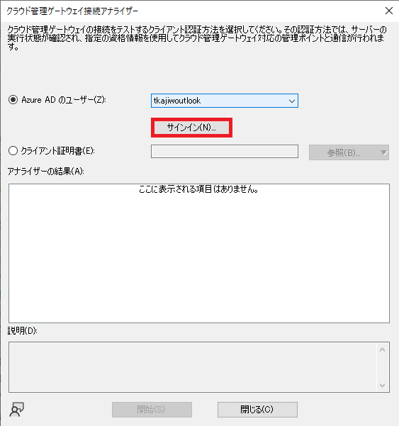

3. 正常にサインインすると赤枠の中に「正常にサインインしました。」と表示されるので、「開始」をクリックします。  

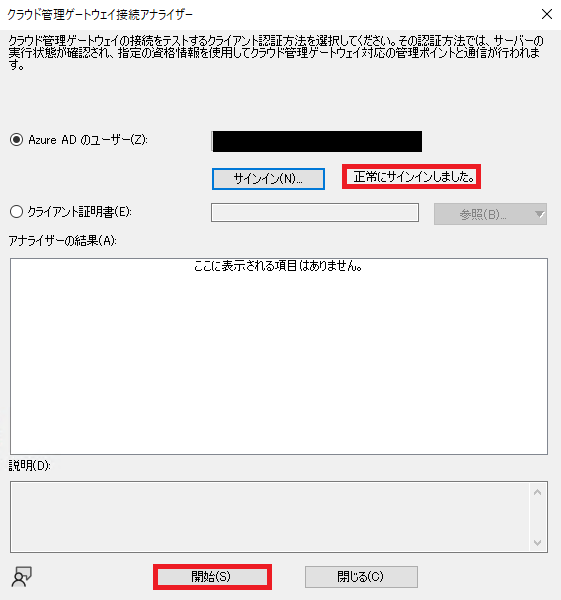


4. 問題無く完了すると 6 つのテスト項目全てで緑色のアイコンで合格と示されます。  

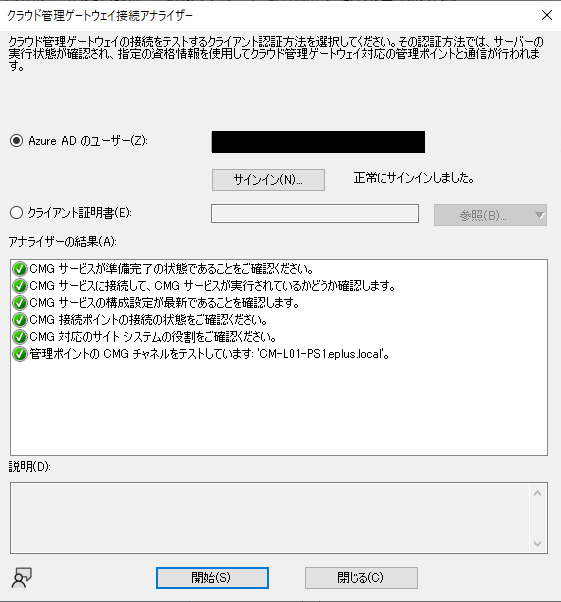


### クライアントでの接続検証

#### 事前準備

1. クライアントにサーバー証明書を発行した CA のルート証明書をインストールしておきます。
2. MECM クライアントバイナリをクライアントに設置しておきます。

#### 一括登録トークンの発行

1. プライマリ サイト サーバーにアクセスします。
2. コマンドプロンプトを管理者権限で開きます。
3. カレント フォルダを 以下に移動します。  
```
[MECM インストール フォルダ]\bin\x64
```
4. 以下のコマンドを実行します。

```
bulkregistrationtokentool.exe /new
```

5. 以下の形でトークンが発行されるので、赤枠の箇所をコピーしてクライアントに渡します。(秘密情報のため途中でトークンを塗りつぶしています)  

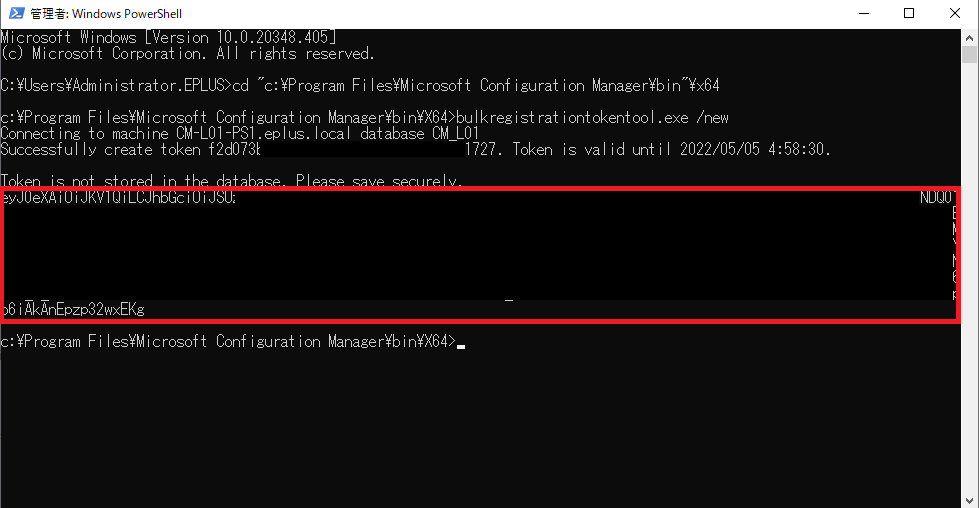

#### CMG URL の取得

1. プライマリ サイト サーバーにアクセスします。
2. SQL Server Management Studio を起動します。
3. 下記画面で「接続」をクリックします。  
   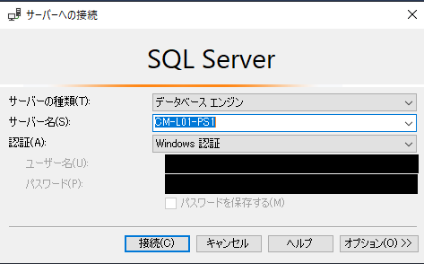
4. サイト データベースのアイコン (CM_[サイト コード])を右クリックし、「新しいクエリ」を選択します。  
   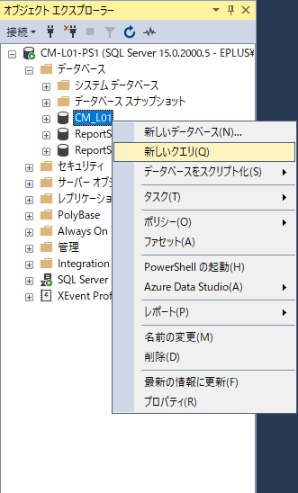
5. サイト データベース に対して以下のクエリを実行します。
```sql
SELECT [MutualAuthPath]  
FROM [dbo].[vProxy_Roles]  
Where [RoleTypeID] = '6'
```
5. 取得した URL をメモしておきます。  

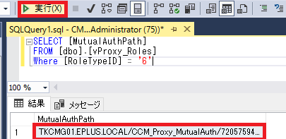


#### MECM クライアントのインストール

1. クライアントにアクセスします。
2. コマンド プロンプトを管理者権限で開きます。
3. カレント フォルダをクライアント バイナリ (ccmsetup.exe ファイルを置いたフォルダー) の場所に移動します。
4. 以下のコマンドで MECM クライアントをインストールします。
```
ccmsetup.exe /NoCRLCheck /source:[クライアント バイナリの場所] SMSSITECODE=[接続先サイト コード] CCMHOSTNAME="[取得した CMG URL]" SMSMP="[管理ポイントのFQDN]" /regtoken:[取得した一括登録トークン] CCMALWAYSINF=1
```
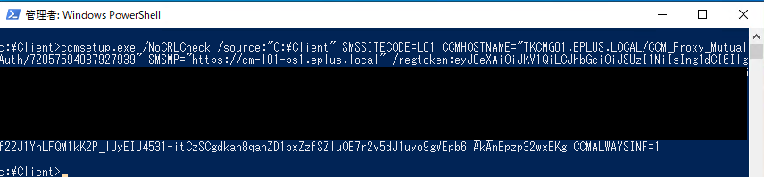

5. 上記実行後、C:\Windows\CCM\Logs\ClientIDManagerStartup.log に以下のログが出力されていたらインストール及びデバイス登録成功。

```
[RegTask] - Client is registered. Server assigned ClientID is GUID:A4AC8F79-FADE-4758-84B9-C8D5F2F56310. Approval status 1	ClientIDManagerStartup	2022/05/02 14:43:58	6488 (0x1958)
```
#### MECM クライアントの接続確認

以下のログが出力されていたら CMG をリバースプロキシとして接続できていることを確認できます。

1. C:\Windows\CCM\Logs\CcmMessaging.log 
クライアントから CMG への状態メッセージ伝達がHRESULT = "0x00000000" とエラー無しで終了している。

```
Raising event:
instance of CCM_CcmHttp_Status
{
	ClientID = "GUID:A4AC8F79-FADE-4758-84B9-C8D5F2F56310";
	DateTime = "20220502055308.653000+000";
	HostName = "TKCMG01.EPLUS.LOCAL";
	HRESULT = "0x00000000";
	ProcessID = 9596;
	StatusCode = 0;
	ThreadID = 9580;
};
	CcmMessaging	2022/05/02 14:53:08	9580 (0x256C)
```

2. C:\Windows\CCM\Logs\DataTransferService.log
クライアントから CMG 経由で管理ポイントへ行われた通信のジョブが成功している。

```
DataTransferService: DTSJob({1BBCC127-0677-4E8B-AC26-8F1905884EF6}) - created to download from 'https://TKCMG01.EPLUS.LOCAL:443/CCM_Proxy_ServerAuth/72057594037927939/SMS_MP' to 'C:\Windows\CCM\CIDownloader\Staging'.	DataTransferService	2022/05/02 14:44:40	8544 (0x2160)
DTSJob({1BBCC127-0677-4E8B-AC26-8F1905884EF6}): Job has completed: Status : SUCCESS, Start time : 05/02/2022 14:44:40, Completion time : 05/02/2022 14:44:41, Elapsed time : 0 seconds	DataTransferService	2022/05/02 14:44:41	8236 (0x202C)
```

