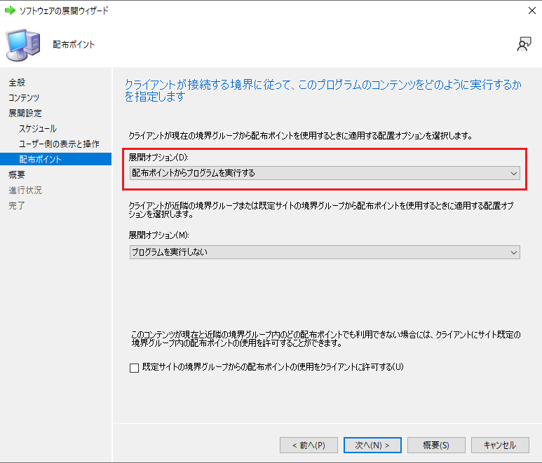

みなさま、こんにちは。Configuration Manager サポート チームです。

Configuration Manager を利用したアプリケーションや更新プログラムの配布運用をされているなかで、管理対象クライアントに対して過去配布したコンテンツを一括で削除されたいと思われたことはございませんか？  
また、クライアント設定で指定したクライアント キャッシュのサイズを超過していることがあると不思議に思われたことはありませんか？  
今回は、クライアント キャッシュの動作と管理対象デバイスへ配布したコンテンツをサーバーから一括で削除する方法についてご紹介させていただきます。

# クライアント キャッシュの動作

管理対象デバイスにコンテンツ（アプリケーション、パッケージや更新プログラム　など）を展開すると、管理対象デバイスはクライアント キャッシュ（ccmcache フォルダー）にコンテンツのダウンロードを行います。  
クライアント キャッシュは、指定されたキャッシュ サイズまでコンテンツのダウンロードし保存します。  
次に、新しいコンテンツをダウンロードする際に、指定されたキャッシュ サイズ（累積）を超えるコンテンツのダウンロードを行う場合は、新しいコンテンツをクライアント キャッシュ内にダウンロードを行うための領域を確保するのに、古いコンテンツを自動で削除してからダウンロードを行います。  
ここまでが基本動作となりますが、ソフトウェア更新プログラム機能で配布した更新プログラムはクライアント キャッシュのサイズに関係なくダウンロードするため、指定したクライアント キャッシュのサイズを超過することが起きます。

実際にコンテンツのダウンロードが行われる際のコンテンツ情報（サイズ）を見てみましょう。  
確認するログは、管理対象デバイスに生成される ”CAS.log” となります。

- パッケージを展開した場合

```txt
**** Received request for content PS10001B.2, size(KB) 1048848, under context System with priority Low, persist duration 0
CacheManager: ADD new cache entry {93CCFA37-5CC3-4E6E-A99A-21B120F10276} for content PS10001B.2, Size : 1048848K, RefCount : 1, LastRef Minutes : 0, State : ACTIVE, PersistDuration : 0, Location : C:\Windows\ccmcache\1.
```

- アプリケーションを展開した場合

```txt
**** Received request for content Content_8e82e01e-98fc-47c7-9f41-7f13b78e93a6.1, size(KB) 5532, under context System with priority Medium, persist duration 0
CacheManager: ADD new cache entry {611DEEB6-C117-4998-92AB-D996C28E2C49} for content Content_8e82e01e-98fc-47c7-9f41-7f13b78e93a6.1, Size : 5532K, RefCount : 1, LastRef Minutes : 0, State : ACTIVE, PersistDuration : 0, Location : C:\Windows\ccmcache\2.
```

- 機能更新プログラムを展開した場合

```txt
**** Received request for content 627d1aed-c707-4b2f-8dc5-5ce588ef8308.1, size(KB) 0, under context System with priority Medium, persist duration 0
CacheManager: ADD new cache entry {160D2012-B37D-4AE1-B3B2-B4C94CF24E80} for content 627d1aed-c707-4b2f-8dc5-5ce588ef8308.1, Size : 3749136K, RefCount : 1, LastRef Minutes : 0, State : ACTIVE, PersistDuration : 0, Location : C:\Windows\ccmcache\1.
```

  ※「627d1aed-c707-4b2f-8dc5-5ce588ef8308」は、Windows 10 バージョン 21H2 の機能更新プログラムの ID となります。

- 累積更新プログラムを展開した場合

```txt
**** Received request for content 9f8e1ae1-c800-4603-aa6d-378d65ba48f4.1, size(KB) 0, under context System with priority Medium, persist duration 0
CacheManager: ADD new cache entry {9CD3EEA7-DFD7-4EC2-ACB6-6A39972DDBF1} for content 9f8e1ae1-c800-4603-aa6d-378d65ba48f4.1, Size : 655018K, RefCount : 1, LastRef Minutes : 0, State : ACTIVE, PersistDuration : 0, Location : C:\Windows\ccmcache\7.
```

  ※「9f8e1ae1-c800-4603-aa6d-378d65ba48f4」は、2022-03 x64 ベース システム用 Windows 10 Version 21H1 の累積更新プログラム (KB5011487) の ID となります。

ご覧のとおり、パッケージとアプリケーションのデータ サイズは展開するデータ サイズと同一のデータ サイズでリクエストを受け取りますが、一方で機能更新プログラムおよび累積更新プログラムのデータ サイズは数百 MB や数 GB の実際のデータ サイズではなく、0KB としてリクエストを受け取っていることが確認できます。

# クライアント キャッシュのクリア方法

通常、クライアント キャッシュのクリアする場合、管理対象デバイス上で [コントロールパネル] にございます [Configuration Manager] の [キャッシュ] タブより、個別にキャッシュのクリアが必要となります。  
しかしながら、こちらは管理者権限を持ち合わせたアカウントでないと実行いただけなく、また、ご利用者様にてご実施いただく必要があります。

以下にご案内する PowerShell スクリプトを実行することにより、管理対象デバイス上にて [Configuration Manager] でキャッシュのクリアを行わずに、ダウンロードしたコンテンツを削除いただけます。

## ccmcache フォルダー内すべて削除

```PowerShell
$UIResourceMgr = New-Object -Com "UIResource.UIResourceMgr"
$Cache = $UIResourceMgr.GetCacheInfo()
$Cache.GetCacheElements() | % {$Cache.DeleteCacheElement($_.CacheElementID)}
```

## ソフトウェア更新プログラムのみすべて削除

```PowerShell
$UIResourceMgr = New-Object -Com "UIResource.UIResourceMgr"
$Cache = $UIResourceMgr.GetCacheInfo()
$Cache.GetCacheElements() | where-object {$_.ContentId.Length -ne 8 -and $_.ContentId -notlike 'conten*'} | % {$Cache.DeleteCacheElement($_.CacheElementID)}
```

# リモートによるクライアント キャッシュのクリア方法

## 方法 1：スクリプト機能

MECM の標準機能であるスクリプト機能を利用して、デバイス単位、または、デバイス コレクションに登録されたデバイスに対して一括でキャッシュのクリアを実行いただけます。  
上述でご案内している PowerShell コマンドレットを登録しておくだけで任意のタイミングで実行いただけますので是非ご活用ください。  
なお、スクリプト機能は以下のブログにて詳細にご説明していますので、こちらをご確認ください。

Title:スクリプト機能のご紹介
URL:https://jpmem.github.io/blog/mecm/20211025_01/

## 方法 2：パッケージ配布

方法の 2 つ目は PowerShell コマンドレットを PS1 形式のスクリプト ファイルにし、パッケージングして配布する方法です。  
方法 1 のスクリプト機能とは異なり即時性はございませんが、定期的に削除するようスケジュール設定できるメリットがございます。  
定期的にクライアント キャッシュ上のコンテンツを削除する運用を取り入れたい場合にはパッケージ配布機能をご選択ください。

- 1）パッケージの作成

1. MECM コンソールにて、[ソフトウェア ライブラリ] - [概要] - [アプリケーション管理] - [パッケージ] を開きます。
2. [パッケージ] を右クリックし、[パッケージの作成] をクリックします。
3. [パッケージとプログラムの作成ウィザード] の [パッケージ] より、[名前] に任意の名前を入力し、[このパッケージにソース ファイルを含める] にチェックを入れます。
4. [ソース フォルダー] の参照ボタンをクリックし、上述にご案内している PowerShell コマンドレットの \*.PS1 ファイルを、スクリプト ファイルの格納場所 (共有フォルダー パス) を指定し、[次へ] をクリックします。
5. [プログラムの種類] にて、[次へ] をクリックします。
6. [標準プログラム] にて、[名前] に任意の名前を指定し、ログオン状態に関わらずスクリプトを実行するために次のように指定します。  
   　・コマンドライン
   　　-32bit OS の場合：powershell.exe -ExecutionPolicy Bypass -NoLogo -NonInteractive -NoProfile -WindowStyle Hidden -File .\<ファイル名>.ps1
   　　-64bit OS の場合：%windir%\sysnative\WindowsPowerShell\v1.0\powershell.exe -ExecutionPolicy Bypass -NoLogo -NonInteractive -NoProfile -WindowStyle Hidden -File .\<ファイル名>.ps1
   　　　　※<ファイル名>.ps1 の「ファイル名」には、事前に作成したスクリプト ファイルの名に変更ください。
   　・プログラムの実行条件
   　　ユーザーのログオン状態に関係なし
   　・実行モード
   　　管理者権限で実行する
7. [要件] より、[次へ] をクリックします。
8. [概要] より、設定内容を確認して、[次へ] をクリックします。
9. [完了] より、正常に完了したことを確認し、[閉じる] をクリックします。

- 2） パッケージの展開

1. 作成したパッケージを右クリックし、[展開] をクリックします。
2. ソフトウェアの展開ウィザードの [全般] より、[参照] をクリックし、配布先のコレクションを指定して [次へ] をクリックします。
3. [コンテンツ] より、[追加] をクリックし配布ポイントを選択し、[次へ] をクリックします。
4. [展開設定] より、目的を “必須” に設定して、[次へ] をクリックします。
5. [スケジュール] より、[割り当てスケジュール] から [新規] をクリックします。
6. [割り当てスケジュール] より、[スケジュール] をクリックします。  
     ※直ちに実行されたい場合は、[次のイベントの直後に割り当てる] の “直ちに” をご指定ください。
7. [カスタム スケジュール] ページにおいて開始時刻を設定し、繰り返しパターンを設定して [OK] をクリックします。
8. [割り当てスケジュール] より、[OK] をクリックします。
9. [スケジュール] にて、[再実行の動作] を [プログラムを常に再実行する] に設定して [次へ] をクリックします。
10. [ユーザー側の表示と操作] より、必要に応じて通知設定を設定し [次へ] をクリックします。
11. [配布ポイント] より、上段の展開オプションを [配布ポイントからプログラムを実行する] に設定し [次へ] をクリックします。

※ご参考
 12. [概要] より、設定内容を確認して、[次へ] をクリックします。  
13. [完了] より、正常に完了したことを確認し、[閉じる] をクリックします。

展開完了後、クライアントが MECM とポーリングを行うと展開ポリシーをダウンロードして順次実行されますので、クライアント キャッシュ上のコンテンツが削除されるのを待ちます。

## 応用：n 日前のコンテンツを削除

クライアント キャッシュ上のコンテンツが一気に削除されるのは心配という場合には、以下にご紹介する PowerShell コマンドレットにて、現在の日にちより前のコンテンツを削除条件としていただくことも可能ですので、こちらのご利用もご検討ください。

```PowerShell
$targetdate=(Get-Date).AddDays(-xx)
$UIResourceMgr = New-Object -Com "UIResource.UIResourceMgr"
$Cache = $UIResourceMgr.GetCacheInfo()
$Cache.GetCacheElements() | where {$_.LastReferenceTime -lt $targetdate} | % {$Cache.DeleteCacheElement($_.CacheElementID)}
```

※「xx」の箇所については、現在の日時より前のコンテンツを削除する日数をご指定ください。  
　 例えば、90 日前とする場合は、「$targetdate=(Get-Date).AddDays(-90)」とします。

- 免責事項
  当ブログ内でご紹介しているサンプル スクリプトは弊社環境で検証した上でご案内しておりますが、弊社にてその動作を保証するものではございません。
  ご使用の際は、お客様の環境に合わせて変更いただき、十分にテストした上で、ご利用くださいますようお願いいたします。
