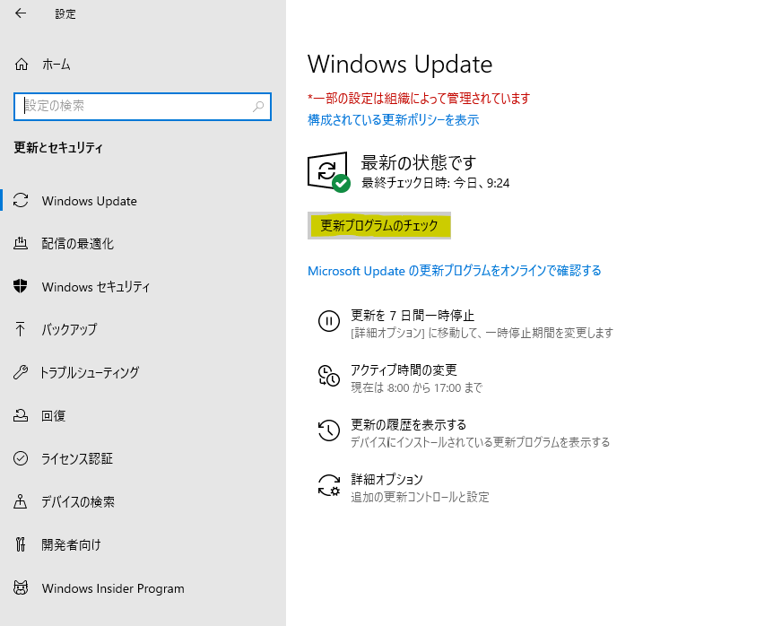

みなさま、こんにちは。Configuration Manager サポート チームです。

今回は Microsoft Endpoint Configuration Manager (以下 MECM) 環境下において、クライアント側で [Windows の設定] - [Windows Update] - [更新とセキュリティ] - [更新プログラムのチェック] をクリックした際の動作についてご紹介いたします。

# MECM 環境下のクライアントで、[更新プログラムのチェック] をクリックすると、MECM から展開した更新プログラムを受け取れるの？

いいえ。受け取れません。  
Windows の更新とセキュリティでの [更新プログラムのチェック] のクリックしますと、クライアントが ソフトウェア更新ポイントの役割が追加されたサーバーにインストールした WSUS に対し WSUS コンソールで承認された更新プログラムの有無を確認する動作となります。  
MECM 環境下においては、WSUS で承認を行わないため [更新プログラムのチェック] をクリックしても MECM からの展開を検出せず、更新プログラムはダウンロードされません。
その為、MECM クライアント コンソール で各サイクルの実行にて展開を受け取る操作を行う事が、MECM からの展開を受け取れているのかを確認する正しい方法となります。

展開を受け取るための MECM クライアント コンソールでの各サイクルの実行につきましては、以下ブログをご参考にしてくださいませ。  
Title : Configuration Manager で、できる限り早く更新プログラムを適用する方法について  
URL : https://jpmem.github.io/blog/mecm/20180619_01/

# [更新プログラムのチェック] と MECM クライアント コンソールでの各サイクルの実行の動作の違いについて

Windows の更新とセキュリティでの [更新プログラムのチェック] を実行した際の動作と MECM クライアントが展開された更新プログラムを受け取る場合の動作は異なるものでありますため、その差異を補足いたします。

クライアント側で Windows の更新とセキュリティでの「更新プログラムのチェック」を実行した際の動作としましては、OS の Update Orchestrator というサービスが Windows Update Agent (WUA) に要求を出し、 WSUS の承認情報を取得しにいきます。  
その為、MECM 環境下においては、WSUS で承認を行わないため、[更新プログラムのチェック]をクリックしても MECM からの展開を検出せず、「最新です」と表示される動作になります。

一方、MECM から展開された更新プログラムを受け取る場合の動作としましては、以下の流れとなります。

1. CcmExec (MECM クライアントのプロセス) が Windows Update Agent (WUA) に要求を出し、ソフトウェアの更新ポイント サーバー (WSUS サーバー) に対してスキャンを行い、更新プログラムの要否を判断します。
2. CcmExec が [コンピューター ポリシーの取得および評価サイクル] を実行するタイミングで MECM サーバーから更新プログラムの展開情報を受信します。
3. スキャンの結果「必要」と判断した更新プログラムが展開されている場合、展開設定に応じてダウンロード、インストールを行います。

その為、MECM から展開されている更新プログラムが、すべて適用されているかの確認につきましては、Windows の更新とセキュリティでの [更新プログラムのチェック] ではなく、 MECM クライアント コンソールで、[上述の公開情報](https://jpmem.github.io/blog/mecm/20180619_01/)に記載の各サイクルの実行にて展開を受け取る操作をご実施後、ダウンロードされてくる更新プログラムの有無によりご確認いただく事が可能でございます。
