みなさま、こんにちは。Configuration Manager サポート チームです。  

本日は、クラウド管理ゲートウェイ (CMG) の監視と運用についてご案内させていただきます。CMG は クラウド上の PaaS 形式で提供されるサービスのため、必要な監視・運用作業は非常に少ないものとなっております。

## CMG の監視

下記 Docs でご案内しております。CMG では CPU やメモリ使用量の監視は必要なく、主にトラフィック、コンテンツ、ログ状態を監視することになります。

CMG を監視する  
https://docs.microsoft.com/ja-jp/mem/configmgr/core/clients/manage/cmg/monitor-clients-cloud-management-gateway

### トラフィック監視

Docs でご案内している通り、以下にて CMG のトラフィック状態を監視できます。

[CM コンソール] - [管理] - [概要] - [クラウド サービス] - [クラウド管理ゲートウェイ] - 該当の CMG を選択 - 画面下部「接続ポイント」タブ

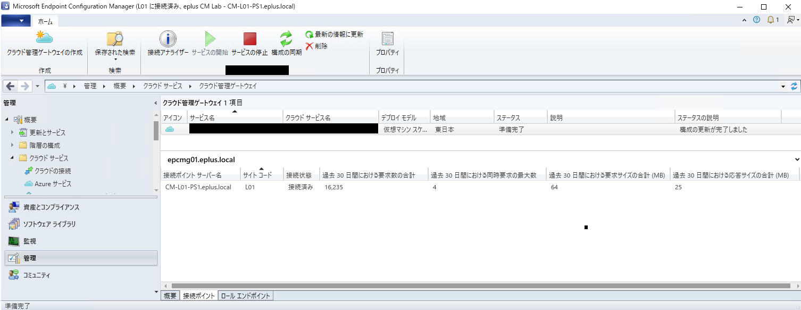

### ストレージ監視

CMG の項目表示列を右クリックから追加することで CMG のストレージ利用量や、CMG からクライアントにコンテンツがダウンロードされた量 を確認できます。

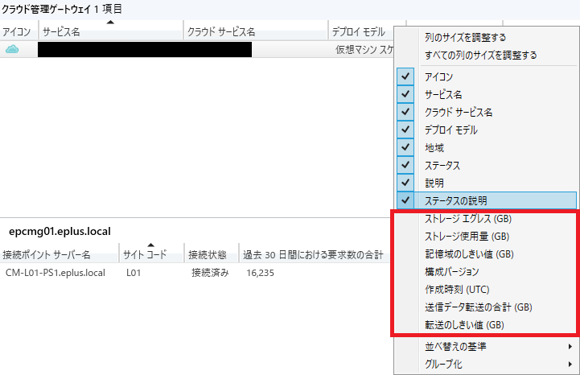

### ログ監視

こちらも Docs にある通りですが、CMG 自体の動作ログは 5 分周期で Azure ストレージから最上位サイトサーバーの Logs フォルダーに同期される仕組みとなっております。

ログを監視する  
https://docs.microsoft.com/ja-jp/mem/configmgr/core/clients/manage/cmg/monitor-clients-cloud-management-gateway#monitor-logs

### クラウド管理ダッシュボード

Docsにもありますが以下に形で Azure AD 統計の後に CMG 関連の統計ダッシュボードを開けますのでご活用ください。CMG からの接続状況の確認にご活用できるかと存じます。

[監視] - [概要] - [クラウド管理]  
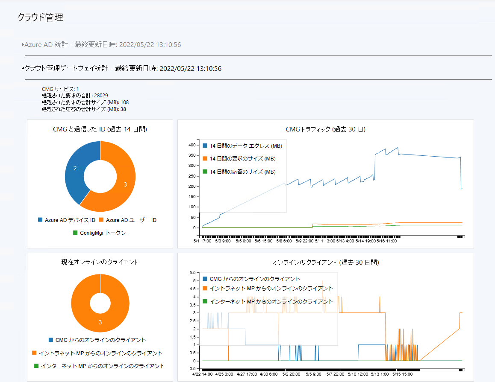

## CMG の運用

CMG に必要な運用作業は以下となります。なお、下記の作業はすべて Azure ポータルからではなく、CM コンソールから実行ください。

1. CMG の起動
2. CMG の停止
3. CMG と構成情報の同期
4. CMG サーバー証明書の更新
5. Entra ID アプリケーション秘密鍵の更新

### CMG の起動

以下を実行してください。  

[CM コンソール] - [管理] - [概要] - [クラウド サービス] - [クラウド管理ゲートウェイ] - 該当の CMG を選択 - [サービスの開始]

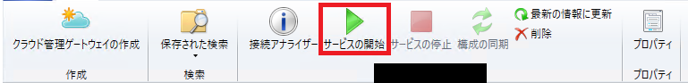

実行すると ステータスの項目が「開始中」 -> 「準備完了」と遷移します。

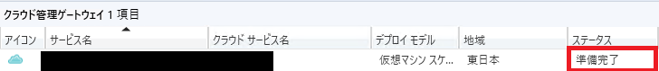

### CMG の停止

以下を実行してください。  

[CM コンソール] - [管理] - [概要] - [クラウド サービス] - [クラウド管理ゲートウェイ] - 該当の CMG を選択 - [サービスの停止]  

実行すると ステータスの項目が「停止中」 -> 「停止」と遷移します。  

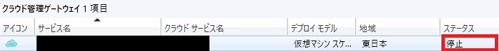

### CMG と構成情報の同期

接続するクラウド管理ゲートウェイサービス接続ポイントや管理ポイント等の設定変更等が行われると、構成情報の同期が必要となります。その際は以下を実行してください。  

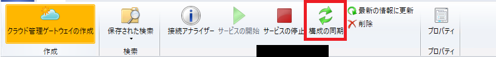

実行すると、ステータスの項目が「アップグレードしています」 -> 「準備完了」と遷移後、ステータスの説明に「構成の更新が完了しました」と表示されます。

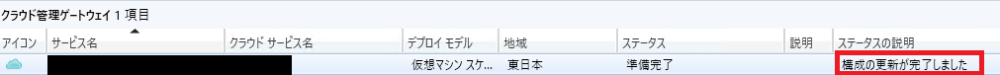

### CMG サーバー証明書の更新

CMG のサーバー証明書の有効期限が切れる前に、サーバー証明書を更新ください。サーバー証明書のサブジェクト名、サブジェクト代替名の内容は変更せずに更新ください。

1. [CM コンソール] - [管理] - [概要] - [クラウド サービス] - [クラウド管理ゲートウェイ] - [プロパティ] - [設定]タブ へ遷移します。
2. [参照]ボタンをクリックします。  

3. 更新したサーバー証明書を指定します。
4. 指定した証明書ファイルが選択されていることを確認します。

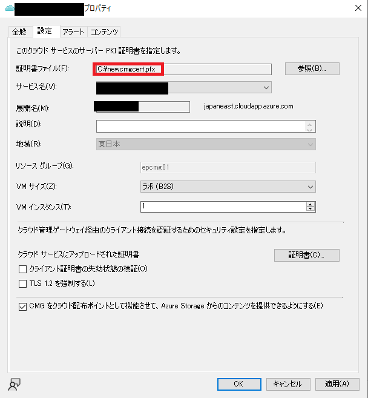  

5. ダイアログ右下の「適用」、「OK」ボタンをクリックします。
6. CMG のステータスが「準備完了」になれば終了です。

### Entra IDアプリケーション秘密鍵の更新

Entra ID アプリケーション秘密鍵の期限が切れる前に更新します。本秘密鍵は、ConfigMgr サーバーが Azure リソースとの通信の際に使われる秘密鍵になります。**期限切れしてしまうと、 ConfigMgr サーバーが Azure リソースと通信できなくなるためご注意ください。 期限が切れてしまうと Entra ID アプリケーションの再作成、及び CMG の再構築が必要になってしまいます。**

なお、作業に該当の Entra ID にて少なくとも クラウドアプリケーション管理者 権限が必要となりますので、事前に準備ください。

1. [CMコンソール] - [管理] - [概要] - [クラウド サービス] - [Azure Active Directory テナント] - 利用しているテナントを選択 - 画面下部「アプリケーション」から 利用している Web アプリケーションを選択  

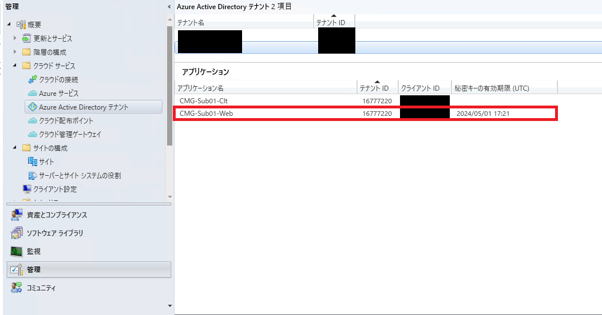  

2. 「秘密鍵を更新する」をクリックする。  

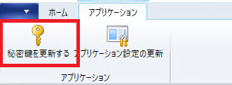  

3. Entra ID 認証が求められたら、利用しているテナントのグローバル管理者権限でログインする。
4. ログイン後、以下のダイアログが表示されたら 「OK」をクリックする。　　

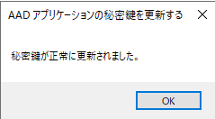  

5. CM コンソールの画面を更新し、秘密キーの有効期限 (UTC) が更新されていることを確認する。

## 改訂履歴
- 2022-05-22 初版
- 2022-06-26 秘密鍵更新時の権限について修正。 表記修正。(Azure AD -> Entra ID, MECM -> ConfigMgr)