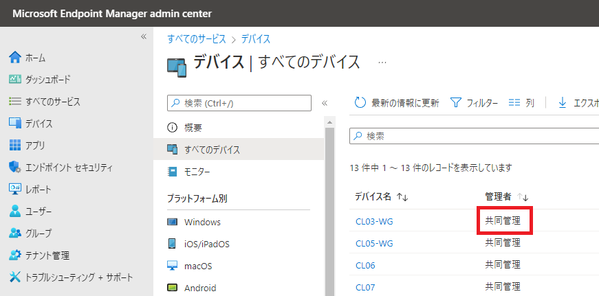
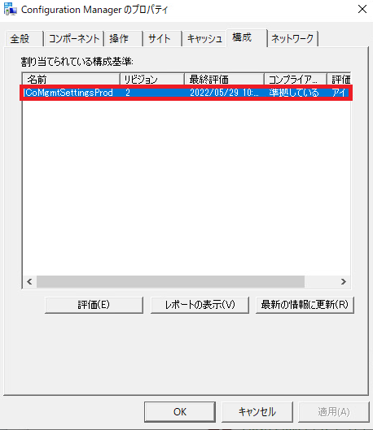

みなさま、こんにちは。Configuration Manager サポート チームです。  

本日は、Microsoft Endpoint Manager　(MEM) が提供する共同管理 のよくある質問 (FAQ)、およびよくあるトラブルシューティング方法についてご案内いたします。なお、本記事は随時アップデートされる予定です。

## よくある質問 (FAQ)

### 共同管理の利用条件

#### Intune と MECM の組み合わせ以外で共同管理は構成できるか

大変申し訳ございませんが、他ベンダー様の製品と弊社製品での組み合わせにおける共同管理は構成できません。なお、他社 MDM 製品と MECM クライアントが同居している状態は以下でご案内している「共存」状態となりますのでご留意ください。

Configuration Manager (CM) における共存状態について  
https://jpmem.github.io/blog/mecm/20211214_01/

#### Azure AD Registered 状態のデバイスは共同管理できないのか

共同管理状態にできません。Azure AD Joined 状態もしくは Hybrid Azure AD Joined 状態にできるようにしてください。

#### 共同管理における MECM サーバーと Intune の接続条件は

共同管理において、MECM サーバーは Intune と接続できる必要はございません。管理対象のクライアントがそれぞれ MECM サーバー、 Intune に接続できるようにしてください。その他のインターネット アクセス要件は以下をご確認ください。

インターネット アクセス要件  
https://docs.microsoft.com/ja-jp/mem/configmgr/core/plan-design/network/internet-endpoints

#### 共同管理において、クラウド管理ゲートウェイ (CMG) の利用は必須か

お客様のご利用要件によっては必須ではございません。以下のようなケースでは CMG が必要となってまいりますのでご検討ください。

1. イントラネットでのキッティングを行わないため、インターネット経由で MECM サーバーに登録する必要がある。(AutoPilot の利用ケースなど)
2. 長期出張などで長期間イントラネット内の MECM サーバーに接続出来ない期間がある

### Intune 画面

#### 特に共同管理設定を実施していないのに Intune 上のデバイス一覧にて「管理者」項目が「共同管理」になった。

以下の画面の状況かと存じます。  

  

2022 年 5 月現在、Intune クライアントは自身の端末に MECM クライアントが存在するのを検出すると、実際には共同管理状態になっていなくても、該当の項目を「共同管理」に切り替えてしまいます。 正しく共同管理状態にするには MECM コンソール上にて共同管理構成設定をする必要がございますので、ご理解くださいますようお願いいたします。共同管理の設定方法については以下ブログ記事をご参照ください。

Configuration Manager における共同管理機能について  
https://jpmem.github.io/blog/mecm/20220321_01/


#### 共同管理設定後、Intune 上のデバイスの「管理者」項目が「ConfigMgr」となった。

以下の画面の状況かと存じます。  

  


上記は、共同管理状態ではなく、MECM コンソールの以下の設定により、MECM クライアントのみがインストールされているデバイスの識別情報がアップロードされている状態です。

- [MECM コンソール] - [管理] - [概要] - [クラウド サービス] - [クラウドの接続] - [プロパティ] - [アップロードを構成する]
    - [Microsoft エンドポイント マネージャー管理センターにアップロードする] が有効化されている
  
  

本アップロードは「テナント アタッチ」機能のために行われ、テナント アタッチ機能は MECM コンソールで実施していた幾つかの作業を、代わりに Intune (MEM 管理センター)の画面を通して行うための機能です。共同管理とは直接は関係のない機能となりますのでご承知おきください。テナント アタッチについては以下を参照ください。

テナントのアタッチ ドキュメント  
https://docs.microsoft.com/ja-jp/mem/configmgr/tenant-attach/

### 共同管理にしたくない

#### 都合上、共同管理構成に出来ないのだが、デバイスにIntune クライアントと MECM クライアントがインストールされている。この状態で継続利用可能か

恐れ入りますが、 共同管理構成されていない、Intune クライアントと MECM クライアントの同居状態は 2022 年5 月時点では非サポートとなります。必ず共同管理構成にするか、出来ない場合はどちらかのクライアントをアンインストールくださいますようお願いいたします。

#### MECM で管理しているデバイス全てを共同管理構成にはしたくない

パイロット コレクションをご利用ください。パイロット コレクションを利用することにより、MECM で管理している一部の端末のみ、ワークロードを Intune に寄せることが可能です。なお、ワークロードごとに設定するコレクションを変更することも可能です。なお、恐れながらパイロット コレクションに指定できるコレクションは各ワークロードごとに 1 つだけとなることにご留意ください。

## トラブルシューティング

### 共同管理状態にならない

共同管理状態にならない理由は大凡以下となります。

1. クライアントが共同管理構成ポリシーを入手できない
2. クライアントが Hybrid Azure AD Join / Azure AD Join できない
3. クライアントが Intune に登録できない
4. クライアントに他社 MDM 製品がインストールされている 

#### クライアントが 共同管理構成ポリシーを入手できない

MECM のコントロールパネルアプレットを開いたとき、「構成」タブで「CoMgmtSettings～」の項目が無い場合、クライアントが MECM サーバー (管理ポイント) と接続できていない場合が多くございます。この場合、管理ポイントとの接続状況をご確認ください。ClientLocation.log, CcmMessaging.log , DataTransferService.log 等が参考になるかと存じます。

  

また、パイロット　コレクションに設定したのに、上記画面で「CoMgmtSettingsPilot～」の項目が無い場合、クライアントが該当のコレクションに所属していないことが考えられます。コレクションの参加条件をご確認ください。

#### クライアントが Hybrid Azure AD Join / Azure AD Join できない

Hybrid Azure AD Join の状態は下記でご案内しております dsregcmd /status コマンドで確認できます。

Azure AD Join 状態の調査  
https://jpmem.github.io/memlog/general/azuread/dsregcmd-status.html

よくある事例は、以下の通りでございます。

- Proxy を介さないと Azure AD に到達できないため、AzureAdPRT の項が YES となっていない。この場合は、WinHTTP プロキシを設定する必要がございます。設定しても Proxy が Azure AD に到達できない場合は、到達できるように設定する必要がございます。ネットワークが頻繁に変わる場合は WPAD の採用をご検討ください。
- Azure AD connect の同期が終わってない。この場合は同期が終わるまで待つ必要がございます。
- Azure AD Registered の状態になっている。この場合は 一度 Registered 状態を解除する必要がございます。

#### クライアントが Intune に登録できない

Intune への接続が出来ない等の理由で登録が失敗している場合がございます。以下でご案内している Intune のインターネットアクセス要件をご確認ください。
また、この他 Intune 側の登録ポリシー等で制限されている場合もございますので、ご確認ください。

Microsoft Intune のネットワーク エンドポイント  
https://docs.microsoft.com/ja-jp/mem/intune/fundamentals/intune-endpoints


#### クライアントに他社 MDM 製品がインストールされている 

クライアントに他社 MDM 製品がインストールされている場合、共同構成ではなく、共存状態となります。この場合、他社 MDM 製品をアンインストールする必要がございますので、ご理解賜りますようお願いいたします。MECM の CoManagementHandler.log に以下の出力があると、共存状態と判定されていると確認できます。

```
This device is enrolled to an unexpected vendor, it will be set in co-existence mode
```