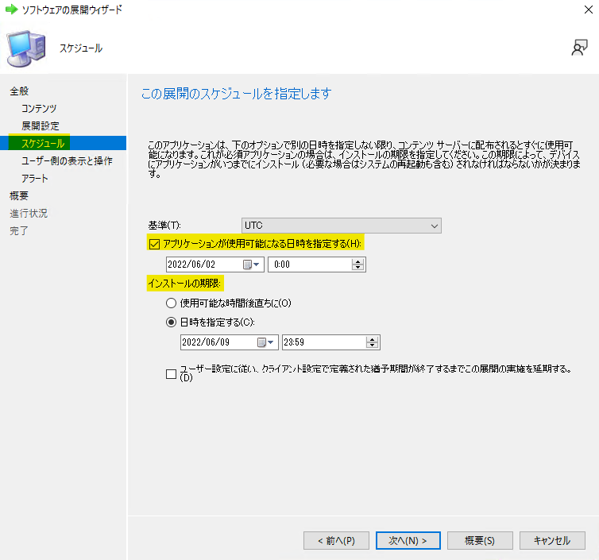
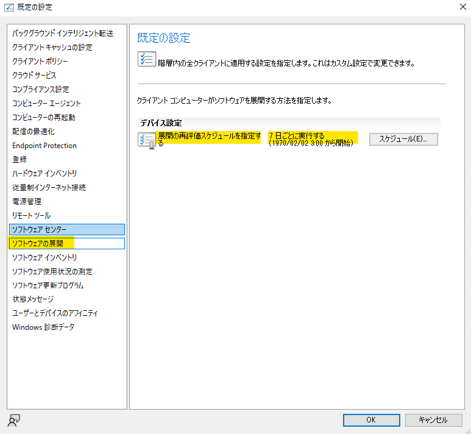
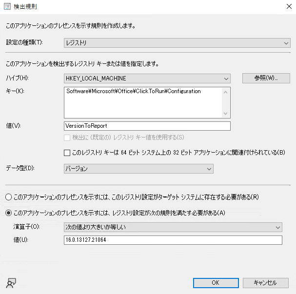

みなさま、こんにちは。Configuration Manager サポート チームです。  

今回は MECM のパッケージとアプリケーションの違いを解説させていただきます。これから展開を行いたいコンテンツがどちらを使えば要望にマッチするのか意識しながら確認してみてください。  

## 実行タイミングの違い

パッケージとアプリケーションとで実行タイミングに大きな違いがありますのでそれぞれ解説させていただきます。  

※ なお、これから解説を行う実行タイミングは **「必須」展開を前提** としております。  
「利用可能展開」の場合には、展開後のクライアント端末上のソフトウェア センターからのユーザー操作により実行されます。  

### パッケージの実行タイミング

パッケージでは明確に実行のタイミングを指定することができます。  
「何時何分に実行したい」などの要件が明確な場合にはパッケージの使用を検討しましょう。  

また、任意の間隔で繰り返し実行を設定することも可能です。  
「繰り返しパターン」では月、週、時間単位で繰り返し実行をスケジュールすることができるので、「月末に実行させたい」や「毎週金曜日に実行させたい」、「6 時間おきに実行させたい」など様々なパターンを設定可能です。  

### アプリケーションの実行タイミング

アプリケーションではパッケージのような特定のタイミングで実行、繰り返し実行を設定することはできません。  

アプリケーションではインストール可能となる日時と、インストールの期限を設定します。
クライアントがアプリケーションが展開されたことを検知すると設定されたインストール可能日時とインストール期限の間でランダムにインストール日時をスケジュールします。  

なお、展開後すぐに実行させたい場合には、[アプリケーションが使用可能になる日時を指定する] のチェックを外し、「インストール期限」= [使用可能な時間後直ちに] を指定ください。

## 再実行の動作の違い

パッケージとアプリケーションとでは、実行が失敗した際の再実行の動作が異なります。  

**・パッケージ → 特定の設定が必要**  
**・アプリケーション → 設定は不要で既定で用意された機能に沿って再実行される。**  

パッケージでは失敗時にのみ再実行させるためには特定の設定が必要となるのに対して、アプリケーションでは失敗後、既定で設定されているアプリケーションの評価サイクルにより再実行が促されます。  

### パッケージの再実行

パッケージにおける再実行の動作には抑えておくべきポイントがございます。
詳細におきましては「[MECM パッケージの再実行の設定方法について解説！](https://jpmem.github.io/blog/mecm/20220421_01/)」をご参照ください。  

### アプリケーションの再実行

アプリケーションの再実行におきましては、下記の [ソフトウェアの展開] クライアント設定の「展開の再評価スケジュールを指定する」のスケジュールに沿って再実行が必要かどうかを決定します。  

この再評価スケジュールでは、該当のアプリケーションのインストール状況を確認し、未インストールと判定（後にご紹介する検出規則を元に判定します。）された場合には、このタイミングでインストールを再実行します。  

## アプリケーション特有の機能

以降はアプリケーション特有の機能についてご紹介させていただきます。  

### アプリケーションのインストール条件を設定する（検出規則）

アプリケーションには検出規則というインストールを実行するかどうかの判定を行う機能がございます。例えば、特定のレジストリの値を評価し、特定の値よりも小さい場合にはインストールを行う（大きい場合にはインストールをしない）などを設定することができます。なお、検出規則はアプリケーション作成時には必ず設定が必要となります。  

設定できる検出規則の種類は以下の通りです。  

- **ファイル システム**
ファイル/フォルダの有無、または更新日などを判定条件とすることができます。  
- **レジストリ**
特定のレジストリキーの有無や値の評価を条件とすることができます。  
- **Windows インストーラー**
msi ファイルを読み込ませることで該当のアプリケーションのインストールの有無を条件とすることができます。  
- **カスタム スクリプト**
PowerShell などのスクリプトの実行結果により、判定させることができます。スクリプトの実行結果や、STDOUT の有無などにより、判定結果を決定します。  
詳細については、[カスタム スクリプト検出方法について](https://docs.microsoft.com/ja-jp/mem/configmgr/apps/deploy-use/create-applications#about-custom-script-detection-methods) を参照くださいませ。  

レジストリを検出規則とした例です。  
※ アプリケーションの [展開の種類] にて設定を行います。  
  

### 置き換え関係の構成

置き換え関係を構成することにより、アプリケーションのインストール時に指定した置き換え関係にあるアプリケーションをアンインストールしてからインストールさせることができます。なお、置き換え規則は必要に応じて設定いただくことが可能でございますので、必須の設定ではございません。  

例えば、新しいバージョンのアプリケーションをインストールさせたい場合、過去のバージョンのアプリケーションを置き換え関係として設定することで、古いバージョンをアンインストールしてから新しいバージョンのインストールを実行させることができます。  

## まとめ

パッケージとアプリケーションの違いについて解説させていただきました。おわかりの通り、アプリケーションではパッケージにはない様々な機能を使用することができます。しかし、パッケージの方が手軽に展開を行えることもまた、ご理解いただけたかと思います。  

そのため、

・シンプルなコマンドの実行やアプリケーションのインストールをしたい
・1 度だけ実行したい
・繰り返し実行したい
　→　**パッケージ**

・インストールの条件を設定したい（条件を満たさない場合には自動的にインストールを促したい）
・置き換えたいアプリケーションがある
　→　**アプリケーション**

のように使い分けてみましょう！
