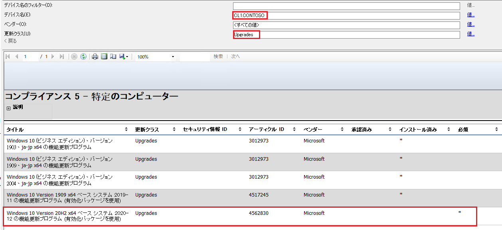
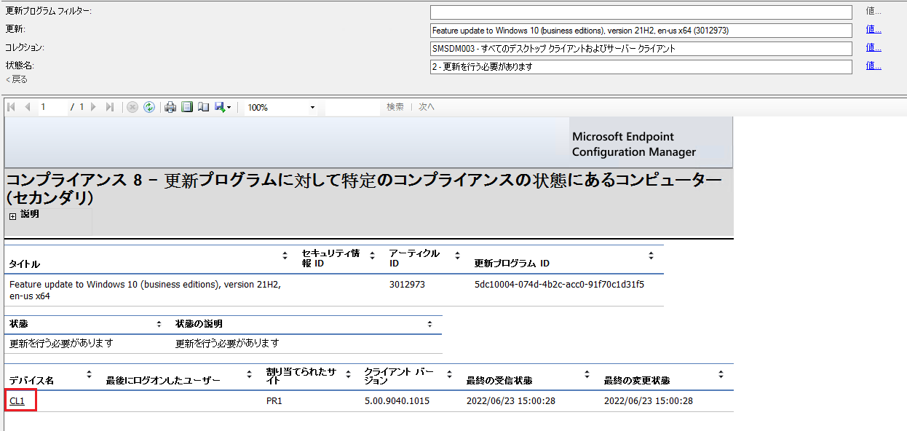

みなさま、こんにちは。Configuration Manager サポート 山田です。  

今回は MECM や WSUS で、Windows 10 の OS を 21H1 や 21H2 などへアップグレードしたい場合、通常の機能更新プログラムとイネーブルメント パッケージのどちらを展開、承認するべきか解説させていただきます。  

## イネーブルメント パッケージとは？  
Windows 10 1903 と 1909、2004 ～ 21H2 は共通のコア オペレーティング システムを使用しています。  
そのため、このイネーブルメント パッケージを展開するだけで、手軽に機能更新プログラムを適用できます。  
通常の機能更新プログラムは数 GB ほどの大きい容量ですが、イネーブルメント パッケージは数十 KB ほどのため、ネットワークもひっ迫することなく機能更新が行えるため、とても便利です。  
  

### 通常の機能更新プログラムとイネーブルメント パッケージ、どちらを展開するべきか  
それではどちらを展開すべきか見ていきましょう。  
具体的には、元の OS がどれを使用しているかに依存します。  
  
■ 例 21H2 にアップグレードしたい場合  
**アップグレード元の OS が 1909 以前 (1909 を含む) → 通常の機能更新プログラム（例 Windows 10 (ビジネス エディション)、バージョン 21H2、ja-jp x64 の機能更新プログラム）を展開します。**  

**アップグレード元の OS が 2004 以降 (2004 を含む) → イネーブルメント パッケージ（例 Windows 10 バージョン 21H2 x64ベースのシステムへの機能更新 2021-11 イネーブルメント パッケージ経由）を展開します。**  
  
イネーブルメント パッケージを展開するためには前提条件が存在します。  
前提条件を満たすことで MECM で "必須判定" されますので、あらかじめご確認ください。  
  
<前提条件>  

■20H2 へのアップグレードの場合 (KB4562830)  
  
・サービス スタック更新プログラム 2020 年 9 月 8 日 かそれ以降のサービス スタック更新プログラムを適用していること  
・2020 年 10 月 13 日 KB4579311 (19041.572) かそれ以降のソフトウェア更新プログラムを適用していること  

参考情報 : [Feature Update through Windows 10, version 20H2 Enablement Package](https://support.microsoft.com/ja-jp/topic/feature-update-through-windows-10-version-20h2-enablement-package-02d91e04-931e-f00d-090c-015467c49f6c)  
  
■21H1 へのアップグレードの場合

・サービス スタック更新プログラム 2020 年 9 月 8 日 かそれ以降のサービス スタック更新プログラムを適用していること  
・2021 年 5 月 11 日 KB5003173 (19041.985) かそれ以降のソフトウェア更新プログラムを適用していること  

参考情報 : [KB5000736: 有効化パッケージを使用Windows 10バージョン 21H1 に対する主な更新プログラム](https://support.microsoft.com/ja-jp/topic/kb5000736-%E6%9C%89%E5%8A%B9%E5%8C%96%E3%83%91%E3%83%83%E3%82%B1%E3%83%BC%E3%82%B8%E3%82%92%E4%BD%BF%E7%94%A8windows-10%E3%83%90%E3%83%BC%E3%82%B8%E3%83%A7%E3%83%B3-21h1-%E3%81%AB%E5%AF%BE%E3%81%99%E3%82%8B%E4%B8%BB%E3%81%AA%E6%9B%B4%E6%96%B0%E3%83%97%E3%83%AD%E3%82%B0%E3%83%A9%E3%83%A0-75a01e67-3b5f-4677-8efe-42852e41c7cf)  
  
■21H2 へのアップグレードの場合

・サービス スタック更新プログラム 2020 年 9 月 8 日 かそれ以降のサービス スタック更新プログラムを適用していること  
・2021 年 9 月 14 日 KB5005565 (19041.1237) かそれ以降のソフトウェア更新プログラムを適用していること  

参考情報 : [KB5003791: 有効化パッケージWindows 10バージョン 21H2 を更新 ](https://support.microsoft.com/ja-jp/topic/kb5003791-%E6%9C%89%E5%8A%B9%E5%8C%96%E3%83%91%E3%83%83%E3%82%B1%E3%83%BC%E3%82%B8windows-10%E3%83%90%E3%83%BC%E3%82%B8%E3%83%A7%E3%83%B3-21h2-%E3%82%92%E6%9B%B4%E6%96%B0-8bc077be-18d7-4aac-81ce-6f6dad2cd384)  
  

### どちらが必須判定されているか確認する方法  
通常の機能更新プログラムとイネーブルメント パッケージのどちらが必須と判定しているか確認したい場合、MECM のレポート機能を使用すると一番わかりやすいです。  
  
■クライアント端末毎に確認するレポート  
[監視] - [レポート] - [ソフトウェア更新プログラム - A コンプライアンス] - [コンプライアンス 5 - 特定のコンピューター]  

デバイス名：任意のクライアントを選択します。  
更新クラス：Upgrades を選択します。  

  
  
上記はイネーブルメント パッケージが "必須判定" されている状態です。  
  
■更新プログラム毎に確認するレポート  
[監視] - [レポート] - [ソフトウェア更新プログラム - A コンプライアンス] - [コンプライアンス 8 - 更新プログラムに対して特定のコンプライアンスの状態にあるコンピューター]  

更新：Windows 10 (ビジネス エディション)、バージョン 21H2、ja-jp x64 の機能更新プログラム など任意の更新プログラム  
コレクション：対象のクライアントが所属するデバイス コレクション  
状態名：2 - 更新を行う必要があります  
  

上記は CL1 というデバイスが機能更新プログラムを必要と判定している状態です。  
  
#### 補足事項  
WSUS で承認する場合も上述の考え方は同じです。  
WSUS もレポート機能がありますので、どちらが必要と判定しているか把握したい場合はレポートを参照してください。  
  
- レポートを出力する手順  
1. WSUS コンソールを開き、[WSUS サーバー名] - [コンピューター] - [すべてのコンピューター] と辿ります。  
2. 該当のクライアント名を右クリックし、[状態レポート] を選択します。  
3. 以下のように項目を選択し、[レポートの実行] を選択します。  

次の分類に更新を含める：Upgrade  
次の状態の更新プログラムを含める：必要  
  
  
  
[インストールされていません] という表記になっている場合は、該当の機能更新プログラムを必要と判定しています。  
  
参考情報  
[WSUS のレポートに表示される「状態」の項目の説明](https://jpmem.github.io/blog/wsus/2017-09-04_02/)  