みなさま、こんにちは。Configuration Manager サポート チームです。  

手順解説シリーズ、今回は自動展開規則の設定方法をステップバイステップで解説致します。  
設定方法がよくわからない方、今の設定を見直したい方はぜひ確認してみてください。  

## 事前準備

自動展開規則を作成する前に、必要となる準備を行います。  

1.自動展開規則を展開するデバイス コレクションを作成します。  
2.自動展開規則で使用する展開パッケージを新規に作成する場合には、事前に共有フォルダーを作成しておく必要がございます。任意のパスにフォルダーを作成の上、共有設定を行ってください。（Everyone に フルコントロール の権限を付与ください。）  

## 自動展開規則の作成手順

1.MECM 管理コンソールを開き [ソフトウェア ライブラリ] > [概要] > [ソフトウェア更新プログラム] > [自動展開規則] の順に開き、リボン上の [自動展開規則の作成] をクリックします。  

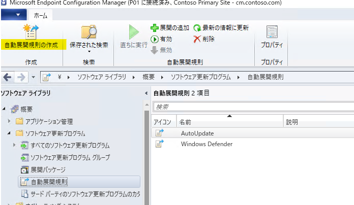

2.自動展開規則の作成ウィザードが開きますので、「全般」にて下記の設定を行います。  

- **名前**　→　任意の名前を入力ください。  
- **コレクション**　→　自動展開規則を展開するデバイス コレクションを指定ください。  
- **ソフトウェア更新プログラム グループ**　→　 
こちらについてはいずれを選んで頂いても問題ございませんが、[新しいソフトウェア更新プログラム グループを作成する] を選択した場合には、自動展開規則から更新プログラムが展開されるたびに新しいソフトウェア更新プログラム グループが追加作成されるため、グループが多数存在する状況となります。  
そのため、特にこだわりがない場合には [既存のソフトウェア更新プログラム グループ] を選択くださいませ。  

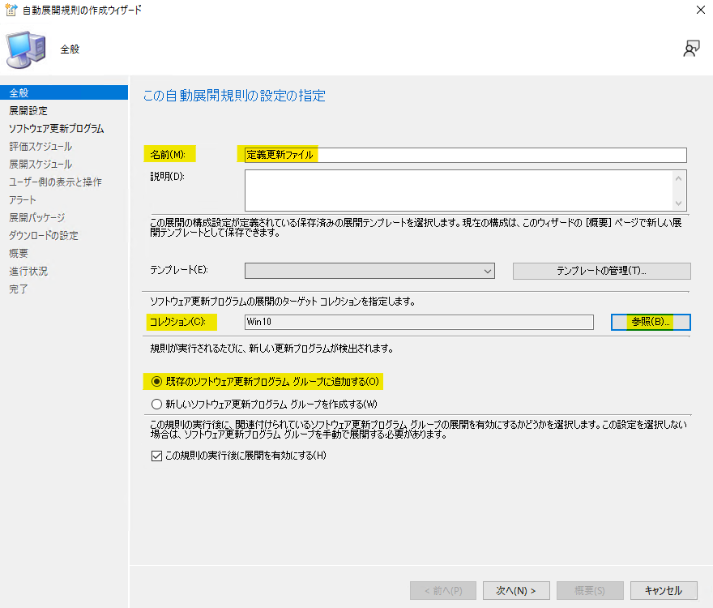

3.「展開設定」にて、「展開の種類」を設定します。  

- **[必須] を指定した場合**  
　→　ユーザー操作なしで自動的にインストールされます。  
- **[利用可能] を指定した場合**  
　→　ユーザーがクライアント端末側でソフトウェア センターを開き、[インストール] ボタンをクリックすることでインストールが開始されます。  

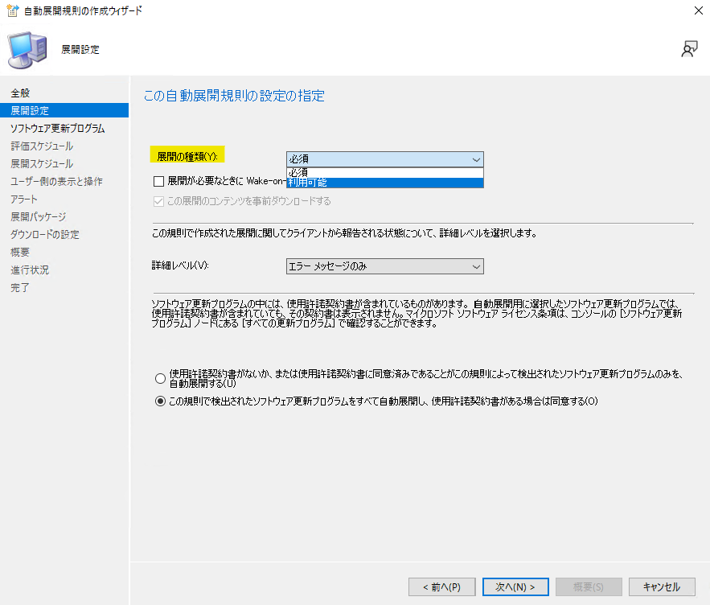

4.「ソフトウェア更新プログラム」にて、展開を行いたい更新プログラムのみが対象となるような「検索条件」を設定します。  
この設定は非常に重要です。この検索条件が誤っていると意図していない更新プログラムが展開されてしまう可能性がございますので正しく設定しましょう。  
検索条件でよく利用する代表的な項目に関しまして、[代表的な検索条件](###代表的な検索条件) にて解説しておりますのでご確認くださいませ。  

5.「評価スケジュール」にて、任意の項目を選択の上、[次へ] をクリックします。  

- **[この規則を自動的に実行しない]**  
　→　自動的に実行されないため手動での実行が必要となります。  
- **[ソフトウェア更新ポイントが 1 つでも同期されたら、規則を実行する]**  
　→　上部に表示されている [現在のソフトウェアの更新ポイントの同期スケジュール] のサイクルに沿って自動展開規則が実行されます。  
- **[スケジュールに基づいて規則を実行する]**  
　→　任意のスケジュールの設定が可能となります。  

特別なご事情が無い限りは [ソフトウェア更新ポイントが 1 つでも同期されたら、規則を実行する] を選択いただければと思います。  

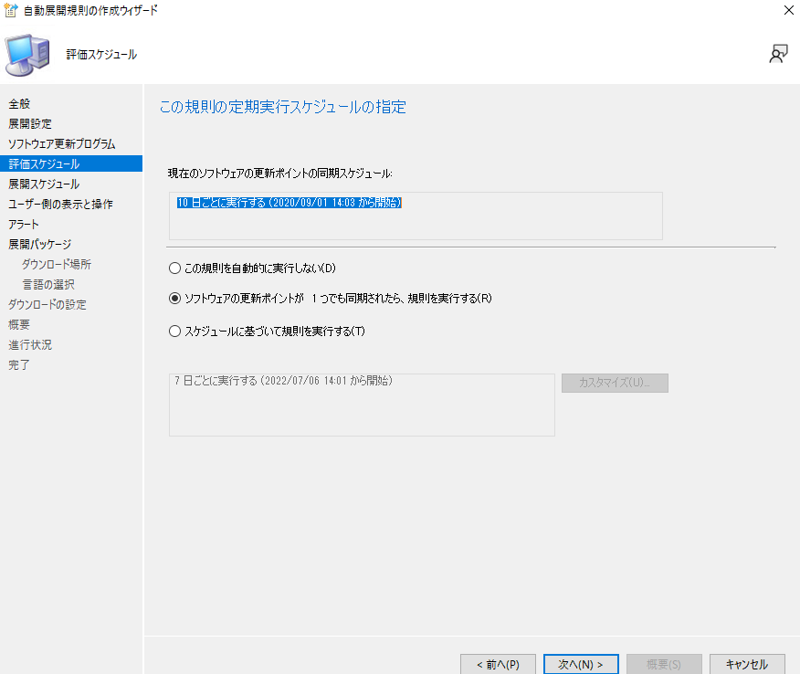

6.「展開スケジュール」にて、任意の項目を選択の上、[次へ] をクリックします。  

- **「基準」**
この展開のスケジュールを UTC、クライアントのローカル時刻のどちらを基準に評価するかを設定します。  
**もしサーバーとタイムゾーンが異なるクライアントを管理する場合には「UTC」を選択頂く必要がございます。**  
タイムゾーンがすべて日本の場合には [クライアントのローカル時刻] を指定頂いても問題ございません。  
- **「ソフトウェアが使用可能な時間」および「インストールの期限」**
上記 2 つの設定によりクライアント側でインストールがスケジュールされる日時が決定します。  
「ソフトウェアが使用可能な時間 ~ インストールの期限」の間でインストールがスケジュールされますので、すぐに適用させる場合にはいずれも [直ちに] を指定くださいませ。  

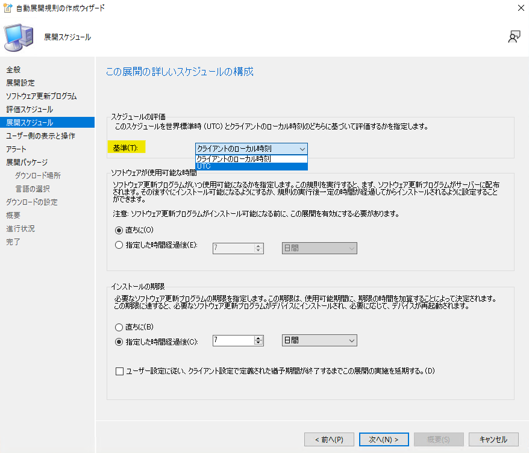

7.「ユーザー側の表示と操作」、「アラート」にて任意の設定を行い、[次へ] をクリックします。  
8.「展開パッケージ」にて、既存の展開パッケージを使用する場合には [展開パッケージを選択する]、新しい展開パッケージを作成する場合には [新しい展開パッケージを使用する] を選択の上、「事前準備」で作成した共有フォルダーを [パッケージのソール] に指定し、[次へ] をクリックします。  

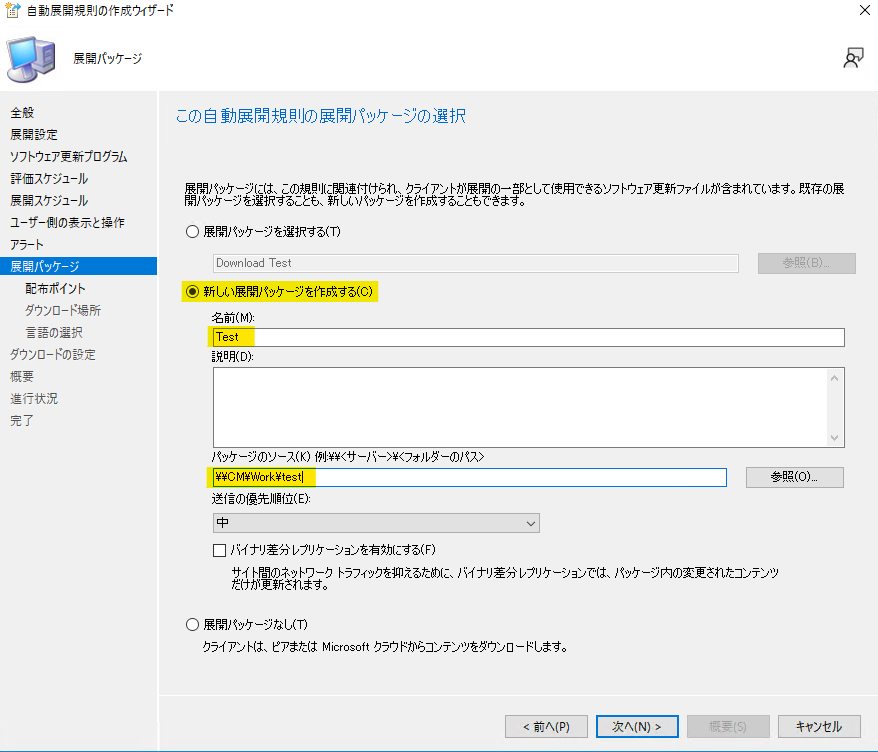

※ 下記手順 9 におきましては新たに展開パッケージを作成する際の解説となります。  

9.「配布ポイント」にてこの自動展開規則にて展開する更新プログラムのコンテンツを配置する配布ポイントを指定し、[次へ] をクリックします。  

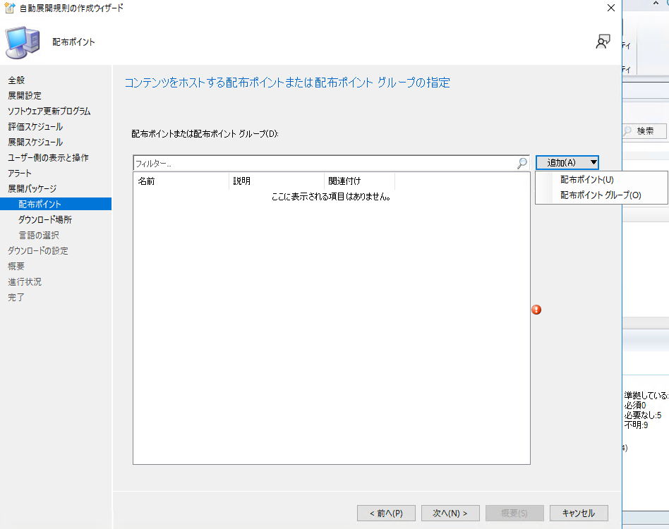

10.「ダウンロード場所」にて [インターネットからソフトウェア更新プログラムをダウンロードする] を選択の上、[次へ] をクリックします。  

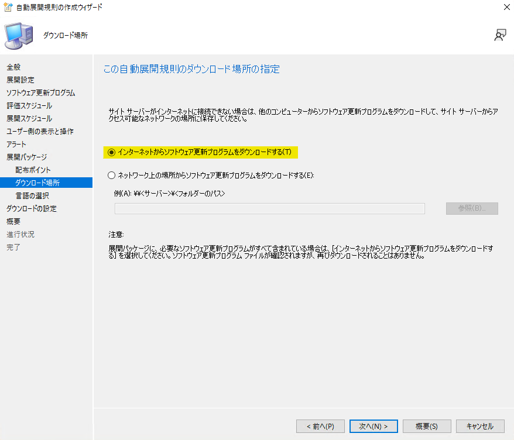

11.「言語の選択」にて言語を選択の上、[次へ] をクリックします。  
12.「ダウンロードの設定」にて、任意の設定を行い、[次へ] をクリックします。  

- **[クライアントが近隣の境界グループまたは既定サイトの境界グループから配布ポイントを使用する時に適用する配置オプションを選択します。]**  
近隣の境界グループ（フォールバック設定された境界グループ）または Default-Site-Boudary-Group （既定サイトの境界グループ）に紐づく配布ポイントを使用する場合の挙動を設定します。  

 

- **[現在または近隣の境界グループのどの配布ポイントでもソフトウェア更新プログラムを利用できない場合、クライアントは、サイト既定の境界グループ内の配布ポイントからソフトウェアの更新をダウンロードして、インストールできます。]**  
現在または近隣の境界グループの配布ポイントを参照できない場合に、 Default-Site-Boudary-Group （既定サイトの境界グループ）を参照させるかどうかの挙動を設定します。  

 

- **[関連する任意の境界グループ内の配布ポイントでソフトウェア更新プログラムを利用できない場合は…]**  
配布ポイントからのダウンロードができなかった場合に、インターネット上の Microsoft Update を参照させたい場合には、チェックを入れてください。  

- **[インストールの期限後、クライアントが従量制のインターネット接続を使用してコンテンツをダウンロードできるようにする]**
これはインストール期限を迎えた場合には、クライアントが従量制課金のネットワークを使用している場合でもコンテンツのダウンロードを許可するかの設定となります。  

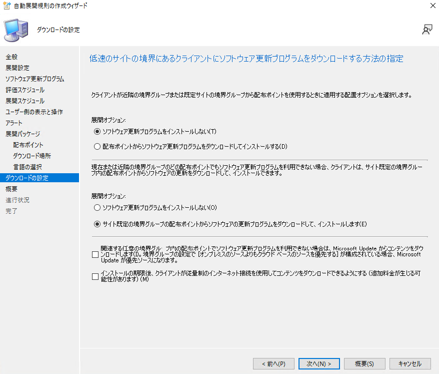

13.「概要」にて、これまでに設定した内容に誤りが無いか確認の上、[次へ] をクリックします。  
14.「完了」にて、「正常に完了しました」と表示されることを確認し [閉じる] をクリックします。  

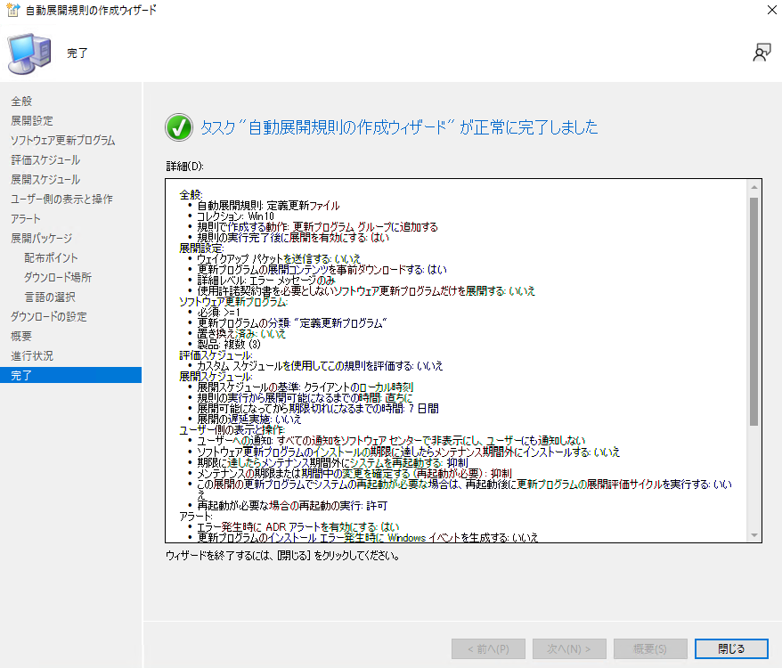

以上で自動展開規則の設定は完了となります。  
設定後、下記の通り「最後のエラーの説明」=「成功」となることをご確認くださいませ。  

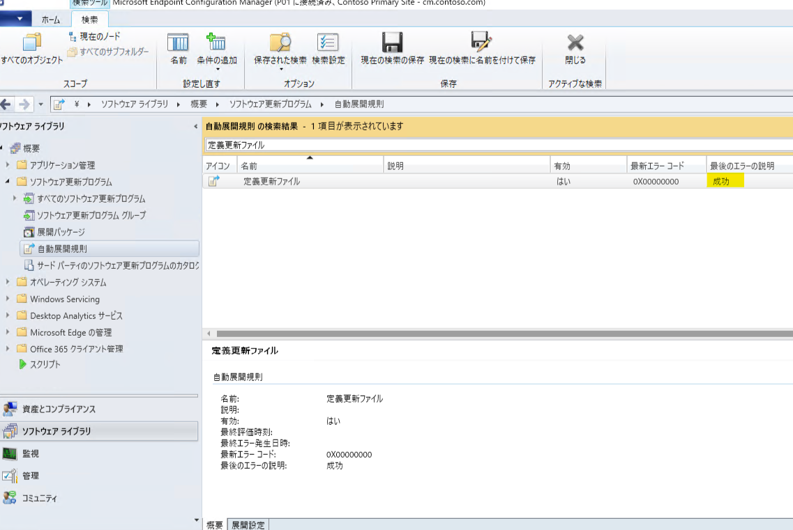

### 代表的な検索条件

設定方法は様々ありますので、代表的なもののみ解説させて頂きます。  

- **[置き換え済み]**
この設定は非常に重要です。この条件を設定することにより更新プログラムの置き換え状態を条件にすることができます。  
累積的な更新プログラムは新しい更新プログラムがリリースされると古いものを置き換えます。  
置き換えられた更新プログラムの内容は新しい更新プログラム内に内包されるため、古い更新プログラムを配信する必要がありません。  
そのため [置き換え済み] = [いいえ] の更新プログラム（つまり置き換えられていない最新の更新プログラム）のみを展開対象とすることで無駄な更新プログラムの展開を行わずにすむ為、必須となる条件となります。  

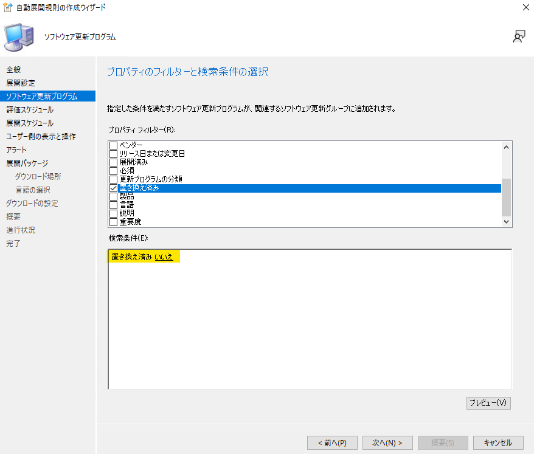

- **[更新プログラムの分類] および [製品]**
各更新プログラムごとに、適用対象となる [更新プログラムの分類] および [製品] が決まっております。
そのため、この 2 つを条件に追加することで分類と製品によるフィルターをかけることが可能となります。   
**確認方法**  
1.MECM 管理コンソール > [ソフトウェア ライブラリ] > [概要] > [ソフトウェア更新プログラム] > [すべてのソフトウェア更新プログラム] にて、項目名バーを右クリックし、[更新プログラムの分類] および [製品] にチェックを入れます。  
2.配信対象の更新プログラムの [更新プログラムの分類] および [製品] をご確認ください。  

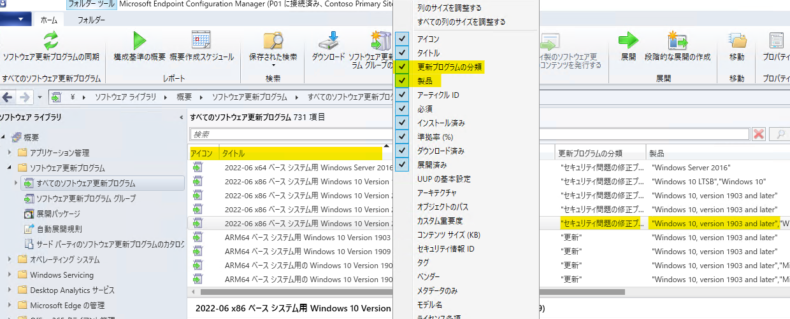

- **[リリース日または変更日]**
特定の期間内にリリースまたは変更された更新プログラムを配信対象とすることができます。  

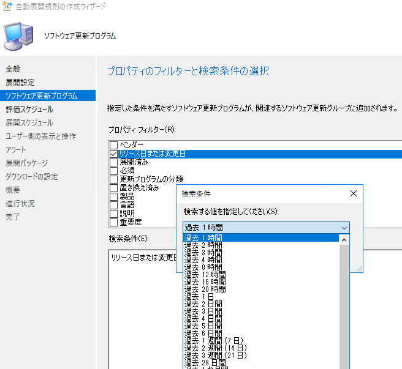

- **[必須]**
ソフトウェア更新プログラムの必須カウントを条件にすることができます。
これを設定することにより、必須と判定された更新プログラムのみを配信対象とすることができます。  
下記では「>=1」と設定することにより、必須カウントが 1 以上の場合には対象とする条件となります。   
なお、必須カウントはクライアント端末側で定期的に実行される「ソフトウェア更新プログラムのスキャン サイクル」により、端末それぞれで必要な更新プログラムを必須と判断しカウントされていきます。  
そのため、新しく同期されたばかりのソフトウェア更新プログラムはすぐには必須判定されず、クライアント側のスキャン サイクル実行後にカウントされる流れとなります。  

- **[タイトル]**
指定した文字列に部分一致するタイトルの更新プログラムを配信対象とすることができます。  
例えば下記の「Beta」を指定する場合には、「Microsoft Edge-ARM64 ベース エディションの Beta チャネル バージョン」という更新プログラムが該当します。  
なお、タイトルにおきましては、文字列の検索となるため、入力ミスなどで意図していない条件となってしまう可能性があります。  
そのためその他の条件だけでは希望する更新プログラムを絞りきれない時にご活用くださいませ。  

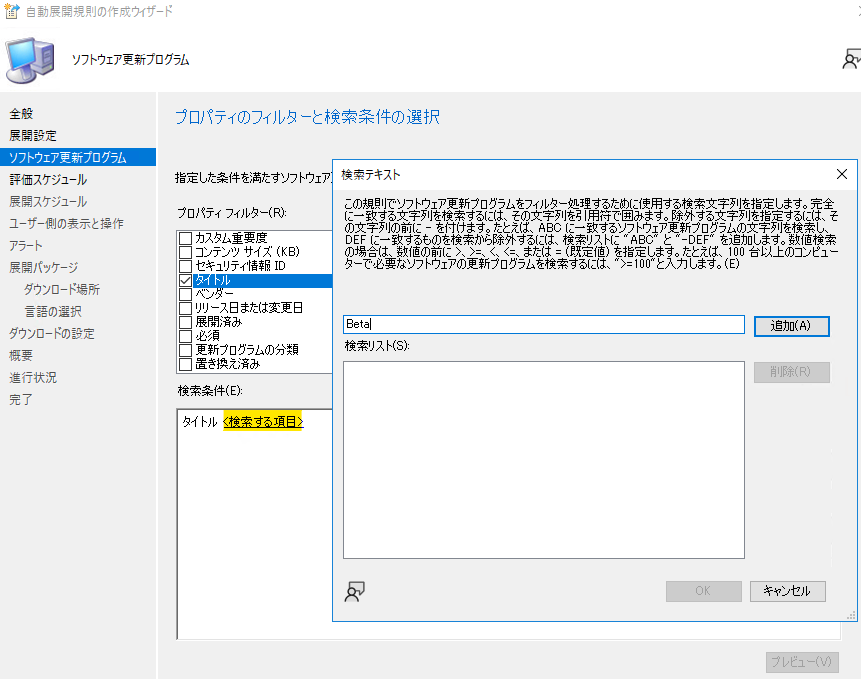

### 検索条件が正しいかの確認方法

検索条件を設定し終わりましたら、[プレビュー] を表示してみましょう。
すると設定した検索条件に合致する更新プログラムの一覧を確認することができます。  
ここで意図していない更新プログラムが表示されている場合には条件が不足している、誤っていることが想定されるので、意図した更新プログラムのみが表示されるまで検索条件を見直しましょう。  

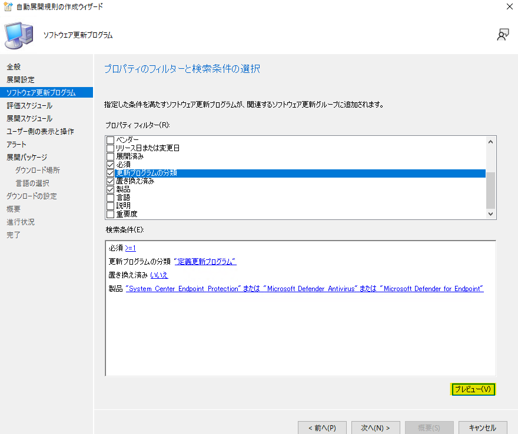

