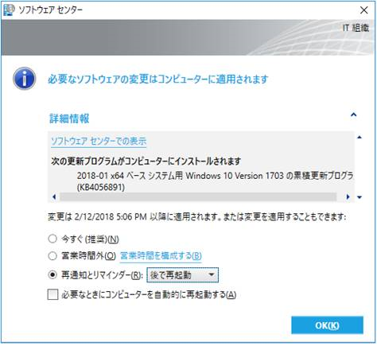
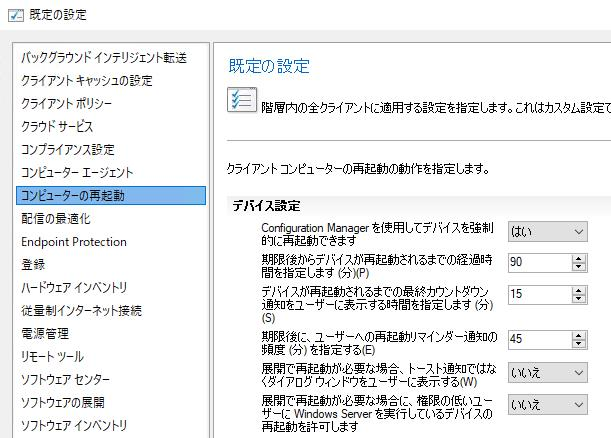
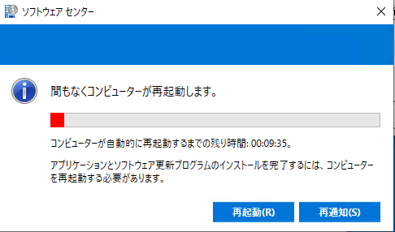

みなさま、こんにちは。Configuration Manager サポート チーム青木です。  
本記事では、Configuration Manager から更新プログラム配信時の再起動動作についてご紹介いたします。また、本記事は以下の記事の新版となります。  

Title : Configuration Manager から更新プログラムを配信する際の再起動動作について  
URL : https://jpmem.github.io/blog/mecm/20180719_01/  

Configuration Manager から更新プログラムを展開する際に、Configuration Manager で再起動を抑制させる/再起動させる設定のお役立て情報おまとめいたしました。また、新版では再起動通知の動作についてもご紹介しております。   

## 再起動を抑制する場合  

展開設定時に [デバイスの再起動] - [サーバー(サーバーOSの場合) or ワークステーション(クライアントOSの場合)]　にチェックを入れることで、再起動の抑制をすることが可能です。


上記設定値を入れることで以下のポップアップとなります。



## 再起動をさせる場合
展開設定時に [デバイスの再起動] - [サーバー(サーバーOSの場合) or ワークステーション(クライアントOSの場合)]　のチェックを無効にすることで、強制的に再起動させることが可能です。  


## 再起動通知を制御するクライアント設定について  
Configuration Manager コンソールから、クライアント設定を設定することで再起動時の通知の動作を制御出来ます。  
以下に具体的な設定とその動作をご紹介いたします。再起動が必要な旨をユーザーに通知させたい管理者の方々のご参考になりましたら幸いです。  

### <再起動通知の動作>  
Configuration Manager コンソールにて、クライアント設定の "コンピューターの再起動" タブで下記項目を "はい" に設定いただきますと、再起動を促すダイアログ通知をクライアントに表示させることができます。  
下記項目を "いいえ" に設定するとトースト通知をクライアントに表示させることができます。これらの 2 種類の通知を、お好みによってお使い分けていただければと思います。

- 該当のクライアント設定 (既定値は "いいえ" の為、"はい" に設定する必要が有ります。)  
```  
展開で再起動が必要な場合、トースト通知ではなくダイアログ ウインドウをユーザーに表示する  
```  

▼ クライアント設定 サンプル画像 (既定値)  
  

▼ ダイアログ通知 サンプル画像  
  

なお、ダイアログ通知のタイミングにつきましては、下記 2 つのタイミングで行われます。  
1. クライアントに再起動が必要な更新プログラムがインストールされた直後のタイミング  
2. クライアント設定の "期限後にユーザーへの再起動リマインダー通知の頻度を指定する" で設定した、リマインダー通知のタイミング  
(リマインダー通知のタイミングとは、ダイアログ通知で "再通知" をクリックした後、次のダイアログ通知が表示される際のタイミング)  

通知機能の詳細につきましては、以下の公開情報に記載されております為、こちらもご参考になりましたら幸いでございます。  

Title : Configuration Managerのデバイス再起動通知
URL : https://docs.microsoft.com/ja-jp/mem/configmgr/core/clients/deploy/device-restart-notifications


## 実際の再起動通知の動作画面をご紹介します
下記の内容のクライアント設定を適用し、ダイアログ通知が行われるタイミングを検証いたしました為以下に併せてご案内いたします。ぜひ貴社ご運用のご参考になりましたら幸いでございます。  

▼ 検証の為に設定したクライアント設定  
  

<検証>
1. クライアントにて MECM から展開した更新プログラムのダウンロードが完了すると、以下の 2 つのトースト通知が行われた。  
  

2. 更新プログラムのインストール後に再起動を要する場合、直ぐに以下のダイアログ通知が行われた。  
ダイアログ通知に表示されている "コンピューターが自動的に再起動するまでの残り時間" は、クライアント設定の "期限後からデバイスが再起動されるまでの経過時間を指定します" で設定した 10 分が反映している。  
  

3. 「2.」のダイアログ通知で "再通知" をクリックした場合、ダイアログ通知が一旦消え、2 分後に再度ダイアログ通知が行われた。  
クライアント設定の "期限後にユーザーへの再起動リマインダー通知の頻度を指定する" で設定した 2 分が反映している。  
  

4. リマインダー通知が行われたタイミングで、再起動までの時間が、クライアント設定の "デバイスが再起動されるまでの最終カウントダウン通知をユーザーに表示する時間を指定します" で設定した 5 分以内になった為、"再通知" がグレーアウトして押せなくなった。また、×をクリックしてもダイアログ通知が消えなくなった。  
 

上記のように、リマインダー通知のタイミングを制御する事で、どのくらいの頻度でユーザーへ通知を出すのか等の運用を決めることが出来る為、本記事をご参考にしていただきつつ会社の運用に併せて設定値を決めていただければと思います。  


