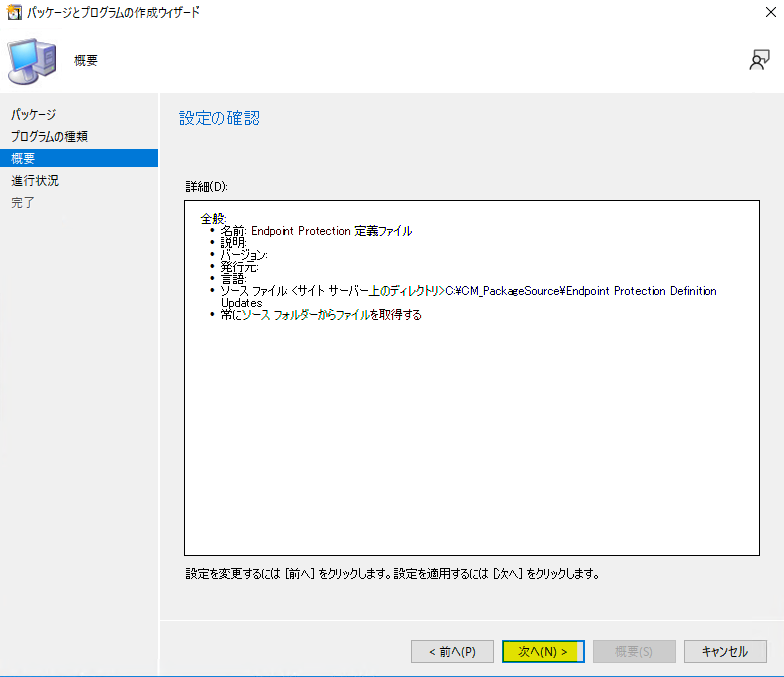
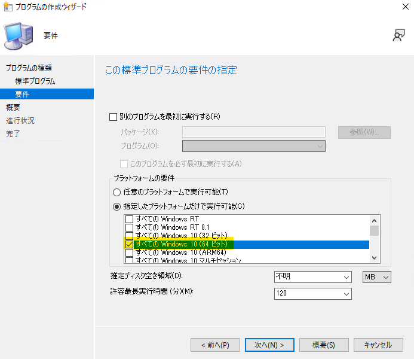
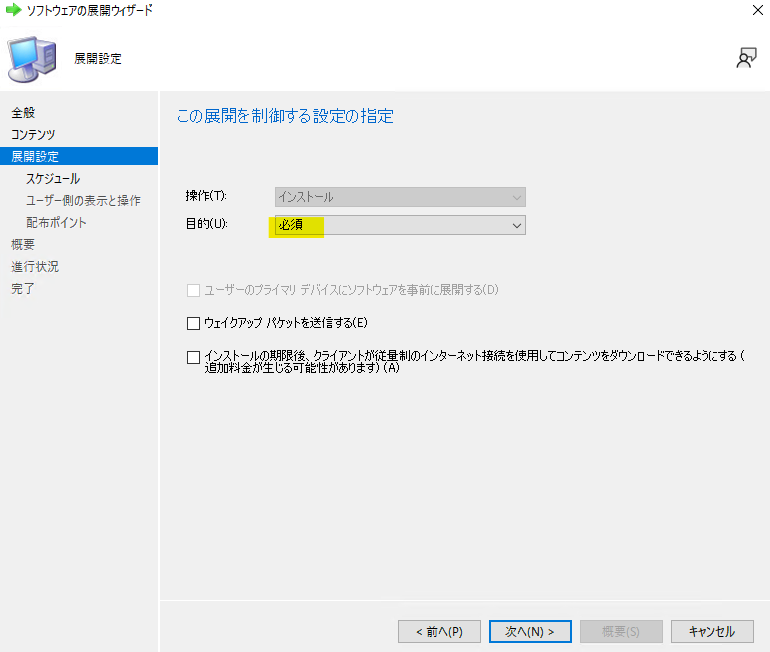

みなさま、こんにちは。Configuration Manager サポート チームです。  

使い方シリーズ、今回はパッケージ機能を使って Microsoft Defender の定義更新ファイルを展開する手順をステップバイステップで解説致します。  
万が一、ソフトウェア更新プログラムの機能を使って定義更新ファイルが配れない場合の暫定対処作として役立ちます。ぜひ確認してみてください。  

## 1. 定義更新ファイルのダウンロード

まず最初に今回適用を行いたい定義更新ファイル（mpam-fe.exe）をダウンロードします。  

   **32-bit (x86) 環境用**
　　[マルウェア対策の完全定義（x86）](https://go.microsoft.com/fwlink/?LinkID=121721&arch=x86)  

   **64-bit (x64) 環境用**
　　[マルウェア対策の完全定義（x64）](https://go.microsoft.com/fwlink/?LinkID=121721&arch=x64)  

ダウンロードしたファイルを任意の共有フォルダーに 配置します。
サイト サーバー上など、サイト サーバーからアクセスできる場所であれば、どの場所でも構いません。  
mpam-fe.exe は 32 bit 版と 64 bit 版が存在しますので、例えば以下のようなフォルダー構成でファイルを配置します。  

例) サーバー名 CM01 の共有フォルダーに配置する場合
　※必要に応じて、32 bit 版、64 bit 番をご用意ください。

- 32 bit 版 mpam-fe.exe を配置するフォルダー

```text
\\CM\CM_PackageSource\Endpoint Protection Definition Updates\i386
```

- 64 bit 版 mpam-feX64.exe を配置するフォルダー

```text
\\CM\CM_PackageSource\Endpoint Protection Definition Updates\x64
```

パッケージ配布を一定期間運用いただく場合、定期的に新しい mpam-fe.exe を入手し、上記フォルダーに上書き保存するようにします。  

## 2. パッケージの作成

定義更新ファイルのインストールを行うパッケージを作成します。  

***2-1.*** Configuration Manager コンソールを開き、以下の場所に移動します。  

[ソフトウェア ライブラリ] - [概要] - [パッケージ]  

***2-2.*** リボン メニューの [ホーム] タブより、[作成] - [パッケージの作成] をクリックします。  


***2-3.*** パッケージとプログラムの作成ウィザードが開くので、[全般] ページにて、「Endpoint Protection 定義ファイル」など任意の名前を入力します。  
　また、[このパッケージにソース ファイルを含める] のチェック ボックスをオンにして、[参照] をクリックします。  

***2-4.*** ソースフォルダーに定義ファイルの配置場所を入力し、[OK] をクリックします。  
　上記例のとおりファイルを配置した場合は、以下のパスとなります。  

```text
\\CM\CM_PackageSource\Endpoint Protection Definition Updates
```


※ x64 フォルダーや i386 フォルダーが配置されているフォルダーを選択します。  

***2-5.*** [プログラムの種類] ページにて、ここでは [プログラムを作成しない] を選択して、[次へ] をクリックします。  


***2-6.*** [次へ] をクリックしていき、ウィザードを完了します。  



***2-7.*** Configuration Manager コンソールに作成したコレクションが表示されます。作成したパッケージを右クリックし、[プロパティ] をクリックします。  


***2-8.*** プロパティより、[データソース] タブにて、[スケジュールに従って配布ポイントを更新する] のチェック ボックスをオンにします。  
パッケージ ソースに配置されている定義ファイルが更新された際は、配布ポイントの更新が必要となりますので、自動化する設定となります。  
スケジュールは、お客様が定義ファイルを更新されるタイミングに合わせて任意のスケジュールを設定してください。  


### 3. プログラムの作成 (必要に応じて、32 bit 版も作成してください)

mpam-fe.exe を適用するためのプログラムを作成します。  
32 bit 版と 64 bit 版を合わせて、2 つのプログラムを作成する必要があります。  
ここでは、64 bit 版の mpam-fe.exe を適用するためのプログラムを作成する手順をご案内します。  

***3-1.*** Configuration Manager コンソールを開き、以下の場所に移動します。  
　[ソフトウェア ライブラリ] - [概要] - [パッケージ]  

***3-2.*** 右上ペインより、**手順 2. パッケージの作成** で作成したパッケージを選択します。  

***3-3.*** リボン メニューの [ホーム] タブより、[プログラムの作成] をクリックします。  


***3-4.*** 64 bit 版の mpam-fe.exe を適用するプログラムを作成します。  

　***3-4-1.*** [プログラムの種類] ページで [標準プログラム] を選択し、[次へ] をクリックします。  

　***3-4-2.*** [標準プログラム] ページで、以下のように入力し [次へ] をクリックします。  

- 名前 : 任意の名前 (mpam-feX64 など)  

- コマンド ライン : ``.\X64\mpam-fe.exe /q``
([参照] ボタンより、64 bit 版の mpam-fe.exe を選択した上で、/q オプションを付加します。)  

- プログラムの実行条件 : ユーザーのログオン状態に関係なし  
- 実行モード : 管理者権限で実行する (変更不可)  


***3-4-3.*** [要件] ページで、[指定したプラットフォームだけで実行可能] を選択し、配布対象となる 64 bit 版 Windows プラットフォームのチェック ボックスをオンにして、[次へ] をクリックします。  

　　※ 32 bit 版の OS を選択しないようにしてください。  



***3-4-4.*** [次へ] をクリックしていき、ウィザードを完了します。  
64 bit 版のプログラムの作成手順は以上となります。  
32 bit 版も管理対象に含める場合は、同様の手順でプログラムを作成してください。  

### 4. 展開の作成

展開を作成して、管理対象コンピューターに定期的に定義ファイルを配布します。

***4-1.*** Configuration Manager コンソールを開き、以下の場所に移動します。  
　[ソフトウェア ライブラリ] - [概要] - [パッケージ]  

***4-2.*** 右上ペインより、手順 C. で作成したパッケージを選択します。  

***4-3.*** リボン メニューの [ホーム] タブより、[展開] をクリックします。  


***4-4.*** ソフトウェアの展開ウィザードが開くので、[全般] ページにて、以下のように設定して [次へ] をクリックします。  

- ソフトウェア : mpam-feX64 (**手順 3. プログラムの作成** で作成した 64 bit 版 mpam-feX64.exe のプログラム)  
- コレクション : Endpoint Protection 定義ファイルを展開したいコレクション


***4-5.*** [コンテンツ] ページにて、クライアントがアクセス可能な配布ポイントを追加して、[次へ] をクリックします。  

***4-6.*** [展開設定] ページにて、以下の設定をして、[次へ] をクリックします。  

- 操作 : インストール  
- 目的 : 必須  



***4-7.*** [スケジュール] ページにて、[新規] をクリックして、スケジュールを決定します。  


***4-7-1.*** 割り当てスケジュールが開くので、[スケジュール] をクリックします。  


***4-7-2.*** カスタム スケジュールが開くので、定期的にプログラムを実行するために、繰り返しパターンを設定します。  

一日単位で定義ファイルを更新する場合は、[間隔指定] を選択して、間隔に「1 日間」を指定し、[OK] をクリックします。  


***4-7-3.*** [OK] をクリックして、ダイアログを閉じます。  

***4-8.*** [スケジュール] ページにて、再実行の動作に [プログラムを常に再実行する] を選択して、[次へ] をクリックします。  


***4-9.*** [ユーザー側の表示と操作] ページにて、既定の設定のまま [次へ] をクリックします。  

***4-10.*** [配布ポイント] ページにて、既定の設定のまま [次へ] をクリックします。  

***4-11.*** [次へ] をクリックしていき、ウィザードを完了します。    

64 bit 版の展開の作成手順は以上となります。  
32 bit 版も管理対象に含める場合は、同様の手順で展開を作成してください。  

※パッケージの再実行の動作については [こちら](https://jpmem.github.io/blog/mecm/20220421_01/)で解説しております。  

### 5. コンテンツの配布完了を確認する

パッケージ ソースから配布ポイントへのコンテンツの配布が完了したことを確認します。  

***5-1.*** Configuration Manager コンソールを開き、以下の場所に移動します。  

[ソフトウェア ライブラリ] - [概要] - [パッケージ]  

***5-2.*** 右上ペインより、**手順 3. プログラムの作成** で作成したパッケージを選択します。  

***5-3.*** リボン メニューの [ホーム] タブより、[最新の情報に更新] をクリックします。  


***5-4.*** 右下ペインの [概要] タブにて、[コンテンツのステータス] が「成功」(<font color="MediumSeaGreen">緑色</font>) になっていることを確認します。  

※「進行中」(<font color="Khaki">黄色</font>) で表示される場合、配布が進行中なので、しばらく待って再度「最新情報に更新」をクリックします。  


### 6. 定義ファイルが適用できるか確認する

上記手順実施後、クライアントでコンピューター ポリシーが取得されると、定義ファイルのダウンロードおよびインストールが行われます。
コンピューター ポリシーの取得は、既定では 1 時間に 1 回の間隔で実行されますが、手動で実行することもできます。  
確認手順は、以下のとおりとなります。  

***6-1.*** 展開対象となっているコンピューターのコントロール パネルを開き、Configuration Manager を開きます。  


***6-2.*** [操作] タブより、[コンピューター ポリシーの取得および評価サイクル] を選択し、[直ちに実行] をクリックします。  


上記手順実行後に、コンピューター ポリシーの取得が開始されます。その後、定義ファイルがダウンロードされ、更新されます。  

クライアント端末側で [スタート] > Windows セキュリティを開き、[ウイルスと脅威の防止の更新] の [ウイルスと驚異の防止の更新] の [前回の更新] が直近の日時になっており、定義のバージョンが更新されていれば、インストールは正常に完了しています。  


なお、コンピューター ポリシーの取得には時間がかかる場合がありますので、正常に完了しない場合は、何度か ***6-2.*** の手順を実行してください。  

### 7. 定義ファイル更新の際の配布手順

新しい定義ファイルに更新する際には、以下の手順を実行します。  

***7-1.*** 手順 **1. 定義更新ファイルのダウンロード** で配置した定義ファイルを、新しい定義ファイルで上書きします。  

***7-2.*** 手順 **2-8.** で指定したスケジュールに従って、配布ポイントのコンテンツが更新されます。  
今すぐに配布ポイントのコンテンツを更新したい場合は、以下を実行します。  

***7-2-1.*** Configuration Manager コンソールを開き、以下の場所に移動します。  

[ソフトウェア ライブラリ] - [概要] - [パッケージ]  

***7-2-2.*** 右上ペインより、手順 **2. パッケージの作成** で作成したパッケージを選択します。  

***7-2-3.*** 右クリック メニューから、[配布ポイントの更新] を選択します。  

***7-2-4.*** 配布ポイントのコンテンツが更新されます。  

配布の完了ステータスの確認方法は、前述の手順 **5. コンテンツの配布完了を確認する** を参照してください。  

***7-3.*** 手順 **4. 展開の作成** で指定したカスタム スケジュールに従って、パッケージが展開されます。  

***7-4.*** クライアントが [コンピューター ポリシーの取得および評価サイクル] を実行した際に、パッケージがダウンロードされ、定義ファイルが更新されます。  
既定では、 [コンピューター ポリシーの取得および評価サイクル] は60 分ごとに実行されます。

定義ファイル配布の手順は以上となります。  
