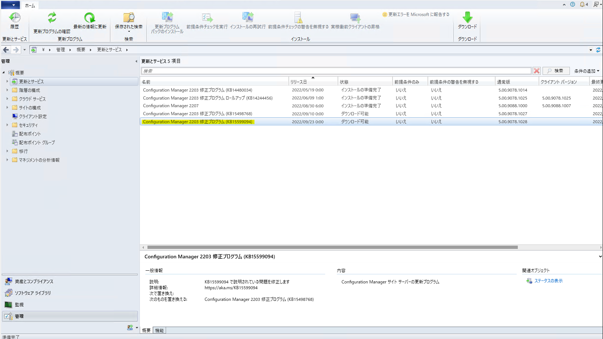

みなさま、こんにちは。Configuration Manager サポート チームです。  

本日は、米国時間 2022/09/20 (日本時間 2022/09/21) にリリースされた、Microsoft Endpoint Configuration Manager の脆弱性について取り上げます。  

Title : Microsoft Endpoint Configuration Manager Spoofing Vulnerability　CVE-2022-37972  
URL : https://msrc.microsoft.com/update-guide/vulnerability/CVE-2022-37972  

---

## 対処方法
こちらの脆弱性は KB15599094 を適用することで対処することが出来ます。  

Title : Microsoft Endpoint Configuration Managerの NTLM クライアント インストール更新プログラム  
URL : https://learn.microsoft.com/ja-jp/mem/configmgr/hotfix/2207/15599094  

### KB15599094 の適用対象バージョン
Microsoft Endpoint Configuration Manager バージョン 2103,2107,2111,2203,2207 が適用対象となります。  

### KB15599094 のインストール方法
適用対象のバージョンの Configuration Manager コンソールにて、下記のように、KB15599094 が表示されます。表示されている KB15599094 を右クリック - [ダウンロード] を実行後、ダウンロードが完了しましたら [更新プログラム パックのインストール] をクリックしインストールを行います。  
  

## 参考情報  
・KB15599094 は対象がサイト サーバーとなりますので、エージェントの更新は不要となります。
ただし、サイト サーバーが適用対象とされていますので、お客様環境下においてセカンダリ サイトを構成している場合には、下記公開情報の「その他のインストール情報」に記載の通り、手動で更新する必要がございます。  

Title : その他のインストール情報  
URL : https://learn.microsoft.com/ja-jp/mem/configmgr/hotfix/2207/15599094#additional-installation-information  

・既にサポートが終了している Microsoft Endpoint Configuration Manager バージョンにつきましては、KB15599094 が Configuration Manager コンソール上に表示されません。その為、サポート対象のバージョン 2103 以降へバージョン アップして頂き、KB15599094 を適用して下さいませ。  

・Microsoft Endpoint Configuration Manager バージョン 2103,2107,2111,2203,2207 向けにリリースされている KB15498768 は期限切れの更新プログラムであり、今回ご紹介した KB15599094 に置き換えられております為、KB15599094 の適用をご実施下さいませ。  