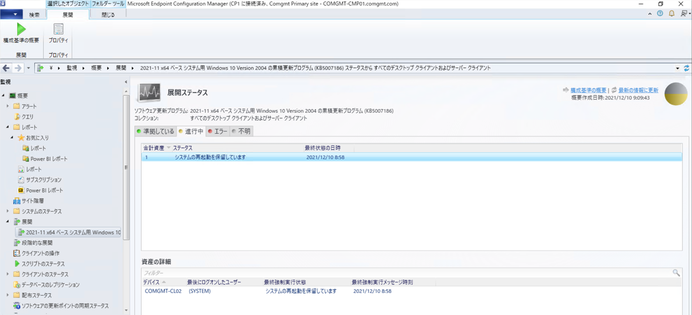
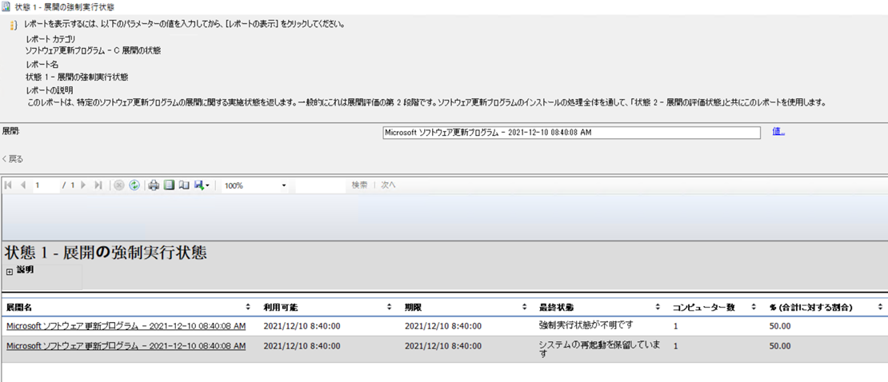
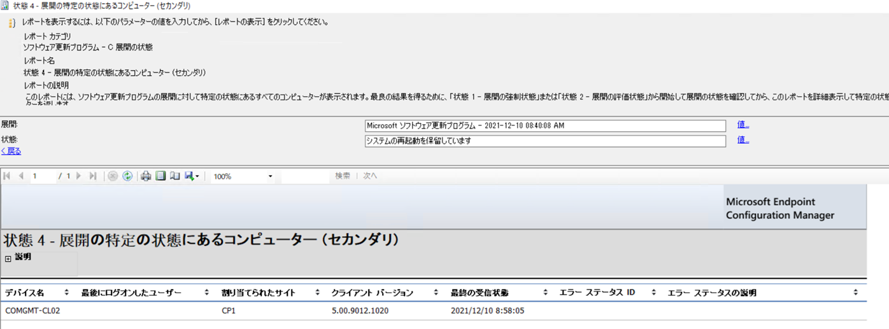
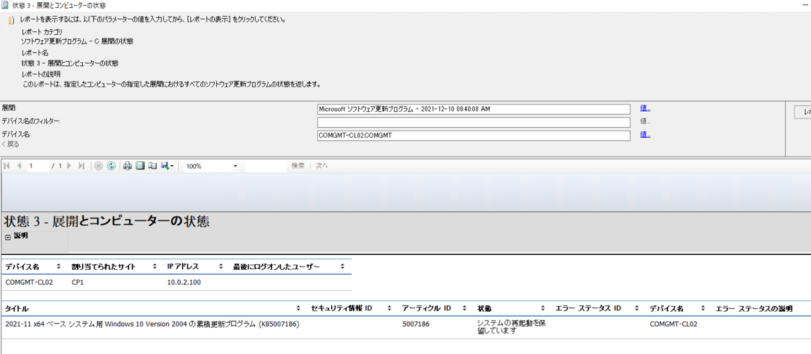
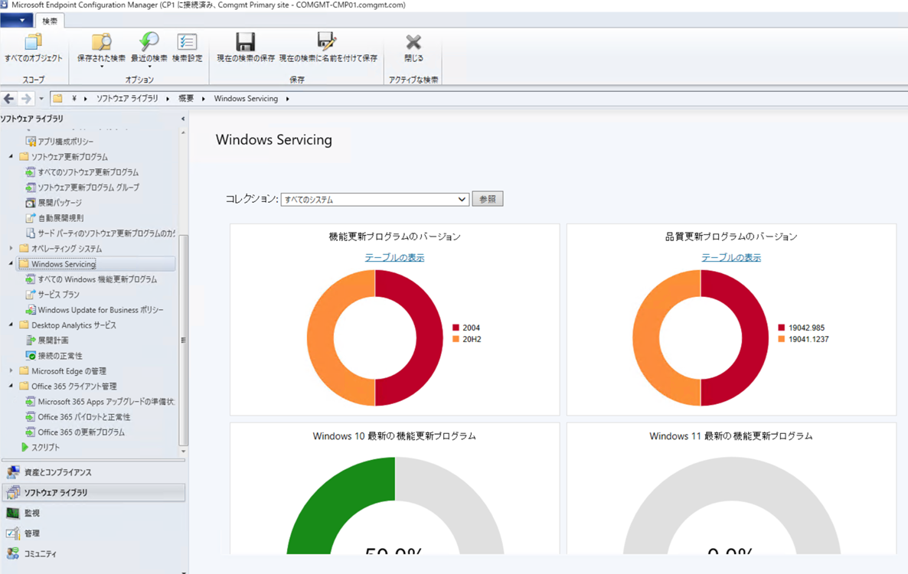

# Configuration Manager における更新プログラムの適用状況の確認方法について
みなさま、こんにちは。Configuration Manager サポート チームです。  

本日は Configuration Manager で更新プログラムを管理している環境において、更新プログラムの適用状況を確認する方法をご紹介いたします。
更新プログラムの適用状況を確認する方法は複数ありますが、それぞれ反映されるタイミングが異なりますので、用途に応じて使い分けていただければと思います。

# 管理コンソールから確認する方法
Configuration Manager の管理者が管理コンソールから、更新プログラムの適用状況を確認する方法です。  
通常の運用では、更新プログラムの展開を行った後、まずこちらで確認することが多くなるかと思います。

## 1. 展開ステータスから確認
展開ステータスは、更新プログラムの展開を受信したクライアントの進行状況の概要を把握するために有用です。  
展開単位で各ステータスの割合やそのステータスを報告したクライアントの一覧を確認できますので、現在の進行状況がおおよそどれくらいになっているかを把握するために使います。  
但し、クライアントから報告された状態メッセージをもとに概要処理が行われた後の概要データを参照している画面となるため、実際のクライアントの適用状況が時間差で反映されることがあります。  
そのため、最新の適用状態を確認する場合は、レポートを使用します。

  

## 2. 展開レポートを確認
展開レポートはクライアントから報告された状態メッセージのデータを表示するため、状態メッセージが正しく報告されている状態であれば、クライアントの最新状況を正確に把握することができます。  
そのため、展開ステータスで概要を把握した後、特定のクライアントの状態を把握するときに使用します。

まず、「状態 1 - 展開の強制実行状態」レポートを確認します。  
このレポートでは検索条件に指定した展開において、最終状態毎に分類されてレコードが表示されます。そのため、対象の展開全体において、どの状態になっているクライアントが多いかを把握することができます。（展開ステータスで確認できる情報と同じものですが、概要処理実行前でも確認可能ですので、こちらの方がリアルタイムに把握できます。）

  

このレポートで展開名列のリンクをクリックすると、「状態 4 - 展開の特定の状態にあるコンピューター (セカンダリ)」レポートが開きます。  
このレポートでは、その状態にあるコンピューターの一覧が表示されます。エラー ステータス ID や説明の列があるので、エラーが発生した場合において具体的なエラー内容を把握するために使用できます。

  

展開に複数の更新プログラムが含まれている場合、その展開の特定のクライアントの状態を知りたい場合は、「状態 3 - 展開とコンピューターの状態」レポートを開きます。  
このレポートでは、検索条件に指定したコンピューターにおいて、対象の展開に含まれる更新プログラムの状態が一覧となって表示されるので、その展開に含まれる更新プログラムの適用状況を把握するために使用できます。

  

## 3. Windows Servicing ダッシュボード (旧 Windows 10 ダッシュボード) を確認
Windows Servicing ダッシュボードでは、機能更新プログラムや品質更新プログラムのバージョンの内訳が円グラフとなって表示されます。Windows 10/11 の場合、品質更新プログラムを適用すると、特定のバージョンになりますので、品質更新プログラムの適用状況はダッシュボードで、そのバージョンになっているかどうかを確認することによっても把握できます。  
円グラフ内で、確認したいバージョンの部分をクリックすると、そのバージョンになっているデバイスの一覧が表示されますので、適用状況を確認したいクライアントがその一覧に表示されるかどうかを確認するために使用できます。

  

# クライアントのログから確認する方法
特定のクライアントで更新プログラムが配信されているかどうかを確認する場合の、確認方法です。  
こちらは更新プログラムを配信したクライアント端末内に存在するログから確認する方法となります。

## 1. ReportingEvents.log による確認
最も簡易的な確認方法です。%windir%\SoftwareDistribution\ReportingEvents.log より、[AGENT_INSTALLING_SUCCEEDED] イベントが CcmExec により Success となっているか確認します。
このログが記録されている場合 Configuration Manager クライアントによって更新プログラムがインストールされたことになります。
 
例）
%windir%\SoftwareDistribution\ReportingEvents.log
```
{08785487-DDB3-4BA7-A32D-97DA31E119DD}    2023-02-10 19:52:59:896+0900          1            183 [AGENT_INSTALLING_SUCCEEDED]       101        {9CB4EAAF-1485-435A-9198-2B452F1DC644}             200        0              CcmExec             Success              Content Install              Installation Successful: Windows successfully installed the following update: 2022-12 Cumulative Update for .NET Framework 3.5, 4.8 and 4.8.1 for Windows 10 Version 21H2 for x64 (KB5021088)      KszDqsCb7UmIDeso.14.0.0.3.0.0
```
★ 2023/2/10 に CcmExec による「2022-12 Cumulative Update for .NET Framework 3.5, 4.8 and 4.8.1 for Windows 10 Version 21H2 for x64 (KB5021088)」のインストールが成功したことを示すログです。
 
## 2. UpdateDeployment.log による確認
Configuration Manager クライアントによって更新プログラムのダウンロードからインストールが行われた経緯を追跡するために有用な確認方法です。
まず、%windir%\CCM\Logs\UpdatesDeployment.log の以下のログより、更新プログラムの Update ID を確認します。
 
例) 
%windir%\CCM\Logs\UpdatesDeployment.log
```
2-03-2023 18:17:12.599    UpdatesDeploymentAgent    4012 (0xfac)    Update (Site_04BBD5B3-EC61-46B0-82C1-83C6B832829D/SUM_9cb4eaaf-1485-435a-9198-2b452f1dc644) Name (2022-12 Cumulative Update for .NET Framework 3.5, 4.8 and 4.8.1 for Windows 10 Version 21H2 for x64 (KB5021088)) ArticleID (5021088) added to the targeted list of deployment ({B92846E4-0C5A-43CD-AF30-25C2074BB30E})
```
「2022-12 Cumulative Update for .NET Framework 3.5, 4.8 and 4.8.1 for Windows 10 Version 21H2 for x64 (KB5021088)」の UpdateID は、9cb4eaaf-1485-435a-9198-2b452f1dc644 であることがわかります。
 
後は確認した Update ID でログをフィルターして、「Progress: Status =」となっているログの記録を追跡します。
 
```
02-03-2023 18:17:12.599    UpdatesDeploymentAgent    4012 (0xfac)    Update (Site_04BBD5B3-EC61-46B0-82C1-83C6B832829D/SUM_9cb4eaaf-1485-435a-9198-2b452f1dc644) Name (2022-12 Cumulative Update for .NET Framework 3.5, 4.8 and 4.8.1 for Windows 10 Version 21H2 for x64 (KB5021088)) ArticleID (5021088) added to the targeted list of deployment ({B92846E4-0C5A-43CD-AF30-25C2074BB30E})
02-03-2023 18:17:12.802    UpdatesDeploymentAgent    8044 (0x1f6c)    Update (Site_04BBD5B3-EC61-46B0-82C1-83C6B832829D/SUM_9cb4eaaf-1485-435a-9198-2b452f1dc644) Progress: Status = ciStateDownloading, PercentComplete = 0, Result = 0x0
...
02-03-2023 18:17:35.748    UpdatesDeploymentAgent    4012 (0xfac)    Update (Site_04BBD5B3-EC61-46B0-82C1-83C6B832829D/SUM_9cb4eaaf-1485-435a-9198-2b452f1dc644) Progress: Status = ciStateDownloading, PercentComplete = 100, Result = 0x0
```
★このタイミングでダウンロードが完了しました。

```
02-10-2023 18:21:09.965    UpdatesDeploymentAgent    4048 (0xfd0)    Update (Site_04BBD5B3-EC61-46B0-82C1-83C6B832829D/SUM_9cb4eaaf-1485-435a-9198-2b452f1dc644) Progress: Status = ciStateDownloading, PercentComplete = 0, Result = 0x0
02-10-2023 18:21:10.630    UpdatesDeploymentAgent    7648 (0x1de0)    Update (Site_04BBD5B3-EC61-46B0-82C1-83C6B832829D/SUM_9cb4eaaf-1485-435a-9198-2b452f1dc644) Progress: Status = ciStateDetecting, PercentComplete = 0, DownloadSize = 0, Result = 0x0
02-10-2023 18:21:10.661    UpdatesDeploymentAgent    5888 (0x1700)    Update (Site_04BBD5B3-EC61-46B0-82C1-83C6B832829D/SUM_9cb4eaaf-1485-435a-9198-2b452f1dc644) Progress: Status = ciStateDownloading, PercentComplete = 0, DownloadSize = 0, Result = 0x0
02-10-2023 18:21:10.911    UpdatesDeploymentAgent    7996 (0x1f3c)    Update (Site_04BBD5B3-EC61-46B0-82C1-83C6B832829D/SUM_9cb4eaaf-1485-435a-9198-2b452f1dc644) Progress: Status = ciStateWaitInstall, PercentComplete = 0, DownloadSize = 0, Result = 0x0
...
02-10-2023 18:22:23.108    UpdatesDeploymentAgent    3540 (0xdd4)    Update (Site_04BBD5B3-EC61-46B0-82C1-83C6B832829D/SUM_9cb4eaaf-1485-435a-9198-2b452f1dc644) Progress: Status = ciStateInstalling, PercentComplete = 100, DownloadSize = 0, Result = 0x0
02-10-2023 18:22:23.186    UpdatesDeploymentAgent    7996 (0x1f3c)    Update (Site_04BBD5B3-EC61-46B0-82C1-83C6B832829D/SUM_9cb4eaaf-1485-435a-9198-2b452f1dc644) Progress: Status = ciStatePendingSoftReboot, PercentComplete = 0, DownloadSize = 0, Result = 0x0
```
★このタイミングでインストールが完了し、再起動待ちとなりました。

```
02-10-2023 19:55:29.081    UpdatesDeploymentAgent    5056 (0x13c0)    Update (Site_04BBD5B3-EC61-46B0-82C1-83C6B832829D/SUM_9cb4eaaf-1485-435a-9198-2b452f1dc644) Progress: Status = ciStateInstallComplete, PercentComplete = 0, DownloadSize = 0, Result = 0x0
```
★このタイミングでインストールが成功しました。

なお、どこの配布ポイントからダウンロードしたかについては、UpdatesDeployment.log には記録されません。
ダウンロード元となる配布ポイントを確認する場合は、UpdatesDeployment.log よりダウンロードが開始された時間を把握した後、DataTrasnferServices.log より確認します。
 
```
02-03-2023 18:17:13.544    DataTransferService    4012 (0xfac)    DataTransferService: DTSJob({5FA19A95-19E4-4EA4-8B5F-03251C093633}) - created to download from 'http://ADA-PS1SITE.adatum.com:80/SMS_DP_SMSPKG$/f65c14ba-94ac-4d7f-847c-ecaf000d1bed' to 'C:\Windows\ccmcache\1p'.
02-03-2023 18:17:13.544    DataTransferService    8044 (0x1f6c)    DTSJob({5FA19A95-19E4-4EA4-8B5F-03251C093633}): state changing from 'New' to state 'DownloadingManifest'.
02-03-2023 18:17:13.794    DataTransferService    6444 (0x192c)    Raising event:
 
instance of CCM_CcmHttp_Status
{
              ClientID = "GUID:DB715499-3414-4055-B873-278BAE1B73C4";
              DateTime = "20230203091713.794000+000";
              HostName = "ADA-PS1SITE.adatum.com";
              HRESULT = "0x00000000";
              ProcessID = 6776;
              StatusCode = 0;
              ThreadID = 6444;
};
02-03-2023 18:17:13.794    DataTransferService    6444 (0x192c)    UpdateURLWithTransportSettings(): OLD URL - http://ada-ps1site.adatum.com/SMS_DP_SMSPKG$/sccm?/f65c14ba-94ac-4d7f-847c-ecaf000d1bed/
02-03-2023 18:17:13.794    DataTransferService    6444 (0x192c)    UpdateURLWithTransportSettings(): NEW URL - http://ada-ps1site.adatum.com:80/SMS_DP_SMSPKG$/sccm?/f65c14ba-94ac-4d7f-847c-ecaf000d1bed/
02-03-2023 18:17:13.794    DataTransferService    6444 (0x192c)    UpdateURLWithTransportSettings(): OLD URL - http://ada-ps1site.adatum.com/SMS_DP_SMSPKG$/f65c14ba-94ac-4d7f-847c-ecaf000d1bed/sccm?/Windows10.0-KB5020872-x64-NDP48.cab
02-03-2023 18:17:13.794    DataTransferService    6444 (0x192c)    UpdateURLWithTransportSettings(): NEW URL - http://ada-ps1site.adatum.com:80/SMS_DP_SMSPKG$/f65c14ba-94ac-4d7f-847c-ecaf000d1bed/sccm?/Windows10.0-KB5020872-x64-NDP48.cab
02-03-2023 18:17:13.794    DataTransferService    6444 (0x192c)    DTSJob({5FA19A95-19E4-4EA4-8B5F-03251C093633}): state changing from 'DownloadingManifest' to state 'RetrievedManifest'.
02-03-2023 18:17:13.810    DataTransferService    4012 (0xfac)    DTSJob({5FA19A95-19E4-4EA4-8B5F-03251C093633}): state changing from 'RetrievedManifest' to state 'PendingDownload'.
02-03-2023 18:17:13.810    DataTransferService    2536 (0x9e8)    DTSFlag is 0x0040050e
02-03-2023 18:17:13.810    DataTransferService    2536 (0x9e8)    ContentInfo root location - C:\Windows\ccmcache\1p.BCWork\ContentInfo
02-03-2023 18:17:13.810    DataTransferService    2536 (0x9e8)    Exclude file list:
02-03-2023 18:17:13.810    DataTransferService    2536 (0x9e8)    Using branch cache option
02-03-2023 18:17:13.826    DataTransferService    2536 (0x9e8)    DTSJob({5FA19A95-19E4-4EA4-8B5F-03251C093633}): state changing from 'PendingDownload' to state 'DownloadingData'.
02-03-2023 18:17:35.983    DataTransferService    4764 (0x129c)    DTSJob({5FA19A95-19E4-4EA4-8B5F-03251C093633}): state changing from 'DownloadingData' to state 'RetrievedData'.
02-03-2023 18:17:35.983    DataTransferService    4764 (0x129c)    DTSJob({5FA19A95-19E4-4EA4-8B5F-03251C093633}):CDTSJob::JobTransferred - Successfully completed download.
02-03-2023 18:17:36.061    DataTransferService    2536 (0x9e8)    DTSJob({5FA19A95-19E4-4EA4-8B5F-03251C093633}): state changing from 'RetrievedData' to state 'NotifiedComplete'.
02-03-2023 18:17:36.061    DataTransferService    2536 (0x9e8)    DTSJob({5FA19A95-19E4-4EA4-8B5F-03251C093633}): Job has completed: Status : SUCCESS, Start time : 02/03/2023 18:17:13, Completion time : 02/03/2023 18:17:35, Elapsed time : 22 seconds
```
★ ada-ps1site.adatum.com がダウンロード元であることがわかります。ダウンロードの経緯については DTSJob の ID でログをフィルターすることで追跡可能です。このログの場合は {5FA19A95-19E4-4EA4-8B5F-03251C093633} でフィルターすることになります。
