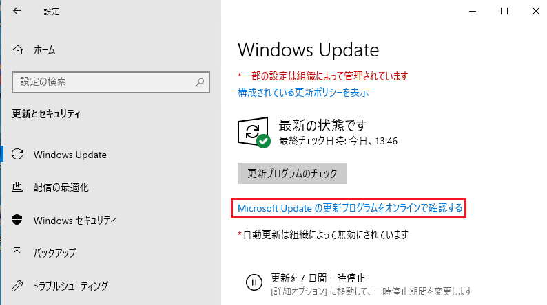
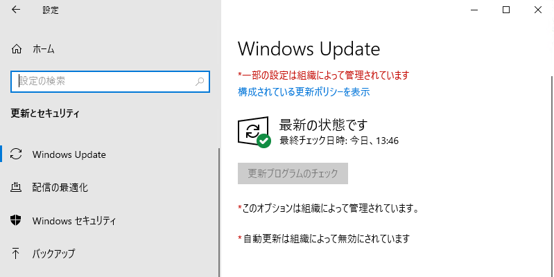
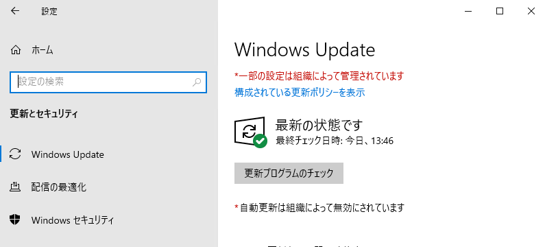
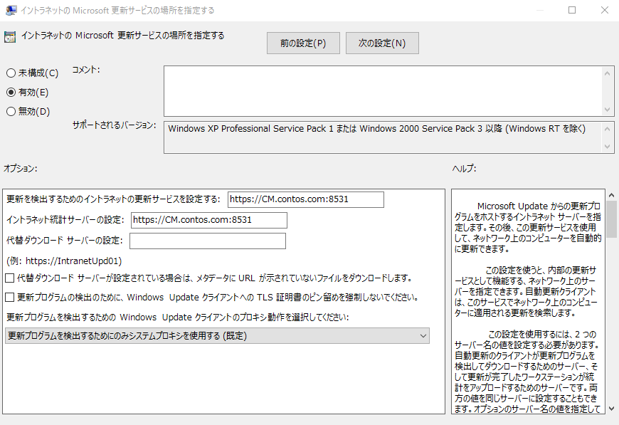

みなさま、こんにちは。Configuration Manager サポート チーム 山田 です。

本日は、Configuration Manager 環境にてクライアントの OS が意図せずアップグレードされてしまった際の要因と対処策についてご紹介いたします。

想定される要因として以下 2 つが挙げられますので、それぞれの場合について記載させていただきます。

1. [Microsoft Update の更新プログラムをオンラインで確認する] ボタンをクリックした。
2. [イントラネットの Microsoft 更新サービスの場所を指定する] ポリシーが "未構成" となっている。

### 1. [Microsoft Update の更新プログラムをオンラインで確認する] ボタンをクリックした。

#### 要因  
ソフトウェア更新ポイントが構成されている Configuration Manager 環境のクライアントであれば、クライアント端末より [設定] - [Windows Update] と辿ると以下のボタンが表示されています。

上記のボタンを押すと構成されている WSUS サーバーではなく、Microsoft Update に対して更新プログラムをチェックしに行くため、その時点でクライアントがインストールできる最新の機能更新プログラムや品質更新プログラムをダウンロード、インストールしてしまいます。  
そのため、結果的に意図していない OS のアップグレードが行われます。

#### 対処策  
以下どちらかのポリシーを "有効" とすると、[Microsoft Update の更新プログラムをオンラインで確認する] ボタンが非表示となるため、ユーザー側でクリックできなくなります。

[コンピューターの構成] - [管理用テンプレート] - [Windows Update] - [Windows Update のすべての機能へのアクセスを削除する]

[更新プログラムのチェック] ボタンはグレーアウトし、クリックできなくなります。

または  
[コンピューターの構成] - [管理用テンプレート] - [Windows Update] - [インターネット上の Windows Update に接続しない]

[更新プログラムのチェック] ボタンはクリックできます。

[インターネット上の Windows Update に接続しない] ポリシーは、Microsoft Update へのアクセスがブロックされますが、Microsoft ストア アプリの更新もブロックされますので、ストア アプリの更新は行いたい場合、[Windows Update のすべての機能へのアクセスを削除する] ポリシーを有効にするなど使い分けてください。

### 2. [イントラネットの Microsoft 更新サービスの場所を指定する] ポリシーが "未構成" となっている。  

#### 要因  
通常、Configuration Manager（ソフトウェア更新ポイントの機能を使用している場合）クライアントであれば、以下のポリシーが "有効" になっており、WSUS サーバーが入力されています。

[コンピューターの構成] - [管理用テンプレート] - [Windows Update] - [イントラネットの Microsoft 更新サービスの場所を指定する]

しかし、何らかの要因により上記ポリシーがリセットされ、"未構成" となってしまっている場合は WSUS サーバーに更新プログラムをチェックしに行かず、Microsoft Update に対して更新プログラムをチェックしに行くため、意図していない OS のアップグレードが行われる可能性がございます。  
今までは Configuration Manager で更新プログラムの管理ができており、特段何もしていないにも関わらず上記ポリシーが "未構成" になってしまった場合には個別の調査が必要でございますので、弊社サポートへのお問い合わせをご検討いただけますと幸いです。

#### 対処策  
一時的な対処としては上述の [インターネット上の Windows Update に接続しない] ポリシーを有効とすることで、Microsoft Update へのアクセスがブロックされますので、意図しない Update を防ぐことが可能です。
もしくは以下のポリシーを "無効" とすることで、クライアント端末が自動で Windows Update が実行されることを無効にすることができます。

[コンピューターの構成] - [管理用テンプレート] - [Windows Update] - [自動更新を構成する]  
※通常 Configuration Manager クライアントであれば ”無効" になっています。

[自動更新を構成する] ポリシーを "無効" にしても、手動で [更新プログラムのチェック] を行うことは可能なため、上述の [Windows Update のすべての機能へのアクセスを削除する] ポリシーと合わせて適用することで、自動 / 手動ともに Windows Update が実行されなくなりますので、どちらかの方法をご検討ください。

ただし、ソフトウェア更新プログラムを Configuration Manager で管理しているクライアントにおいて、 [イントラネットの Microsoft 更新サービスの場所を指定する] ポリシーが "未構成" であることは本来あるべき状態ではございません。  
根本解決のためにはトラブルシューティングが必要のため、弊社サポートへのお問い合わせをご検討ください。

#### 補足事項  
今回は Configuration Manager 環境のクライアントについて記載いたしましたが、WSUS 環境のクライアントでも以下 3 つのポリシーを 有効 / 無効 とすることは効果的でございますので、貴社環境の運用に合わせて適用ください。

- [Windows Update のすべての機能へのアクセスを削除する]
- [インターネット上の Windows Update に接続しない]
- [自動更新を構成する]
