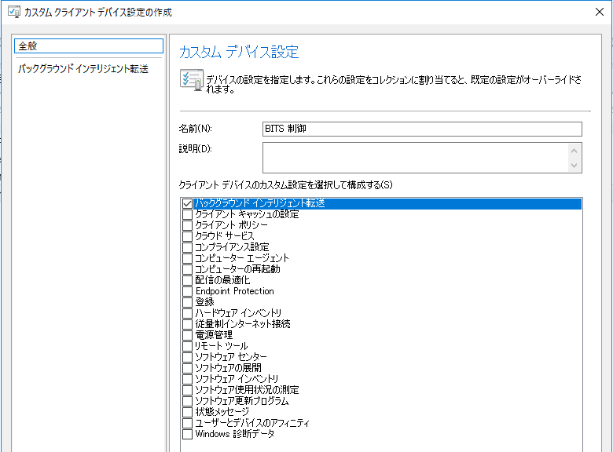
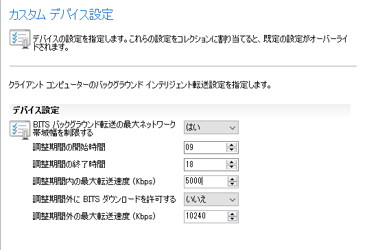
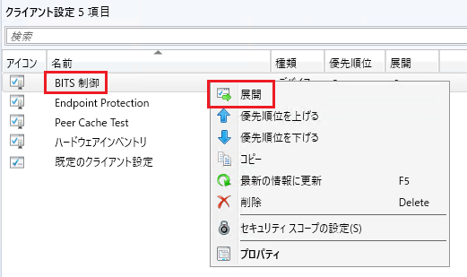
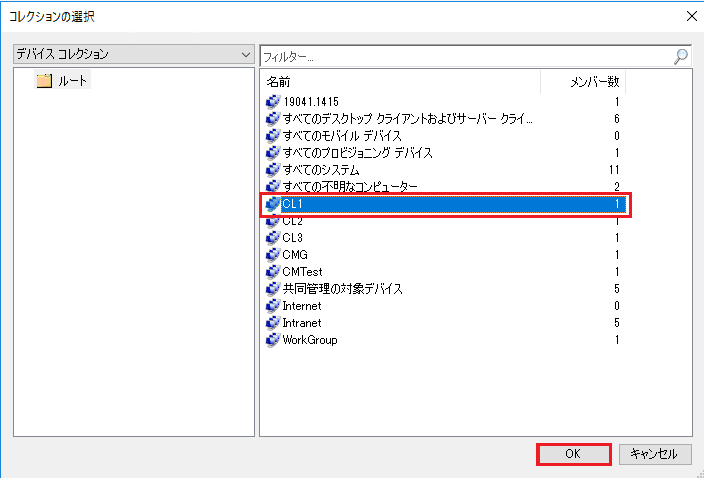
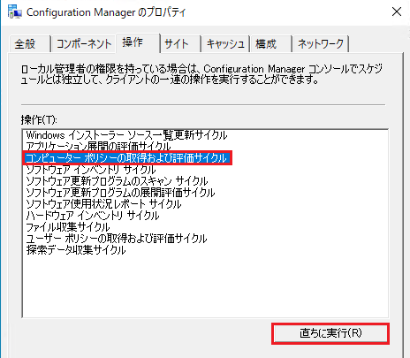
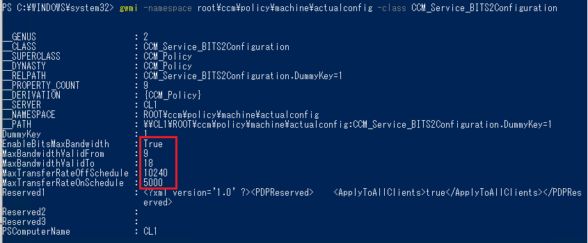

みなさま、こんにちは。Configuration Manager サポート チーム 山田 です。  
  
本ブログの連載企画として Microsoft Configuration Manager の基本的なナレッジを、これから管理者となる方や導入を検討されている方向けに分かり易く紹介する予定です。  
今回は [クライアント設定] の機能について紹介いたします。  
  
### [クライアント設定] とは・・・
Configuration Manager で設定した内容を、Configuration Manager クライアントに反映させる（ローカル グループ ポリシーやレジストリに書き込みます）機能です。  
  
参考公開情報  
Title : Configuration Managerのクライアント設定について  
URL : https://learn.microsoft.com/ja-jp/mem/configmgr/core/clients/deploy/about-client-settings  
  
### 何ができるのか  
[クライアント設定] で実現できるサンプル例を記載します。  
  
#### 例 1  
クライアントの BITS の帯域制御を以下のように設定したい。  
  
制御の開始時間：9:00  
制御の終了時間：18:00  
転送速度（Kbps）：5000  
  
#### 例 2  
ハードウェア インベントリの収集スケジュールや、収集対象となるハードウェア インベントリ クラスを変更したい。  
  
#### 例 3  
クライアントを Microsoft 365 更新プログラムの管理対象にしたい。
  
上記は数多くある [クライアント設定] の一部ですが、Configuration Manager に備わっている強力な機能でございますので、ぜひ運用の検討材料にしていただければ幸いです。  
  
### どのように設定するのか
ここからは具体的にどのように設定していくのかを記載いたします。  
例として、BITS の制御を設定する方法についてご紹介します。  
※[既定のクライアント設定] で設定を行うとすべてのクライアントに対して設定されてしまうため、ここではカスタム クライアント デバイス設定の作成方法をご紹介します。  
  
1. Configuration Manager 管理ツールを起動し、[管理] - [クライアント設定] と辿ります。  
2. 画面上部の [カスタム クライアント デバイス設定] を選択します。  
3. [名前] を任意で設定し、[バックグラウンド インテリジェント転送] にチェックを入れます。  

   
  
4. 画面左側の [バックグラウンド インテリジェント転送] を選択し、画面右側で BITS の制御を設定します。  
  
  ここでは以下のように設定しました。  

  
  
  画面下部の [OK] ボタンで閉じます。  
  
5. 作成した名前のクライアント設定を右クリックし、[展開] を選択します。  
  

  
6. 適用したいデバイス コレクションを選択し、 [OK] ボタンで閉じます。  
  

  
7. クライアント側でポリシーのダウンロードに成功したら適用完了です。  
  
検証などで手動でポリシーのダウンロードを促したい場合は、Configuration Manager のプロパティより [コンピューター ポリシーの取得および評価サイクル] を実行します。  
  

  
8. クライアント端末上で以下の PowerShell コマンドを管理者として実施し、実際に適用されていることを確認します。  

```
gwmi -namespace root\ccm\policy\machine\actualconfig -class CCM_Service_BITS2Configuration
```
  
以下のように、クライアント設定で設定した値が反映されていれば、適用完了です。  
  

  
今回は [バックグラウンド インテリジェント転送] を対象とした PowerShell コマンドでしたが、その他のクライアント設定の項目に対する対象のクラスや、クライアント設定が適用されない場合は以下のブログをご参照ください。  
  
[クライアント設定が適用されない！確認すべき 3 つのポイント](https://jpmem.github.io/blog/mecm/20220408_01/)
