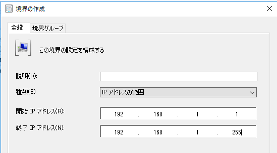
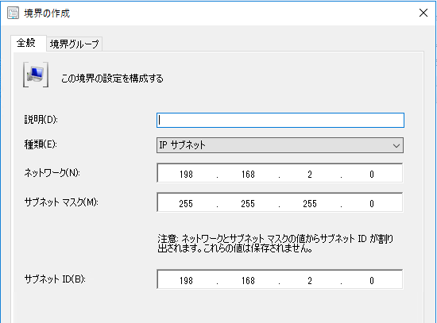
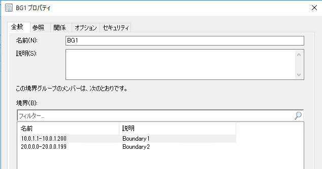
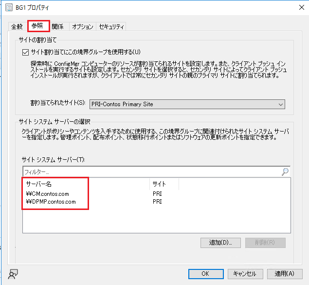

みなさま、こんにちは。Configuration Manager サポート チーム 山田 です。  
  
本ブログの連載企画として Microsoft Configuration Manager の基本的なナレッジを、これから管理者となる方や導入を検討されている方向けに分かり易くご紹介いたします。  
今回は、Configuration Manager の "境界" と "境界グループ" についてご紹介いたします。  
  
Title : 境界と境界グループの概要  
URL : https://learn.microsoft.com/ja-jp/mem/configmgr/core/servers/deploy/configure/define-site-boundaries-and-boundary-groups  
  
Configuration Manager のクライアントは同じ境界グループに所属する管理ポイントや配布ポイント、ソフトウェア更新ポイントに対して通信を行います。  
そのため、どのクライアントがどのサイト システム サーバーに通信することを意図しているか決定し、境界と境界グループを正しく構成することは必要不可欠です。  
  
#### 境界とは  
まず境界とは、クライアントが存在しているネットワーク上の場所です。  
例えば以下のような設定が可能です。  
  
##### IP アドレスの範囲  
  
  
##### IP サブネット  
  
  
#### 境界グループとは  
境界を複数まとめたものが境界グループです。  
以下は 2 つの境界が含まれている境界グループの例です。  

  
また、境界グループにはサイト システム サーバーを関連付けることが可能で、境界グループに所属するクライアントはここで関連付けられている管理ポイントや配布ポイント、ソフトウェア更新ポイントに対して通信を試みます。  
以下の例の場合、BG1 に所属するクライアントは CM.contos.com か DPMP.contos.com に対して通信します。  

  
もし所属する境界グループの管理ポイントなどに通信が行えない場合は、別の境界グループにフォールバックし、別の境界グループに関連付けられている管理ポイントなどに通信を試みるように構成することも可能ですので、運用の検討材料にしていただけますと幸いです。  
  
Title : Configuration Managerの境界グループについて  
URL : https://learn.microsoft.com/ja-jp/mem/configmgr/core/servers/deploy/configure/boundary-groups#fallback  