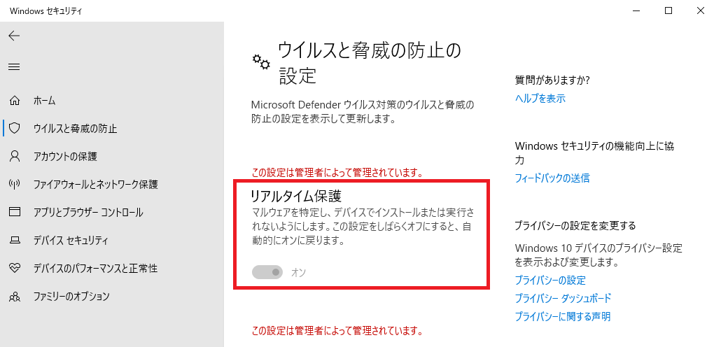
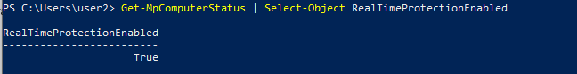
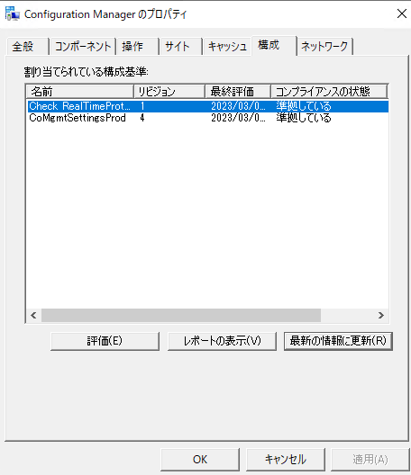
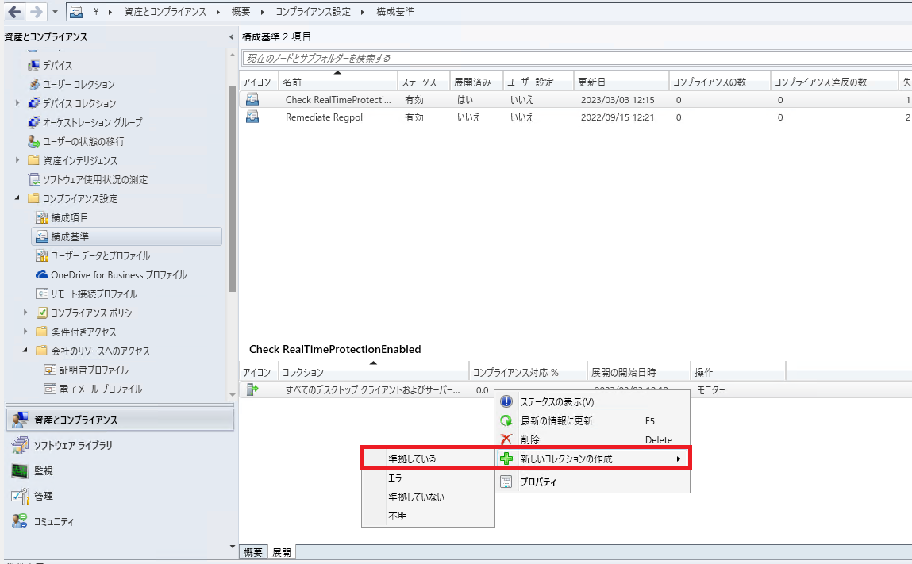

# Configuration Manager で PowerShell スクリプトを配布する
みなさま、こんにちは。Configuration Manager サポート チームです。

本日は Configuration Manager で コンプライアンス機能で PowerShell スクリプトを使用して準拠状態をチェックする方法についてご紹介いたします。  
あまり知られていないコンプライアンス機能ですが、この機能はクライアントにとって「あるべき状態」を設定し、その状態になっているかどうかをチェックして「準拠」か「非準拠」を判断したいときに有用です。  
例えば、特定のグループ ポリシーが適用されているか判断したいときに、レジストリ値をチェックする構成項目・構成基準を作成して展開すれば、グループ ポリシーの適用可否をチェックできるといったことです。

今回は、レジストリ値でチェックできないが、PowerShell スクリプトの結果をもって「準拠」「非準拠」を判断したい場合の設定例をご紹介します。  
設定例では Microsoft Defender の「リアルタイム保護」の有効・無効をチェックし、有効なら「準拠」、無効なら「非準拠」として報告させることを目的としています。  
  
こちらの値は PowerShell コマンド Get-MpComputerStatus で得られた結果の RealTimeProtectionEnabled というプロパティで判定できるので、そちらの結果を使用する PowerShell スクリプトとなります。
  

PowerShell スクリプトを変更すれば、様々なコマンドに応用できると思いますので、是非本手順をご活用ください！

# 事前準備
既定ではクライアントの PowerShell 実行ポリシーが "すべて署名済み" ですので、コンプライアンス機能で展開する PowerShell スクリプトが実行できません。  
そのため、既定の状態で構成基準を展開すると、エラーになる可能性があるので、クライアントに展開しているクライアント設定で以下の手順で "バイパス" に変更してください。  

1. 管理コンソールを起動し、[管理] - [クライアント設定] を開きます。
2. クライアントに展開しているクライアント設定を右クリックしてプロパティを開きます。
3. [コンピューター エージェント] - [PowerShell 実行ポリシー] をバイパスに設定します。

クライアントに展開されたクライアント設定の結果の確認方法は、[こちらの記事](https://jpmem.github.io/blog/mecm/20220408_01/)をご確認ください。

# 手順 1: 構成項目の作成
1. 管理コンソールを起動し [資産とコンプライアンス] - [コンプライアンス設定] - [構成項目] を右クリックし、[構成項目の作成] をクリックします。
2. [全般] ページにて、任意の名前を指定し、デバイスの指定において [Windows デスクトップおよびサーバー] を選択し [次へ] をクリックします。
3. [サポートされているプラットフォーム] ページにて、任意で対象の Windows バージョンを選択し「次へ」をクリックします。
4. [設定] ページにて、[新規] をクリックします。
5. [全般] タブにて、任意の名前を指定し以下の設定を行った後、[探索スクリプト] - [スクリプトの追加] を選択します。
・設定の種類 ： スクリプト  
・データ型 : ブール値
6. [スクリプト言語] に [Windows PowerShell] を選択して、以下のような PowerShell スクリプトを入力し、[OK] を選択し [次へ] をクリックします。  
スクリプトで $True を返した場合「準拠」、$False を返した場合「非準拠」とするようにします。  
```powershell
$mdInfo = Get-MpComputerStatus

if($mdInfo.RealTimeProtectionEnabled -eq $True) {
    Write-Output $True
} else{
    Write-Output $False
}
```
7. [コンプライアンス規則] タブにて、[新規] をクリックし任意の名前を指定し、[参照] を選択します。
8. 項番 5. 6. で作成した構成項目名を選択し、[選択] をクリックします。
9.  以下の設定を行い [OK] をクリックします。  
・規則の種類：値  
・演算子：次の値と等しい  
・次の値の場合： True  
・この設定インスタンスが見つからない場合はコンプライアンス違反としてレポートする : オン  
10. [次へ] をクリックしていき、構成項目の作成を完了します。

# 手順 2: 構成基準の作成と展開
作成した構成項目を含む構成基準を作成・展開します。クライアントはこの構成基準を受信して評価することで、構成項目内の PowerShell スクリプトを実行し、準拠状態をサーバーに報告します。

1. [資産とコンプライアンス] - [概要] - [コンプライアンス設定] - [構成基準] を右クリックし、[構成基準の作成] をクリックします。
2. 任意の名前を指定し、画面中央部にある [構成データ] で [追加] をクリックし、[構成項目] をクリックします。
3. 作成した構成項目を指定して、画面中央部にある [追加] をクリックし、[OK] をクリックします。  
4. [OK] をクリックします。  
5. 作成した構成基準を右クリックし [展開] をクリックします。
6. 以下の設定を実施し「OK」をクリックします。  
・「選択した構成基準」に作成した構成基準が表示されていることを確認します。表示されていない場合は「利用可能な構成基準」から作成した構成基準を選択して [追加] をクリックします。   
・「コレクション」にて、展開対象のコレクションを選択します。  
・「スケジュール」にて、構成基準の評価スケジュールを指定します。（既定では 7 日に 1 回）

# 実行結果の確認方法
構成基準を展開した後、クライアント側で、コントロール パネルを開き、表示方法を "小さいアイコン" に変更し、[Configuration Manager] を開いて [操作] タブより [コンピューター ポリシーの取得および評価サイクル] を選択し、[直ちに実行] を何度かクリックします。その後 [構成] タブを開き、[最新の情報に更新] をクリックすると、展開した構成基準の名前が表示されます。  
最初は「コンプライアンスの状態」が「不明」となっていますので [評価] をクリックします。「準拠している」となった場合、この構成基準は「準拠」として、既定で 15 分以内にサーバー側に状態メッセージとして報告されます。  

  

「エラー」となった場合は [レポートの表示] をクリックしてレポートを確認してください。「スクリプトに署名がありません」と表示された場合、PowerShell スクリプトの実行が許可されていませんので、事前準備のクライアント設定が展開されているか改めてご確認ください。

# 補足
## 構成基準の実行タイミングについて
構成基準を展開した後は、クライアント側で [コンピューター ポリシーの取得および評価サイクル] が実行されることで、最大 2 時間以内で構成基準がスケジューリングされ実行されます。
コンピューター ポリシーの受信サイクルについては、既定で 60 分間隔で実行されています。  
なお、できる限り早く実行させたい場合は、「クライアント通知」という機能を使用すれば、「コンピューターポリシーの取得および評価サイクル」を直ちに実行するように、サーバー側からクライアントに通知させることができますので、こちらもご利用ください。(デバイス単位でもコレクション単位でも実行可能です。)    
   
Title: Configuration Manager でのクライアント通知  
URL: https://learn.microsoft.com/ja-jp/mem/configmgr/core/clients/manage/client-notification

## 「準拠している」端末のみを含むコレクションを作成する方法
構成基準に「準拠している」端末のみを含むコレクションを作成することも可能です。  
作成した構成基準の「展開」を右クリックして「新しいコレクションの作成」-「準拠している」をクリックします。  

  

ウィザードを進めてコレクションを作成することで、今回の構成基準に対して「準拠している」端末のみを含むコレクションを作成できます。  
「準拠していない」を選択すれば、同様に「準拠していない」端末のみを含むコレクションを作成することも可能ですので、「準拠していない」端末をリストアップする際に有用です。