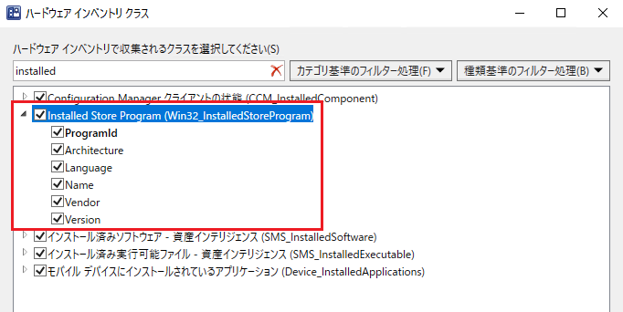
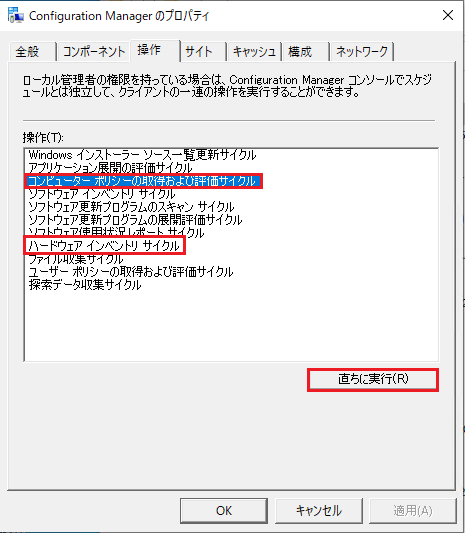
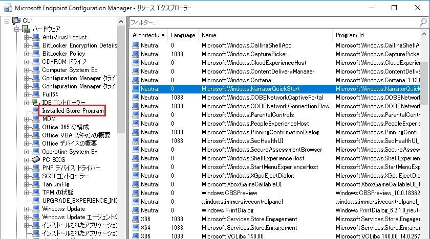

# ハードウェア インベントリで特定の WMI クラスを収集する

みなさま、こんにちは。Configuration Manager サポート チームです。  

使い方シリーズ、今回はハードウェア インベントリで特定の WMI クラスを収集する方法についてご案内いたします。  
特定の WMI クラスを収集して、Configuration Manager コンソールで確認したいという場合に本手順をお役立ていただけますと幸いです。  

# 想定シナリオ
今回、収集対象とする WMI クラスは、名前空間 root\cimv2 に存在する Win32_InstalledStoreProgram というクラスです。  

# 手順

以下の手順をご実施ください。  

1. Configuration Manager 管理コンソールを開きます。  
2. [管理] > [概要] > [クライアント設定] > [既定の設定] を右クリック > プロパティを開きます。  
3. ハードウェア インベントリ を選択 > ハードウェア インベントリ クラス の [クラスの設定] を選択します。  
4. 表示されたハードウェア インベントリ クラス ウィザードにて、[追加] を選択します。  
5. 名前空間: にて [接続] を選択します。  
6. 接続を行いたいコンピューター名と WMI 名前空間を指定します。  
   参照したい WMI 名前空間がローカル コンピューターに存在しない場合には、リモートのコンピューターを指定することも可能です。  

   今回は以下のように指定します。  

   コンピューター名：ローカル コンピューター名（既定値のまま）  
   WMI 名前空間　　：root\cimv2  
   繰り返し　　　　：チェック  
  
    上記入力後、[接続] をクリックします。  
    
7. [インベントリ クラス] のフィルターに Installed と入力し、"Installed Store Program" にチェックを入れ、収集対象としたい項目にチェックを入れ、[OK] で閉じます。  
   

## 確認方法

実際に対象の情報が収集されているか確認します。  
  
まずクライアントは、ポリシーを受けとることで上記で設定したクラスをハードウェア インベントリで収集するようになります。  
その後、ハードウェア インベントリのサイクルが実行されると、収集対象としたクラスの情報を管理ポイントへ送信し、サイト サーバーに情報が送られ、Configuration Manager のデータベースに書き込まれることで Configuration Manager コンソールで確認できるようになります。  
  
そのため、クライアント端末で以下のサイクルを順番に実施します。  
反映されたポリシーを受信するまでに時間がかかる場合がありますので、テストの際は以下のサイクルを何度か実行ください。  

- [コンピューターポリシーの取得および評価サイクル]  
- [ハードウェア インベントリ サイクル]  
  

  
ハードウェア インベントリが正常に収集されると、Configuration Manager コンソールからクライアントを右クリックして、リソース エクスプローラを起動することで、収集したレジストリ情報をご確認いただけます。  
  

  
また、データベースに対して SQL クエリを実行することでもご確認いただけます。  
今回例の場合は以下のクエリを実行します。  
  
```
select * from v_GS_INSTALLED_STORE_PROGRAM
```
  
SQL の実行方法については、以下の記事をご参照ください。  
  
Title: SQL Query 結果の出力方法について  
URL: https://jpmem.github.io/memlog/configmgr/sql/sqlquery.html
