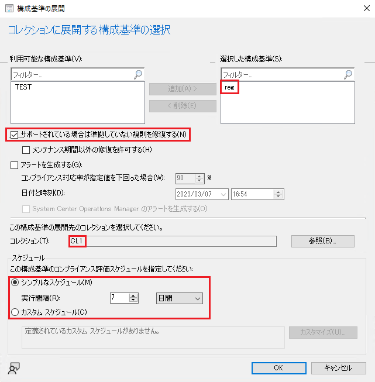

# コンプライアンス機能で特定レジストリ値をセットする方法
みなさま、こんにちは。Configuration Manager サポート チーム 山田 です。  
  
本日は Configuration Manager のコンプライアンス機能で特定のレジストリ値をセットする方法についてご紹介いたします。  
クライアントに特定のレジストリ値をセットしたいというときに、別途スクリプトを作成して、それをパッケージで展開する必要なくレジストリ値をセットできます。  
ワークグループのクライアントでドメインのグループ ポリシーが適用できない場合などにも有効ですので、ぜひご活用ください。  
  
今回は例として、HKEY_LOCAL_MACHINE\SOFTWARE\Policies\Microsoft\Windows\WindowsUpdate 配下にある DisableWindowsUpdateAccess というレジストリ値をセットする方法をご紹介します。  

# 手順 1: 構成項目の作成
1. [資産とコンプライアンス] - [概要] - [コンプライアンス設定] - [構成項目] を右クリックし、[構成項目の作成] を選択します。  
2. [全般] ページにて、任意の名前を指定し、デバイスの指定において [Windows デスクトップおよびサーバー] を選択し [次へ] をクリックします。  
3. [サポートされているプラットフォーム] ページにて、任意で対象の Windows バージョンを選択し「次へ」をクリックします。  
4. [設定] ページにて、[新規] をクリックします。  
5. [全般] タブにて、任意の名前を指定し以下の設定を行います。  
・設定の種類 ： レジストリ値  
・データ型 : 整数  
・ハイブ名：HKEY_LOCAL_MACHINE  
・キー名：SOFTWARE\Policies\Microsoft\Windows\WindowsUpdate  
・値の名前：DisableWindowsUpdateAccess  
[準拠していないルール用に修復された場合には REG_DWORD データ型としてレジストリ値を作成する]: オン  

6. [コンプライアンス規則] タブにて、[新規] をクリックし以下の設定を行い [OK] を選択します。  
・名前：任意の名前  
・規則の種類：値  
・演算子：次の値と等しい  
・次の値の場合：1  
・サポートされている場合は準拠していない規則を修正する : オン  
・この設定インスタンスが見つからない場合はコンプライアンス違反としてレポートする : オン  

7. [次へ] を選択していき、構成項目の作成を完了します。  
  
# 手順 2: 構成基準の作成と展開
作成した構成項目を含む構成基準を作成・展開します。クライアントはこの構成基準を受信して評価することで、構成項目内の PowerShell スクリプトを実行し、準拠状態をサーバーに報告します。  

1. [資産とコンプライアンス] - [概要] - [コンプライアンス設定] - [構成基準] を右クリックし、[構成基準の作成] を選択します。  
2. 任意の名前を指定し、画面中央部にある [構成データ] で [追加] を選択し、[構成項目] を選択します。  
3. 手順 1 で作成した構成項目を指定して、画面中央部にある [追加] をクリックし、[OK] を選択します。  
4. [OK] を選択します。  
5. 作成した構成基準を右クリックし [展開] を選択します。  
6. 以下の設定を実施し [OK] を選択します。  
・「利用可能な構成基準」から作成した構成基準を選択して [追加] をクリックし「選択した構成基準」に表示されていることを確認します。  
・[サポートされている場合は準拠していない規則を修復する]: オン  
・「コレクション」にて展開対象のコレクションを選択します。  
・「スケジュール」にて、構成基準の評価スケジュールを指定します。（既定では 7 日に 1 回）  

# 実行結果の確認方法
構成基準を展開した後、クライアント側で、コントロール パネルを開き、表示方法を "小さいアイコン" に変更し、[Configuration Manager] を開いて [操作] タブより [コンピューター ポリシーの取得および評価サイクル] を選択し、[直ちに実行] を何度かクリックします。その後 [構成] タブを開き、[最新の情報に更新] をクリックすると、展開した構成基準の名前が表示されます。  
最初は「コンプライアンスの状態」が「不明」となっていますので [評価] をクリックします。「準拠している」となった場合、この構成基準は「準拠」として、既定で 15 分以内にサーバー側に状態メッセージとして報告されます。  

「準拠している」となったことを確認後、実際にレジストリ値がセットされているかご確認ください。  
  
■構成基準適用前  

  
■構成基準適用後

# 補足
## 構成基準の実行タイミングについて
構成基準を展開した後は、クライアント側で [コンピューター ポリシーの取得および評価サイクル] が実行されることで、最大 2 時間以内で構成基準がスケジューリングされ実行されます。  
コンピューター ポリシーの受信サイクルについては、既定で 60 分間隔で実行されています。  
なお、できる限り早く実行させたい場合は、「クライアント通知」という機能を使用すれば、「コンピューターポリシーの取得および評価サイクル」を直ちに実行するように、サーバー側からクライアントに通知させることができますので、こちらもご利用ください。(デバイス単位でもコレクション単位でも実行可能です。)  
  
Title: Configuration Manager でのクライアント通知  
URL: https://learn.microsoft.com/ja-jp/mem/configmgr/core/clients/manage/client-notification
