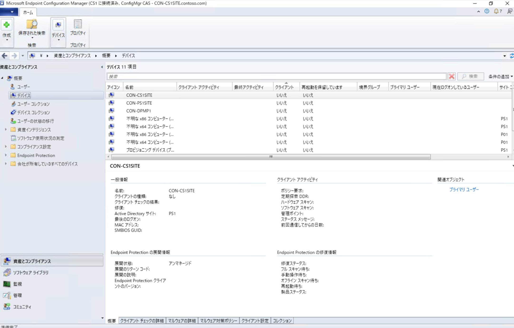
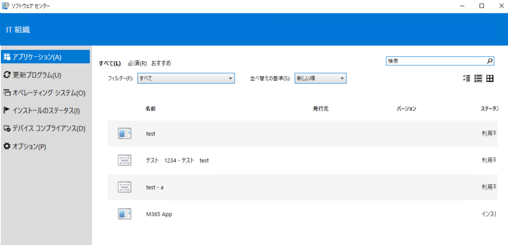

# Microsoft Configuration Manager 自習書シリーズ 1 Microsoft Configuration Manager とは

皆様、Microsoft Configuration Manager サポート チームの箱木です。

本日より、本ブログの連載企画として Microsoft Configuration Manager の公開情報などを整理し、これから管理者となる方や導入を検討されている方が知っておくべきポイントなどをお伝えする予定です。

今回は公開情報：[Configuration Manager とは]( https://learn.microsoft.com/ja-jp/mem/configmgr/core/understand/introduction) をベースに Microsoft Configuration Manager の歴史や機能についてご紹介します。

現在の最新バージョンである Configuration Manager (Current Branch) では、本製品の所属するブランドについて、以下のように記述されております。

>**Configuration Managerは、Microsoft Intune製品ファミリの一部です。**

Configuration Manager は過去 Microsoft 社内のデバイス構成を管理することが目的に開発され、1994 年に Systems Management Server 1.0 として製品化されました。
その後 Systems Management Server 2003 、System Center Configuration Manager 2007 、System Center 2012 Configuration Manager を経て現在の Configuration Manager (Current Branch) に進化してきた歴史があります。
主にオンプレミスにあるデバイスを管理する目的の製品群である System Center 製品ファミリーでしたが、現在は上記のように **Microsoft Cloud のパワーを利用しながら、Configuration Manager への既存の投資を活かしつづける** ことが現在の Intune 製品ファミリーとなった背景です。

# 概要

「製品が想定する用途、シナリオ」として、公開情報の **IT の生産性と効率を向上させる** 節でご案内している通り、ハードウェアやソフトウェアに対する展開や分析を行うことが主たる機能です。
重要なポイントは Configuration Manager は資産管理ツールではなく、構成管理ツールであることを理解しておきましょう。

ソフトウェア資産管理（SAM）目的に利用できる機能は備えておりますが、製品のデザインや設計思想は **いかに効率よくデバイスを構成、管理するか** が主目的であるため何のために Configuration Manager の機能を利用したいのかを明確にしておくと導入や運用におけるギャップは少なくなるでしょう。

# ユーザー インターフェース

Configration Manager のインターフェースは管理者が操作する Configration Manager コンソールと、管理デバイス上でユーザーが操作可能なソフトウェア センターがあります。

コンソールは Configration Manager のすべての操作が可能ですが、コンソール起動時の OS の Active Directory ドメイン アカウントやセキュリティ グループを利用して操作範囲を制限したり、操作内容の監査記録を行うことができます。

またユーザーは展開された更新プログラムやアプリケーションをインストールする場合のインターフェースとしてソフトウェア センターとしてインストールされるアプリケーションから操作することができます。

各インターフェースの説明は次回以降の解説をお待ちください。

次回は [Microsoft Configuration Manager FAQ](https://learn.microsoft.com/ja-jp/mem/configmgr/core/understand/configuration-manager-faq) についての解説を公開予定です。
