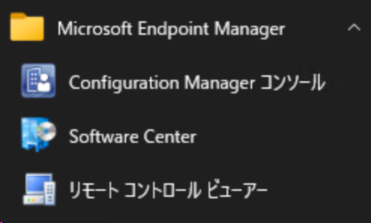

# Microsoft Configuration Manager 自習書シリーズ 2 Microsoft Configuration Manager FAQ

皆様、Microsoft Configuration Manager サポート チームの箱木です。

今回は [Microsoft Configuration Manager FAQ](https://learn.microsoft.com/ja-jp/mem/configmgr/core/understand/configuration-manager-faq) について解説していきます。

## Microsoft Intune 製品ファミリーとは

本記載のとおり、Configuration Manager, Intune, Desktop Analytics, Autopilot が Microsoft Intune ブランドの一部になりました。
Intune の利用に必要なサブスクリプションには現在 Configuration Manager のライセンスが含まれており、共同管理機能などの導入が簡素化されています。

## Configuration Manager と Microsoft Intune 製品ファミリで何が変わりますか?

機能に変更はありません。管理コンソールやソフトウェア センターなどのプログラムのフォルダー名が Microsoft System Center から Microsoft Endpoint Manager に変更されております。

## ライセンスの変更はありますか?

現在保有している Configuration Manager のライセンスを Intune との共同管理に利用いただけます。

なお技術サポートではお客様の契約内容を確認することができませんので、ライセンスについての詳細なご質問については弊社担当営業もしくは契約担当者へお問い合わせいただくようお願いいたします。

次回は [Configuration Manager のヘルプを見つける](https://learn.microsoft.com/ja-jp/mem/configmgr/core/understand/find-help) についての解説を公開予定です。
