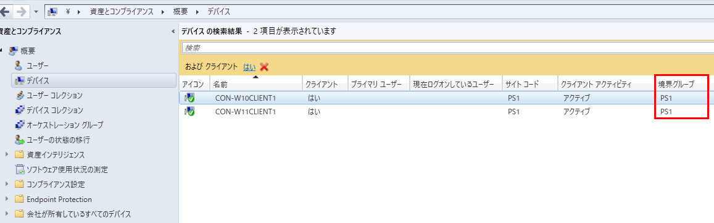
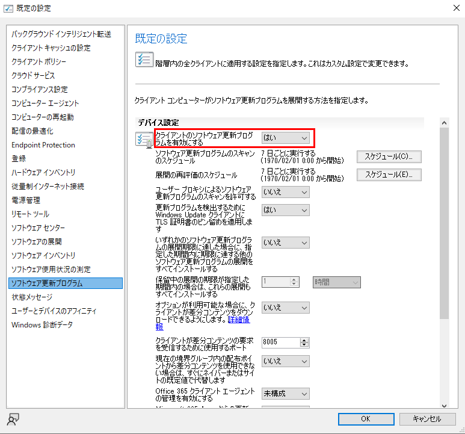

# ソフトウェアの更新ポイントがクライアントのスキャン先として設定されない原因と対応の例 - CWuaHandler::SetCategoriesForStateReportingExclusion
みなさま、こんにちは。Configuration Manager サポート チームです。  

今回は、MECM でソフトウェアの更新ポイント(以下、SUP と呼びます)を構成している環境で、クライアントのスキャン先が SUP を向かない原因とその対応の例についてご案内します。具体的には、MECM クライアントのログの一つであるWUAHandler.log に
```
CWuaHandler::SetCategoriesForStateReportingExclusion
```
が記録されているケースを取り上げます。

MECM で更新プログラムを展開すると、展開ポリシーを受け取ったクライアントは SUP の役割を持ったサイト サーバーに対して更新プログラムのスキャンを行い、スキャンの結果必要と判定された更新プログラムを配布ポイント等からダウンロードします。

サイト サーバーとクライアントが適切に構成されていれば、通常はクライアントのスキャン先はスキャンを行うタイミングで境界グループに基づき自動で SUP を向く様に構成されますが、もし構成されない場合はスキャンを行えず、その結果、更新プログラムのインストールに失敗します。あるいは、環境によっては意図せず Microsoft Update 経由で更新プログラムがインストールされてしまうこともあります。

上記のメッセージが WUAHandler.log に記録されており、クライアントのスキャン先としてSUPが設定されていないことが判明した場合は、以下にご案内する方法をお試しください。

## 事象を特定する
MECM クライアントが更新プログラムのスキャンを実行した際は、ローカル グループ ポリシー(ポリシー名「イントラネットの Microsoft 更新サービスの場所を指定する」)経由でスキャン先が構成されますが、構成された結果、設定値は `HKEY_LOCAL_MACHINE\SOFTWARE\Policies\Microsoft\Windows\WindowsUpdate` 以下のレジストリ値 `WUServer` および `WUStatusServer` に反映されます。例えば、通常は以下のように設定されます。

```
[HKEY_LOCAL_MACHINE\SOFTWARE\Policies\Microsoft\Windows\WindowsUpdate]
"WUServer"="http://<SUP の FQDN>:8530"
"WUStatusServer"="http://<SUP の FQDN>:8530"
```

もしこれらのレジストリ値が設定されていない場合は正しくスキャン先が設定されていないことになり、SUP に対してスキャンが行われません。このとき、更にクライアントの `C:\Windows\CCM\Logs\WUAHandler.log` に以下で始まるメッセージが記録されている場合、当記事のケースに該当すると判断できます。

```
CWuaHandler::SetCategoriesForStateReportingExclusion
```

## 原因と解決策
原因としては設定に起因する場合と何らかの不具合に起因する場合が考えられますが、境界グループの設定あるいはクライアント設定に起因するお問い合わせを多く頂いていますので、まずは以下のセクションの内容をご確認ください。いずれも問題ない場合は詳細な調査が必要となるため、弊社サポート窓口までお問い合わせいただければ幸いです。

### 境界グループの設定
クライアントが SUP をスキャン先として使用するためには、予め SUP を境界グループに追加しておく必要があります。更に、その境界グループにクライアントが紐づいている必要があります。いずれかが満たされない場合はクライアントは SUP を認識できず、スキャン先として設定できません。

状況を確認するためには、まずクライアントが紐づく境界グループを特定する必要があります。方法は幾つかありますが、例えば管理コンソールの `\資産とコンプライアンス\概要\デバイス` に「境界グループ」列を表示させることで確認可能です(列名が表示されている部分を右クリックすると表示する列を変更できます)。もし境界グループ列に何も表示されていない場合は、どの境界グループにも紐づいていない状態ですので、クライアントを境界グループに紐づけてください。



クライアントと境界グループの紐づけに問題がなければ、次に管理コンソールの `\管理\概要\階層の構成\境界グループ` から該当の境界グループのプロパティを開き、「参照」タブ内に SUP の役割を持つサーバーが含まれることを確認します。SUP が含まれていない場合は、その境界グループに紐づくクライアントは参照する SUP が存在しないことになるため、更新プログラムのスキャンに失敗します。そのため、境界グループへ SUP の追加が必要になります。

境界グループへのクライアントの紐づけやサーバーを追加する手順は以下の記事が参考になりますので、該当する場合は必要に応じて参照ください。

[参考記事: Configuration Manager から配信しているコンテンツのダウンロードが開始されない](https://jpmem.github.io/blog/mecm/20180706_02/)

### クライアント設定
クライアントがローカル グループ ポリシー経由でスキャン先等を設定するためには、クライアント設定 \[クライアントのソフトウェア更新プログラムを有効にする\] を \[はい\] へ設定する必要があります。



この設定を有効化しないと、境界グループに問題がない場合もスキャン先が設定されません。既定では有効化される項目ですが、意図せず無効化していないかご確認ください。
