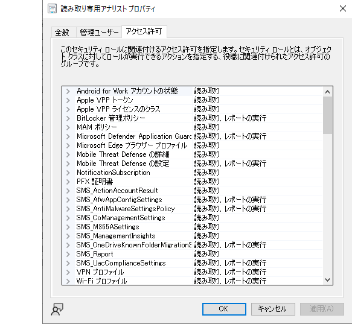
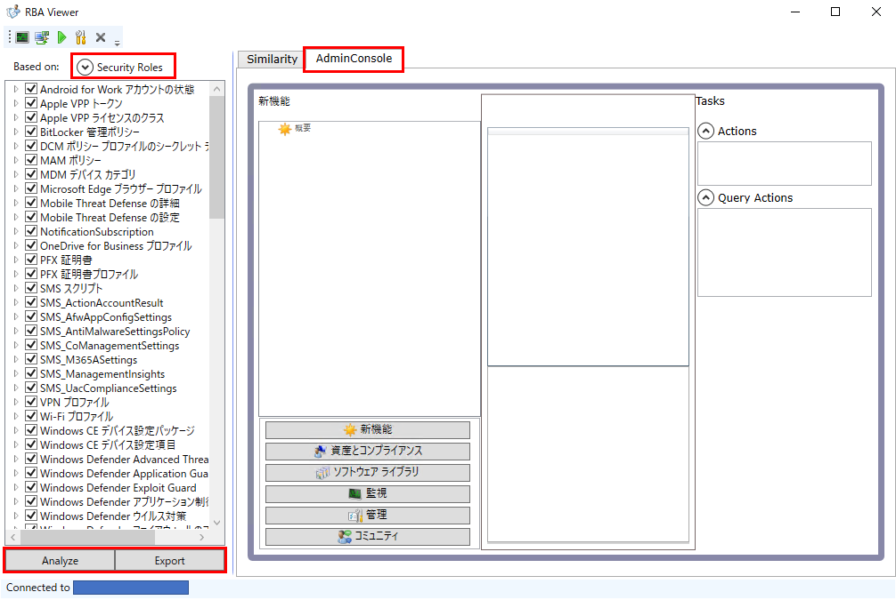
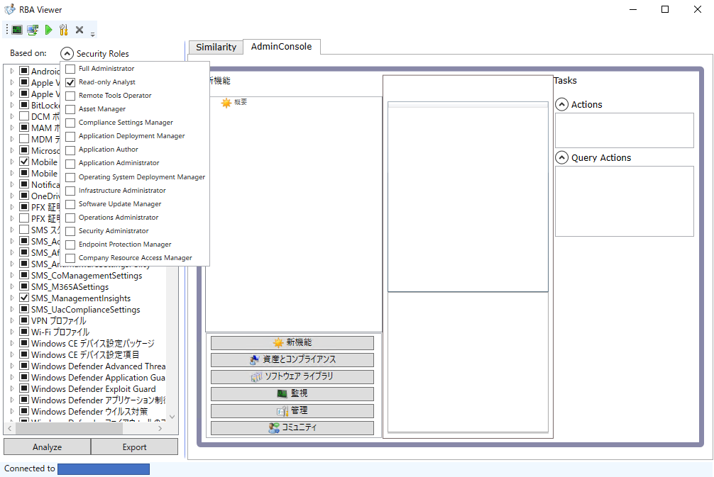
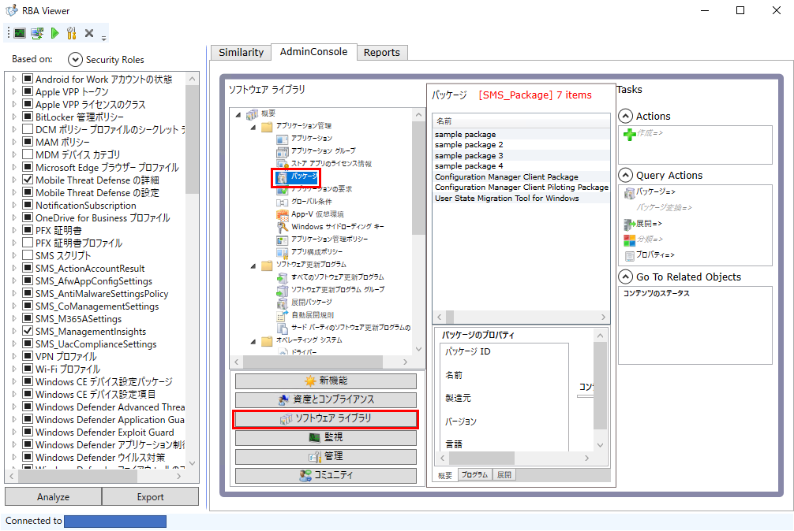
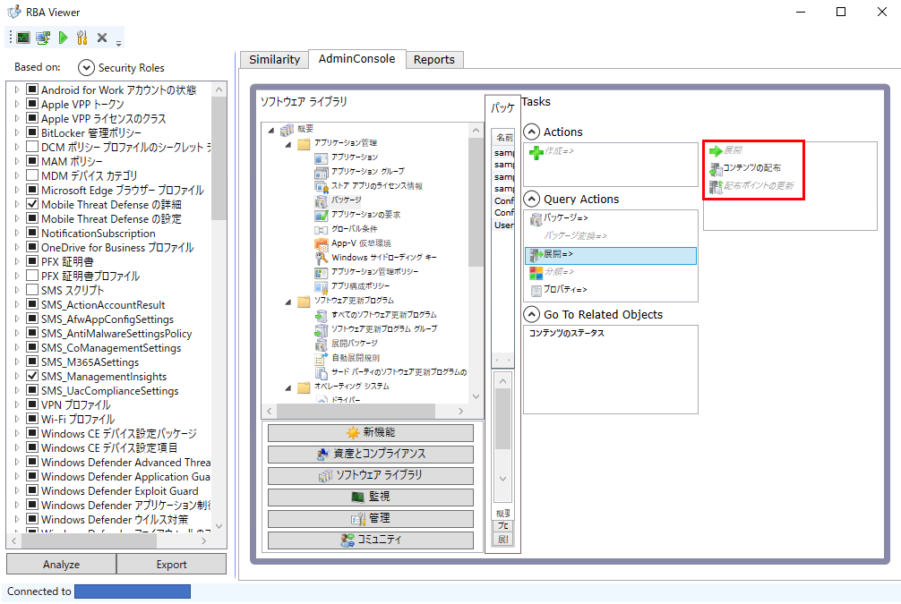
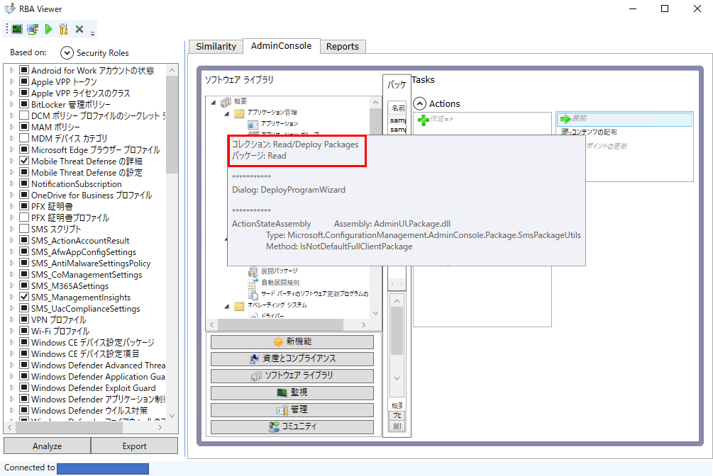
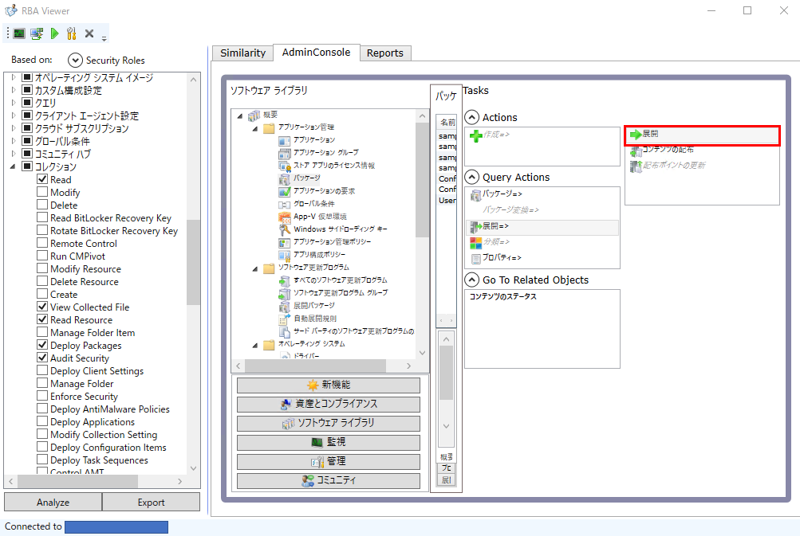
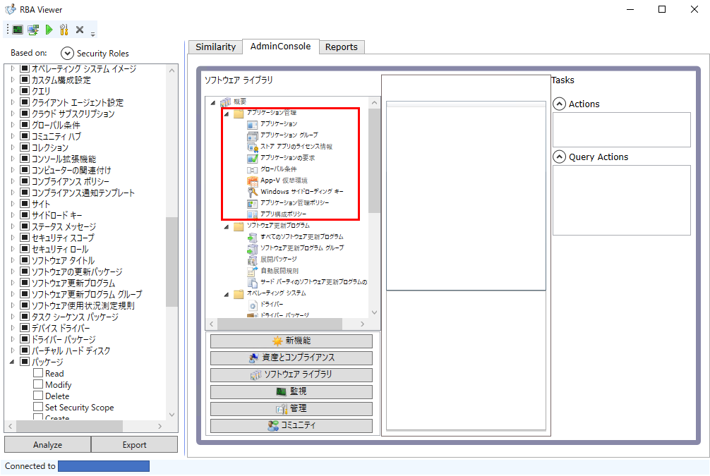
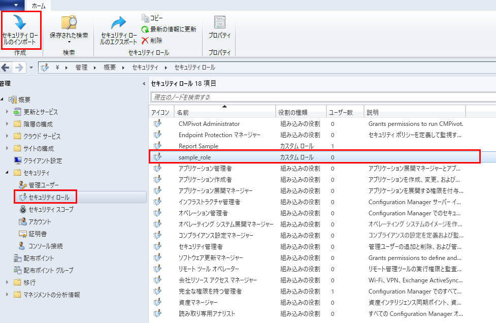

# カスタム セキュリティ ロールで RBAC を設計する方法(RBA Viewer の基本的な使い方)
みなさま、こんにちは。Configuration Manager サポート チームです。  

今回は、Configuration Manager にカスタム セキュリティ ロールを作成し、管理コンソールのアクセス制御を行う方法をご案内します。

Configuration Manager にはロールベースのアクセス制御を行う機能が備わっており、「完全な権利を持つ管理者」や「読み取り専用アナリスト」など、異なるアクセス許可の組み合わせを割り当て済みの幾つかのセキュリティ ロールが予め用意されています。そして、任意のユーザーやグループに一つ以上のセキュリティ ロールを割り当てることで、ロール ベースのアクセス制御(RBAC)を実現することが可能です。

[Configuration Managerのロールベースの管理を構成する](https://learn.microsoft.com/ja-jp/mem/configmgr/core/servers/deploy/configure/configure-role-based-administration)

更に、組み込みのセキュリティ ロールとは異なる単位でアクセス許可を設定したい場合は、任意のアクセス許可を割り当てたカスタム セキュリティ ロールを新規に作成することが可能ですが、各アクセス許可が具体的にどの操作を表すか、アクセス許可の名称からは判断が難しい場合があるため、アクセス許可と管理コンソール上の操作との紐づけについてしばしばお問い合わせいただくことがあります。



実際にアクセス許可を割り当てた上で動作確認する方法もありますが、この様な場合は、Configuration Manager ツールと呼ばれる付属ツール一式に含まれる「RBA Viewer」をご利用いただくことをお勧めします。RBA Viewer は、実際の管理コンソール上の各項目にどのアクセス許可が必要か確認しながらセキュリティ ロールを設計し、設計した内容を管理コンソールからインポート可能な形式でエクスポート可能なツールです。また、既存のセキュリティ ロールを読み込み、管理コンソール上の表示のイメージの確認を行うことも可能です。

そこで当記事では、RBA Viewer の使用にフォーカスしながら、実際にアクセス許可を構成し、カスタム セキュリティ ロールを作成するまでの流れをご説明します。

なお、Configuration Manager では、セキュリティ ロールとは別に、セキュリティ スコープを併用することで更に各オブジェクトのアクセス制御を行うことが可能です。また、管理ユーザー単位で各コレクションへのアクセスを制御することも可能ですが、いずれも当記事では触れません。セキュリティ ロールと併せて設定を行う場合は、それぞれ以下のドキュメントをご確認ください。

- [セキュリティ スコープの構成方法](https://learn.microsoft.com/ja-jp/mem/configmgr/core/servers/deploy/configure/configure-role-based-administration#configure-security-scopes-for-an-object)
- [コレクションのアクセス許可](https://learn.microsoft.com/ja-jp/mem/configmgr/core/servers/deploy/configure/configure-role-based-administration#configure-collections-to-manage-security)

## RBA Viewer の概要
製品のドキュメントとしては以下でご案内しています。実行前に前提条件をご確認ください。

[ロールベース管理および監査ツール](https://learn.microsoft.com/ja-jp/mem/configmgr/core/support/rbaviewer)

RBA Viewer は、バージョン 2107 以降は管理コンソールとともにインストールされますが、スタートメニューには表示されないため、起動する場合は管理コンソールのインストール先ディレクトリ(既定では `\Program Files (x86)\Microsoft Endpoint Manager\AdminConsole\bin`)内の `RBAViewer.exe` を直接実行します。必要に応じてショートカットを作成しておくと良いです。

RBA Viewer を起動すると、図 2 の様なウィンドウが起動します。



カスタム セキュリティ ロールを設計する際は、基本的には以下の流れで操作を行うことになりますが、詳細は以下のセクションで随時ご説明します。

1. 左上の \[Security Roles\] からベースとなるセキュリティ ロールを選択し、読み込む
2. 左下の \[Analyze\] ボタンをクリックし、選択済みのアクセス許可の内容を、右側の Admin Console タブに反映する
3. 右側の Admin Console タブでアクセスが必要/不要な項目を確認し、左側のアクセス許可の有効化/無効化を行う
4. Admin Console タブの内容が満足する結果となるまで 2 と 3 を繰り返す
5. 選択したアクセス許可を左下の \[Export\] ボタンで XML ファイルにエクスポートする
6. 管理コンソールで、XML ファイルをカスタム セキュリティ ロールとしてインポートする
7. 管理コンソールで、インポートしたカスタム セキュリティ ロールの動作確認を行う

## 既存のセキュリティ ロールのアクセス許可を確認する
RBA Viewer を起動した直後は全てのアクセス許可が選択された状態ですが、\[Security Roles\] から既存のセキュリティ ロールを選択することで、そのセキュリティ ロールに割り当てられているアクセス許可のみが選択された状態になります。\[Security Roles\] から選択可能なセキュリティ ロールは、カスタム セキュリティ ロールを除き英語表記となりますが、概ね直訳のため、以下のリンク先を参考に選択ください。

[組み込みのセキュリティ ロール一覧](https://learn.microsoft.com/ja-jp/mem/configmgr/core/understand/fundamentals-of-role-based-administration#security-roles)

今回は、組み込みのセキュリティ ロールの一つである「読み取り専用アナリスト(Read-only Analyst)」を選択することにします。読み取り専用アナリストは、その名の通り読み取り専用のロールであり、基本的に変更操作を行えない様にアクセス許可が割り当てられています。そのため、読み取り専用アナリストをベースにして不要なアクセス許可を削除することで、権限の弱いロールを設計することが可能です。

それでは実際に \[Security Roles\] からセキュリティ ロール「Read-only Analyst」を選択し、読み込んでみます。セキュリティ ロールの読み込みを行うと、図 3 の様に左側のアクセス許可の幾つかが有効化されます。なお、管理コンソールからカスタム セキュリティ ロールを新規作成する場合はベースとなるセキュリティ ロールの選択が必要ですが、RBA Viewer で設計を行うにあたっては、既存のセキュリティ ロールの読み込みは必ずしも必要ではありません。例えばごく一部の項目のみ表示可能なロールを設計したい場合は、読み込みを行わずにゼロからアクセス許可を追加した方が早いこともありますので、ニーズに合わせて判断ください。



セキュリティ ロールの読み込み直後は、右側の Admin Console タブに変化はありません。アクセス許可の有効化や無効化を行っても即時に反映されないため、現在のアクセス許可に基づく管理コンソールのイメージを確認したい場合は、\[Analyze\] をクリックする必要があります。アクセス許可を変更した際は、クリックを忘れないようにご注意ください。

Admin Console タブ内は、実際の管理コンソールの様に各メニュー項目をクリックし動作を確認することが可能です。例えば `[ソフトウェア ライブラリ] - [概要] - [アプリケーション管理] - [パッケージ]` を選択すると図 4 の様に表示されますが、この画面に到るまでに管理コンソール上に `[ソフトウェア ライブラリ]` のメニュー項目が表示されており、更に `[パッケージ]` が選択可能となっていた筈です。これは、現在のアクセス許可の選択に基づいた場合、それぞれが表示および選択可能となっていることを表します。すなわち、Admin Console タブ内で実際にできることが管理コンソールでできることになるため、実際の管理コンソールを操作しなくてもイメージを掴むことが可能です。なお、Admin Console タブには、選択したメニュー項目によって実際のレコードの内容が表示されますが、RBA Viewer で行った操作が Configuration Manager へ影響を与えることはありませんので、色々な項目の表示を試してみてください。



ここまでの操作でお気づきかもしれませんが、Admin Console タブで項目を選択すると、画面右側の「Tasks」の下に、「Actions」や「Query Actions」という項目が表示されます。これらはメニュー項目内で実施できるアクションの分類を表しますが、それぞれ以下の意味です。
- Actions: レコードに関係なく、その項目内で実行可能なアクション(コンソール画面上部のボタン)
- Query Actions: その項目内に表示されるレコードに対して実行可能なアクション(レコードを選択した状態で表示されるコンソール画面上部のボタンや右クリックメニューの内容)

また、それぞれの分類の配下に表示されているアクションの内容により文字色が黒であったりグレーであったりしますが、それぞれ以下の意味です。
- 黒: 実行が許可されているアクション
- グレー: 実行が許可されていないアクション

例えば `[ソフトウェア ライブラリ] - [概要] - [アプリケーション管理] - [パッケージ]` の場合は、図 4 では
- Actions
  - 作成=>(グレー)
- Query Actions
  - パッケージ=>(黒)
  - パッケージ変換=>(グレー)
  - 展開=>(黒)
  - 分類=>(グレー)
  - プロパティ=>(黒)

の様に表示されていますが、これはパッケージの作成は不可であるものの、既存の各パッケージに対する一部のアクションが許可されていることを表します。なお、各アクションの末尾に「=>」が付与されている場合はそのアクションは入れ子になっていることを表し、例えば上記は \[展開\] が黒ですが、この場合はパッケージの展開が可能と判断するのではなく、\[展開\] をクリックして表示される配下のアクションの状態を確認して判断します。

実際に \[展開\] をクリックすると図 5 の様に
- 展開=>(黒)
  - 展開(グレー)
  - コンテンツの配布(黒)
  - 配布ポイントの更新(グレー)

であることを確認できますが、これ以上入れ子になっていないため、この時点で \[コンテンツの配布\] が許可されていると判断可能です。



ここまでで、セキュリティ ロールの読み込みから Admin Console タブの確認方法をご説明しましたが、次のセクションからは実際にセキュリティ ロールを設計する上で必要となるアクセス許可の追加や削除の方法についてご説明します。

## 必要なアクセス許可を追加する
実行が許可されていないアクションはグレーの文字で表示されることをご説明しましたが、各アクションの許可をするためには何らかのアクセス許可を付与する必要があります。具体的にどのアクセス許可が必要となるかは、該当のアクションにマウスのカーソルを置くと表示されるポップアップの内容から確認できます。



例えば図 6 では、パッケージの \[展開\] がグレーアウトされている状態で \[展開\] にカーソルを置くと
```
コレクション: Read/Deploy Packages
パッケージ: Read
```
と表示されていますが、これは、\[展開\] を行うためにはコレクションの Read および Deploy Packages とパッケージの Read のアクセス許可が必要であることを表します。すなわち、これらのアクセス許可を追加することで、パッケージの \[展開\] が可能となることが分かります。実際にそれぞれのアクセス許可をウィンドウの左側から探して有効化し \[Analyze\] をクリックすると、図 7 の様に \[展開\] がグレーから黒へ変わります。



この様に、管理コンソールから行いたい操作や表示したい項目にマウスのカーソルを置くことで必要なアクセス許可を確認することができます。

なお、日本語版の管理コンソールでは Read や Deploy Package の部分はそれぞれ「読み取り」と「パッケージの展開」と翻訳されるため表記は異なりますが、RBA Viewer からエクスポートした XML ファイルを管理コンソールにインポートした後は、日本語表記へ置き換わります。

## 不要なアクセス許可を削除する
実行可能なアクションや表示可能な項目を不許可にしたり非表示にする場合は、アクセス許可の追加時と同じ要領でアクセス許可を確認し、それらを無効化することで可能です。

例えば `[ソフトウェア ライブラリ] - [概要] - [アプリケーション管理] - [パッケージ]` の場合は
```
パッケージ: Read
```
のアクセス許可が必要ですが、これを無効化することで図 8 の様に非表示にすることが可能です。



## 設計内容を Configuration Manager へインポートする
セキュリティ ロールの設計が完了したら、\[Export\] ボタンをクリックすることで XML ファイルへエクスポートすることができますが、この XML ファイルを管理コンソールからインポートを行うことで、一つのセキュリティ ロールとして扱える様になります。

XML ファイルをインポートする際は、図 9 の様に管理コンソールで `[管理] - [概要] - [セキュリティ] - [セキュリティ ロール]` を開き、\[セキュリティ ロールのインポート\] をクリックします。インポート後は、ファイル名と同じ名称のセキュリティ ロールが作成されます(名称は変更可能です)。実際に管理コンソールで動作確認を行った上で、正式に利用いただければ幸いです。


