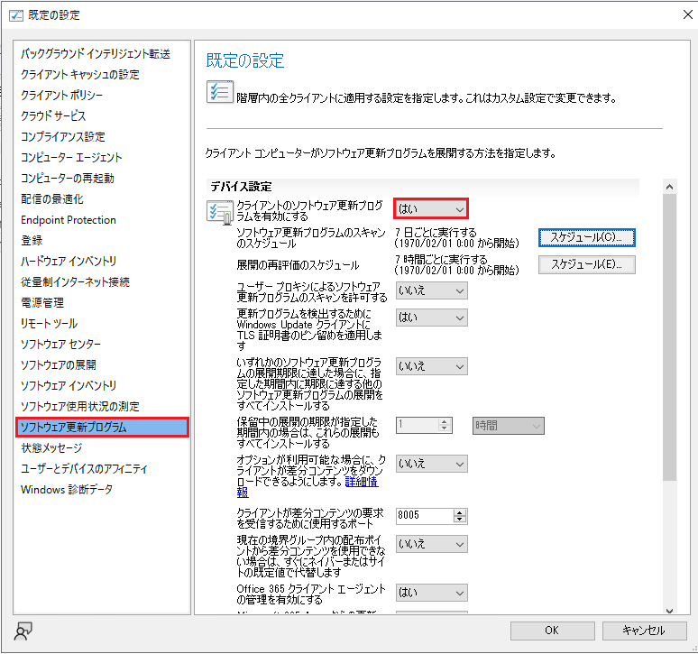

みなさま、こんにちは。Configuration Manager サポート チームです。  
  
本日は、Configuration Manager クライアントで Windows Update 配下のポリシーが未構成になってしまう事象についてご紹介いたします。該当のポリシーのパスは以下です。  
  
[コンピューターの構成] - [管理用テンプレート] - [Windows コンポーネント] - [Windows Update]  
  
Configuration Manager でソフトウェア更新プログラムの管理を行っている場合、以下のポリシーが "有効" になりますが、これらのポリシーが "未構成" になってしまうシナリオがございます。  
  
・[イントラネットの Microsoft 更新サービスの場所を指定する]  
・[Windows Update に対するスキャンを発生させる更新遅延ポリシーを許可しない]  
・[イントラネットの Microsoft 更新サービスの保存場所にある署名済み更新を許可する]  
  
[イントラネットの Microsoft 更新サービスの場所を指定する] ポリシーが "未構成" の場合、ソフトウェア更新ポイント（WSUS）サーバーに対してスキャンされないため、インターネットの Windows Update に対してスキャンを行ってしまいます。  
その結果、意図しない機能更新プログラムや品質更新プログラムがダウンロード、インストールされてしまうため、更新プログラムの管理が行えなくなります。  
  
想定される要因として以下 3 つが挙げられ、それぞれの場合について記載させていただきますので、トラブルシューティングのご参考になれば幸いです。  
  
1. Configuration Manager クライアントをアンインストールした。  
2. クライアント設定で [クライアントのソフトウェア更新プログラムを有効にする] の設定を "いいえ" にした。  
3. 60 日間、管理ポイントと通信を行っていない。  
  
### 1. Configuration Manager クライアントをアンインストールした。  
クライアントをアンインストールすると、Configuration Manager で管理されなくなるため、上記 3 つのポリシーは "未構成" になります。  
対処としては Configuration Manager クライアントをインストールすることです。  
  
### 2. クライアント設定で [クライアントのソフトウェア更新プログラムを有効にする] の設定を "いいえ" にした。  
クライアント設定の [ソフトウェア更新プログラム] にて、[クライアントのソフトウェア更新プログラムを有効にする] の設定を "いいえ" に変更した際、[イントラネットの Microsoft 更新サービスの場所を指定する] のローカル ポリシーが "未構成" になります。  

  
  
対処としては上記の [クライアントのソフトウェア更新プログラムを有効にする] の設定を "はい" に設定することです。  
    
### 3. 60 日間、管理ポイントと通信を行っていない。  
Configuration Manager の管理ポイントから取得するポリシーには有効期限が 60日に設定されており、この有効期限の間に管理ポイントと通信をしなかった場合にポリシーが削除されます。  
  
ポリシーが削除されたあと、CcmExec サービスが起動することにより、上述のポリシーが "未構成" になってしまいます。
なお、再度クライアントが Configuration Manager の管理ポイントと通信を行うとポリシーの取得を行います。
その後、ソフトウェア更新ポイントへのスキャンのタイミングで、管理ポイントにソフトウェア更新ポイントの場所を問い合わせ、上述のポリシーがローカル グループ ポリシーに書き込まれます。  
  
上記のため、対処としては管理ポイントと通信させることです。  
  
以上、ご参考になりましたら幸いです。