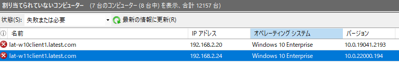
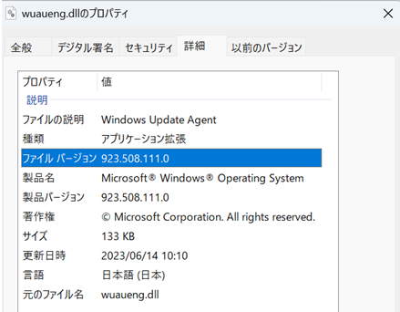

# WSUS で Windows 11 クライアントが Windows 10 と表示される事象について

みなさま、こんにちは。WSUS サポート チームです。

今回は WSUS で Windows 11 クライアントが Windows 10 と表示される事象についてご紹介します。

本問題は弊社でも同様の動作になることを確認できておりますが、誠に恐縮ながら現時点で修正可否は未定です。
本問題について進展がありましたら、本ブログを更新する予定ですので、ご不便をおかけしますが、何卒ご理解賜りますようお願い申し上げます。

## 事象の概要

WSUS サーバー上でコンピューターの一覧を表示した場合、Windows 11 であってもオペレーティング システムの表示項目は Windows 10 と表示されます。

本事象はクライアント バージョンを判断するための情報が Windows 10 と Windows 11 で共通であるため発生いたしますが、表示上の問題であり更新プログラムの管理動作には影響はございません。

## 回避策

現時点で本動作の修正予定はございませんので、恐れ入りますが、クライアントのオペレーティング システムの判別には表示列を追加し、バージョンの情報をご確認ください。  
なお、現在確認できているバージョンの情報は下記の通りでございますが、今後変更される可能性がございますのでお含みおきいただけますと幸いです。  
 
Windows 11 21H2：10.0.22000 から始まるバージョン  
Windows 11 22H2 以降：923 から始まるバージョン  

## 補足

バージョンの情報は、%windir%\System32\wuaueng.dll のバージョンが表示されます。  
上記バージョン以外が表示された場合は、必要に応じてご確認いただけますと幸いです。  
 
// Windows 11 22H2 (OS ビルド 22621.1848) の場合  

